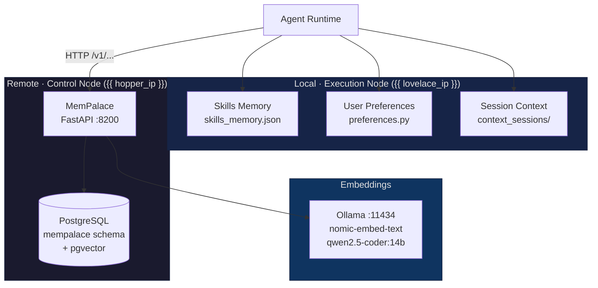

# Memory System

Memex provides persistent knowledge across sessions through several
complementary memory subsystems. Each lives at a different layer of the
stack, with a different storage backend and a different retrieval style.

## Overview



| Subsystem | Location | Backend | Retrieval | Best for |
|---|---|---|---|---|
| **Skills Memory** | Lovelace, file-backed | `skills_memory.json` | Keyword match against domain | Hard rules, explicit preferences taught via TRAIN |
| **User Preferences** | Lovelace, file-backed | `preferences.py` | Direct lookup by `(owner_id, key)` | Per-user settings (default model, response style) |
| **Session Context** | Lovelace, file-backed | `context_sessions/<session>.json` | Recency (last N messages) | Active conversation history |
| **MemPalace** | Hopper, networked | PostgreSQL + pgvector | Cosine similarity over 768-dim embeddings | Durable cross-session memory, semantic recall |

The first three live in-process on the agent runtime; MemPalace is a separate
networked service so its data survives container restarts and can be queried
by other clients (the Palace 3D UI, MCP tools in VS Code, ad-hoc admin
queries).

---

## Skills Memory

The fast, deterministic, rule-based store. Loaded into memory at startup,
written back to JSON on change.

### Domains

| Domain | Examples |
|---|---|
| `visual_rules` | "cyberpunk: neon lighting, rain-slicked streets" |
| `coding_rules` | "python: use type hints", "error_handling: log with context" |
| `general_rules` | "tone: be concise" |
| `session_summaries` | Auto-generated conversation recaps |

### API

```python
memory = SkillsMemory()
memory.add_rule("coding_rules", "python", "Always use f-strings")
rules = memory.get_relevant_rules(prompt, "coding_rules")
summaries = memory.get_recent_summaries(n=5, owner_id="user_001")
```

### Storage

`/workspace/agents/skills_memory.json` — persisted via Docker volume mount on
the agent runtime container.

When the user types something the router classifies as `TRAIN` ("remember
that I prefer X"), the rule is stored here AND a procedural memory is also
written to MemPalace via `mempalace_client.store(...)` for cross-session
semantic recall.

---

## User Preferences

Per-user configuration with no semantic retrieval — just direct lookup.

```python
prefs = Preferences()
prefs.set("user_001", "response_style", "concise")
prefs.set("user_001", "default_model", "{{ solver_model }}")
style = prefs.get("user_001", "response_style")  # "concise"
```

Stored alongside Skills Memory on the execution node. Owner-isolated: one
user's preferences are never returned to another user, enforced by the
`owner_id` argument on every read/write.

---

## Session Context

Active conversation state, one file per `session_id`.

```python
context = ContextManager()
session = context.get_session(session_id)
session.add_message({"role": "user", "content": "Hello"})
history = session.get_messages()
```

Tracks:

- Message history
- Active tools and tool results
- Coordinator scratchpad artifacts (for COORDINATE-intent sessions)
- JWT-ACE token metadata for audit

Files live in `agents/context_sessions/`. Trimmed by the Context Budget
Manager (planned in ADR-005) before being injected into model prompts.

---

## MemPalace

The semantic memory service. Lives on Hopper as a separate container
(`mempalace` on port 8200) with its own PostgreSQL schema. Three subsystems
behind one API:

| Subsystem | Table | Purpose |
|---|---|---|
| **Semantic memories** | `mempalace.memories` | Vector-searchable facts, the dominant traffic |
| **Agent snapshots** | `mempalace.agent_snapshots` | Versioned per-agent learned state |
| **Team memories** | `mempalace.team_memories` | Shared scratchpad for Coordinator teams |

### Memory taxonomy

Every semantic memory has a `memory_type` and a `domain`:

| `memory_type` | Meaning | Example |
|---|---|---|
| `semantic` | Factual knowledge | "User's home server IP is 192.168.2.102" |
| `episodic` | An event or experience | "User asked about Open Design Studio integration on May 7" |
| `procedural` | A rule or how-to | "When deploying mempalace, stamp baseline before first boot" |
| `preference` | User preference | "User prefers cyberpunk visual style with neon palette" |
| `discovery` | Findings / insights | "qwen3.6:27b regularly outperforms 14b on multi-step coordination" |

`domain` is free-form (`coding`, `visual`, `architecture`, `cooking`, …)
and is what the Palace UI surfaces as "rooms" within each hall.

For full schema, endpoints, and the palace metaphor, see
[MemPalace Architecture Deep Dive](mempalace-deep-dive.md).

---

## How the subsystems compose

A single user turn typically touches all four:

1. **Session Context** loads recent history for the prompt.
2. **User Preferences** resolves the user's default model and style.
3. **Skills Memory** keyword-matches relevant rules into the system prompt.
4. **MemPalace** semantic-searches relevant memories (after intent
   classification) and injects them as additional context. After the turn
   completes, the agent calls `POST /v1/extract` so MemPalace can identify
   any durable facts in the conversation and store them for next time.

Skills Memory and Preferences are local and instantaneous. MemPalace is
networked and pays a ~50–200 ms round-trip cost — but stores quantitatively
more knowledge and supports semantic recall.

---

## Key files

| File | Purpose |
|---|---|
| `agents/memory_system.py` | Skills Memory — rule storage and retrieval |
| `agents/preferences.py` | User preference management |
| `agents/context_manager.py` | Session context lifecycle |
| `agents/main.py` (`_mempalace_extract_http`) | HTTP caller for the extraction pipeline |
| `agents/mempalace_client.py` | Legacy embedded-library client (single TRAIN-flow caller; deprecation candidate) |
| `control_plane/mempalace/` | MemPalace FastAPI service + Alembic migrations |

## Related

- [Getting Started: Concepts](../getting-started/concepts.md) — simplified overview
- [Memory Module](../modules/memory.md) — agent-side implementation reference
- [Service: MemPalace](../modules/services/mempalace.md) — operator reference
- [MemPalace Architecture Deep Dive](mempalace-deep-dive.md) — full design
- [Memory Palace UI Guide](../user-guide/palace.md) — the 3D viewer
- [User Guide: Settings](../user-guide/settings.md) — teaching preferences
