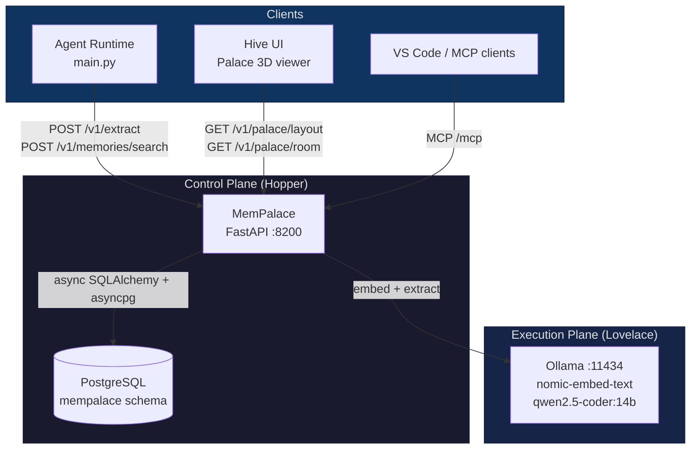

# MemPalace — Architecture Deep Dive

```
Document ID: ARCH-MEM-001
Domain: Architecture
Owner: Core Platform
Status: Approved
Version: 3.0
Last Updated: 2026-05-08
Source of Truth: control_plane/mempalace/app/{main.py,database.py,embeddings.py}
```

---

## Purpose

MemPalace is Memex's hierarchical semantic memory service. It provides three
memory subsystems behind a FastAPI + PostgreSQL/pgvector backend, exposed both
as a REST API and as MCP (Model Context Protocol) tools so VS Code, agent
runtimes, and the 3D Palace UI can all read and write through one source of
truth.

---

## Service Topology

| Property | Value |
|----------|-------|
| **Node** | Control Plane ({{ hopper_ip }}) |
| **Container** | `mempalace` |
| **Image** | `control_plane-mempalace` |
| **Port** | 8200 (HTTP + MCP) |
| **URL** | `http://{{ hopper_ip }}:8200` |
| **MCP endpoint** | `http://{{ hopper_ip }}:8200/mcp` |
| **Backend** | PostgreSQL (`mempalace` schema) with pgvector |
| **Embeddings** | Ollama `nomic-embed-text` (768-dim) on Lovelace |
| **Extraction LLM** | Ollama `qwen2.5-coder:14b` |
| **Compose** | `control_plane/docker-compose.yml` |
| **Build** | `control_plane/mempalace/Dockerfile` |



---

## Three Memory Subsystems

MemPalace stores three distinct kinds of memory in three separate tables.
They share the same vector embedding pipeline but have different semantics.

### 1. Semantic Memories (`mempalace.memories`)

Vector-searchable facts extracted from conversations. The dominant table —
all primary read/write traffic touches it.

| Field | Type | Notes |
|-------|------|-------|
| `id` | UUID | Primary key |
| `content` | TEXT | The memory itself (one clear sentence) |
| `memory_type` | VARCHAR(50) | `semantic` / `episodic` / `procedural` / `preference` / `discovery` |
| `domain` | VARCHAR(100) | `coding` / `visual` / `general` / `architecture` / `cooking` / … |
| `agent_id` | VARCHAR(100) | Creating agent (nullable) |
| `team_id` | VARCHAR(100) | Coordinator team scope (nullable) |
| `owner_id` | VARCHAR(100) | User identity (required for writes) |
| `embedding` | `Vector(768)` | nomic-embed-text |
| `metadata_` | JSONB | Free-form key/value (column name `metadata`) |
| `created_at` / `updated_at` | TIMESTAMP | Server defaults |
| `access_count` | INT | Bumped on every search hit; used for UI heat indicator + planned ranking score (ADR-005) |
| `relevance_decay` | FLOAT | Reserved for future decay scoring |

### 2. Agent Snapshots (`mempalace.agent_snapshots`)

Versioned per-agent learned state. The TRAIN intent and per-agent learning
loops persist here. Uniqueness constraint `(agent_id, owner_id, version)`
ensures no two snapshots share a version, and the writer retries on race.

| Field | Type | Notes |
|-------|------|-------|
| `id` | UUID | Primary key |
| `agent_id` | VARCHAR(100) | Required |
| `owner_id` | VARCHAR(100) | Nullable |
| `snapshot_data` | JSONB | Arbitrary state |
| `version` | INT | Monotonic per `(agent_id, owner_id)` |
| `created_at` | TIMESTAMP | |

### 3. Team Memories (`mempalace.team_memories`)

Shared key-value scratchpad for Coordinator task teams. Atomic upserts via
`INSERT … ON CONFLICT (team_id, key) DO UPDATE`.

| Field | Type | Notes |
|-------|------|-------|
| `id` | UUID | Primary key |
| `team_id` | VARCHAR(100) | Required |
| `key` | VARCHAR(255) | Unique within team |
| `value` | TEXT | |
| `embedding` | `Vector(768)` | Indexed (`{key}: {value}` is embedded) |
| `author_agent` | VARCHAR(100) | |
| `created_at` | TIMESTAMP | |

### Supporting Tables

`mempalace.memory_audit_log` — append-only audit trail. Records `created` /
`edited` / `deleted` actions on individual memories with actor identity and
the previous content. `memory_id` is intentionally **not** a foreign key so
the audit row survives deletion of the underlying memory.

`mempalace.extraction_log` — per-attempt log of `/v1/extract` calls,
keyed by `owner_id`. Used by the `/v1/palace/audit/extractions` endpoint to
report extraction success rate and recency.

`mempalace.alembic_version` — single-row table managed by Alembic. Records
which migration the schema is at.

---

## The Palace Metaphor

The Palace UI presents memories as a navigable 3D space. The metaphor maps
onto the database columns as follows:

| UI Level | Encoded as | Source column |
|---|---|---|
| **Wing** | `wing_team_<team_id>` / `wing_agent_<agent_id>` / `wing_owner_<owner_id>` / `wing_self` | derived from `team_id`, `agent_id`, `owner_id` |
| **Hall** | `hall_facts` / `hall_events` / `hall_advice` / `hall_preferences` / `hall_discoveries` | mapped from `memory_type` |
| **Room** | The `domain` value itself | `domain` |
| **Drawer** | A single memory record | one row |

### `memory_type` → Hall mapping

| `memory_type` | Hall name | Meaning |
|---|---|---|
| `semantic` | `hall_facts` | Factual knowledge |
| `episodic` | `hall_events` | Events / experiences |
| `procedural` | `hall_advice` | Rules / how-to |
| `preference` | `hall_preferences` | User preferences |
| `discovery` | `hall_discoveries` | Findings / insights |

Unknown `memory_type` values fall back to `hall_<type>` (no fixed mapping).

### Wing prefix encoding (post-2026-05-08)

Every wing name carries an explicit prefix so the Palace 3D viewer can
unambiguously reverse-decode any wing back to a database filter. Earlier
versions used bare `wing_<id>` and could not distinguish agent-scope from
owner-scope; that ambiguity was fixed in the v3 service rewrite.

---

## API Surface

The service exposes 15 HTTP endpoints (under `/v1/...`) and 4 MCP tools
(under `/mcp`). The HTTP and MCP surfaces are intentionally aligned: the same
operations are available through both, with MCP tailored for tool-using
agent contexts.

### REST endpoints (selected)

| Method | Path | Purpose |
|---|---|---|
| `GET` | `/health` | Liveness — used by Docker `HEALTHCHECK` |
| `POST` | `/v1/memories` | Store a memory (writes audit `created`) |
| `POST` | `/v1/memories/search` | Semantic search with cosine similarity |
| `PATCH` | `/v1/memories/{id}` | Update content/type/domain/metadata (writes audit `edited`) |
| `DELETE` | `/v1/memories/{id}` | Delete (writes audit `deleted`) |
| `GET` | `/v1/memories/stats` | Counts by `(memory_type, domain)` |
| `GET` | `/v1/memories/{id}/audit` | Audit history for a memory |
| `POST` | `/v1/extract` | Run conversation through LLM extractor + store + log |
| `POST` | `/v1/snapshots` | Save agent snapshot (next version, race-safe) |
| `GET` | `/v1/snapshots/{agent_id}` | Get latest snapshot |
| `POST` | `/v1/team/{team_id}` | Atomic upsert team key/value |
| `GET` | `/v1/team/{team_id}` | List team memories |
| `POST` | `/v1/team/{team_id}/search` | Semantic search within a team |
| `DELETE` | `/v1/team/{team_id}` | Clear all team memories |
| `GET` | `/v1/palace/layout` | Wings → halls → rooms → drawer counts |
| `GET` | `/v1/palace/room` | Memories in a specific palace coordinate |
| `GET` | `/v1/palace/audit/extractions` | Per-owner extraction audit (single query) |

Full request/response schemas live in the
[Developer Guide → MemPalace API](../developer-guide/api/mempalace.md).

### MCP tools (mounted at `/mcp`)

| Tool | Purpose |
|---|---|
| `search_memories_mcp` | Semantic search (requires `owner_id`) |
| `store_memory_mcp` | Store a memory (requires `owner_id`) |
| `get_memory_stats_mcp` | Total + per-type/domain breakdown |
| `extract_from_conversation_mcp` | Run LLM extraction from a conversation summary |

The MCP server is `FastMCP` from the `mcp` Python SDK, mounted as a
sub-application at `/mcp`. Transport security restricts allowed hosts to
`hopper:*`, `localhost:*`, `127.0.0.1:*`, and `192.168.2.102:*`.

---

## Data Flow: Extraction Pipeline

The most operationally significant pathway. The agent runtime calls
`POST /v1/extract` after each turn with a short conversation summary;
MemPalace calls Ollama to identify discrete facts, embeds them in batch, and
persists everything in a single transaction.

```mermaid
sequenceDiagram
    autonumber
    participant Agent as Agent Runtime<br/>(main.py)
    participant MP as MemPalace<br/>:8200
    participant Ollama as Ollama<br/>:11434
    participant PG as PostgreSQL

    Agent->>+MP: POST /v1/extract<br/>{conversation, owner_id, agent_id}
    MP->>+Ollama: POST /api/generate<br/>(qwen2.5-coder:14b)
    Note over Ollama: Identify discrete facts<br/>and emit JSON array
    Ollama-->>-MP: [{content, type, domain}, ...]
    MP->>+Ollama: POST /api/embed (batch)<br/>(nomic-embed-text)
    Ollama-->>-MP: [[0.12, ...], [0.34, ...], ...]
    MP->>+PG: BEGIN
    MP->>PG: INSERT memories × N
    MP->>PG: INSERT extraction_log × 1
    MP->>-PG: COMMIT
    MP-->>-Agent: 200 [{stored memories}, ...]
```

Both inserts share one transaction — the audit row can never disagree with
what was actually stored, even on partial failure. Embedding calls retry up
to 2× on 5xx / transport errors with exponential backoff.

---

## Schema Migrations

Schema is owned by **Alembic** under `control_plane/mempalace/alembic/`. The
runtime app calls `alembic upgrade head` on boot (in
`init_db()`) instead of `Base.metadata.create_all` — so schema drift is
impossible: the deployed code refuses to start unless migrations are applied.

Current migrations:

| Revision | Title | Adds |
|---|---|---|
| `0001_baseline` | baseline schema | 5 tables, 8 indexes (incl. ivfflat on embeddings) |
| `0002_add_unique_constraints` | snapshot + team uniqueness | `uq_snap_agent_owner_version`, `uq_team_mem_team_key`, dedupe |

For the procedure to introduce a new migration, see
[Procedures → MemPalace Migrations](../procedures/mempalace-migration.md).

---

## Operational Hardening (May 2026 review)

The service was audited and hardened in early May 2026. Headline changes:

| Concern | Before | After |
|---|---|---|
| MCP `extract_from_conversation` mis-typed memories | Always defaulted to `semantic` | Reads correct `type` key |
| Palace viewer for owner-scoped memories | Decoder couldn't reach them | Explicit `wing_owner_*` prefix + decoder symmetric |
| Audit trail | Only edits recorded | `created` / `edited` / `deleted` all recorded with actor_id |
| Snapshot race | `SELECT max(version) → INSERT` could collide | UNIQUE constraint + IntegrityError retry (5×) |
| Team memory race | Read-then-write upsert | `INSERT … ON CONFLICT … DO UPDATE` |
| Schema management | `create_all` (no migration support) | Alembic with baseline + migration |
| Connection pool | 5 + 10 overflow, no pre-ping | 20 + 20 overflow, pre-ping, 30-min recycle |
| Ollama transient errors | First 5xx → 500 to caller | Bounded retry with exponential backoff |
| Container security | Ran as root | Non-root UID 1000 + Docker `HEALTHCHECK` |

See [ADR-005](decisions/index.md) for the planned Phase 2 sparse-attention
ranking work that builds on this baseline.

---

## Known Follow-Ups

| Item | Trigger |
|---|---|
| IVFFlat → HNSW index migration | When memory count justifies the rebuild cost (pgvector ≥ 0.5 supports HNSW directly) |
| Authenticated identity for `actor_id` on PATCH/DELETE | Currently caller-supplied; trusted boundary |
| Phase 2 sparse-attention scoring | ADR-005 — composite cosine + recency + access |
| Deprecate `agents/mempalace_client.py` | Single residual caller in `church.py` (TRAIN intent fallback) — replace with HTTP call |

---

## Source of Truth

| Component | File |
|-----------|------|
| FastAPI app + endpoints + MCP tools | `control_plane/mempalace/app/main.py` |
| ORM models + engine + migrations runner | `control_plane/mempalace/app/database.py` |
| Embedding + extraction pipeline | `control_plane/mempalace/app/embeddings.py` |
| Schema migrations | `control_plane/mempalace/alembic/versions/*.py` |
| Container image | `control_plane/mempalace/Dockerfile` |
| Service definition | `control_plane/docker-compose.yml` |
| HTTP caller (extraction) | `agents/main.py:_mempalace_extract_http` |

## Related

- [Memory System (architecture overview)](memory-system.md)
- [Memory Module (agent-side memory)](../modules/memory.md)
- [Service: MemPalace (operator reference)](../modules/services/mempalace.md)
- [Memory Palace (3D UI guide)](../user-guide/palace.md)
