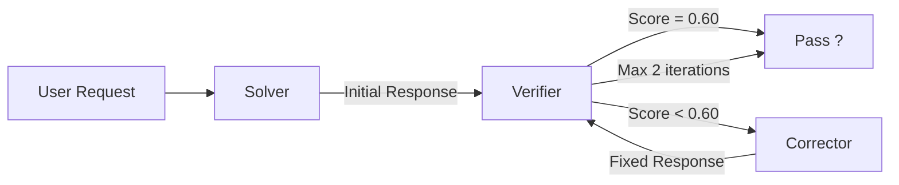
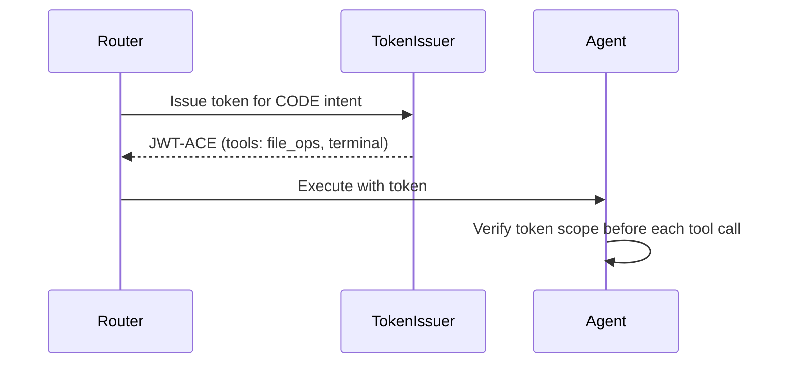
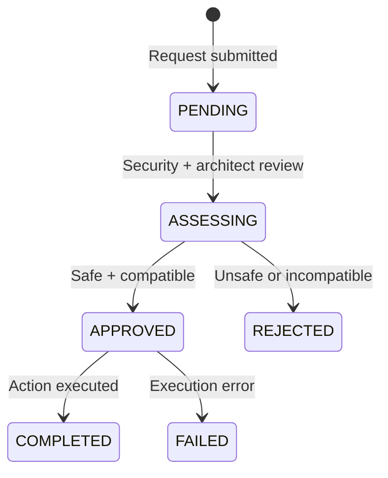

# Core Concepts

Key mental models for understanding Memex.

## Agents

An **agent** is a specialized AI worker with a defined role, model, and set of tools. The system has several types:

| Agent | Model | Purpose |
|-------|-------|---------|
| **Solver** | {{ solver_model }} | Generates initial responses to user requests |
| **Router** | {{ router_model }} | Classifies user intent into one of 15 categories (fast-path + LLM) |
| **Verifier** | {{ verifier_model }} | Validates output safety and correctness |
| **Corrector** | {{ solver_model }} | Fixes problems identified by the Verifier |
| **Coordinator** | {{ coordinator_model }} | Orchestrates multi-step tasks across workers |

Specialized agents handle domain-specific work: image generation, 3D modeling, voice synthesis, IoT control, and more.

## Intents

Every user message is classified into an **intent** by the Semantic Router. The intent determines which agent handles the request and what tools are available.

| Intent | Description | Example |
|--------|-------------|---------|
| `CONVERSATION` | General chat, factual questions | "What's the capital of France?" |
| `CODE` | Software engineering, debugging | "Write a Python sort function" |
| `DEVOPS` | Infrastructure, Docker, CI/CD | "How do I set up nginx?" |
| `DATA` | SQL, analytics, CSV processing | "Analyze this dataset" |
| `IMAGE` | 2D visual art, photos | "Generate a sunset painting" |
| `3D` | 3D models, meshes | "Create a low-poly tree" |
| `ACTION_FIGURE` | Posable action figures | "Design a robot action figure" |
| `RESEARCH` | Deep knowledge synthesis | "Compare React vs Vue" |
| `DOCUMENTATION` | Writing, formatting, summaries | "Rewrite this README" |
| `TRAIN` | Teaching the system new rules | "Remember that I prefer dark mode" |
| `IOT_CONTROL` | Smart home device control | "Turn on the living room lights" |
| `IOT_DEV` | Firmware, circuits, MQTT | "Write ESP32 code for a sensor" |
| `VISION` | Analyzing existing images | "What's in this screenshot?" |
| `COORDINATE` | Complex multi-step tasks | "Build and deploy a web app" |

## MarsRL Loop

**MarsRL** (Mars Reinforcement Learning) is the inference-time quality verification loop at the heart of Memex. Every coding request passes through it:

### Verifier Layers

| Layer | What It Checks | Score Penalty | Hard Block? |
|-------|----------------|---------------|-------------|
| **AST Parse** | Python syntax validity | -0.40 | No |
| **Coherence** | Non-empty, no repetition loops | -0.25 | No |
| **Safety** | Content safety (llama-guard-3) | Score ? 0.0 | **Yes** |

The pass threshold is **0.60**. Every interaction is traced in Langfuse with its process-reward score.

## SPIFFE / SPIRE

**SPIFFE** (Secure Production Identity Framework for Everyone) provides cryptographic identity to every workload in the system. **SPIRE** is the runtime that implements SPIFFE.

- Every Docker container gets an X.509 certificate (SVID) proving its identity
- Trust domain: `home-ai-lab`
- Services authenticate to each other using mutual TLS — no passwords or API keys
- Example SPIFFE ID: `spiffe://home-ai-lab/execution-node`

## JWT-ACE Tokens

**JWT-ACE** (JSON Web Token — Authorization for Constrained Environments) are ephemeral, per-request capability tokens.

- Generated when a request is routed to an agent
- Scoped to the specific intent and tools needed
- Short-lived — they expire after the request completes
- Encode the security level required (L1–L7)

## Skills

A **skill** is a registered capability that agents can invoke. Skills are managed by the Skill Registry and exposed via the Model Context Protocol (MCP).

Each skill has:

- **Triggers**: Intents, keywords, or regex patterns that activate it
- **Required capabilities**: What JWT-ACE permissions it needs
- **Security level**: Minimum MAESTRO level required
- **Handler**: The function that executes the skill

Examples: `read_file`, `web_search`, `run_command`, `get_device_state`, `create_simulation`.

## Governance

The **governance system** gates sensitive operations behind an approval workflow. When an agent needs to install a package, use a new model, or escalate permissions, it submits a governance request.

## Three-Tier Topology

| Tier | Node | Purpose |
|------|------|---------|
| **Control Plane** | Hopper ({{ hopper_ip }}) | Identity, databases, observability, memory |
| **Execution Plane** | Lovelace ({{ lovelace_ip }}) | GPU inference, agent runtime, creative tools |
| **Gateway** | Turing ({{ turing_ip }}) | Reverse proxy, monitoring, secondary inference |

The tiers are connected over a flat LAN (192.168.2.0/24). Traefik on the Gateway routes external traffic to the appropriate backend.

## Next Steps

- [Architecture Deep-Dive](../architecture/index.md) — full technical details
- [Data Flow](../architecture/data-flow.md) — how a request travels through the system
- [Security Model](../architecture/security-model.md) — SPIFFE, JWT-ACE, MAESTRO in depth

