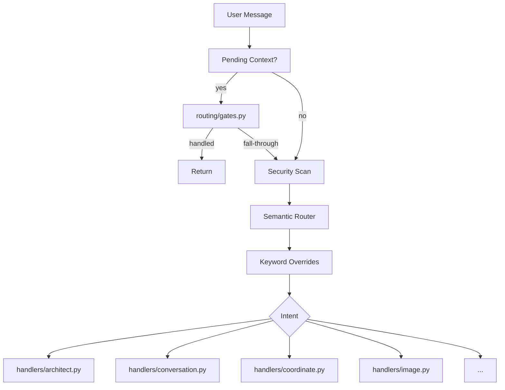

# Router

The Semantic Router is the entry point for all user requests. It classifies intent, issues capability tokens, and dispatches to the appropriate handler module.

> **Architecture note**: `church.py` was refactored from a 3,173-line monolith into a thin wrapper (~500 lines) that delegates to focused handler modules. See [ADR-005](../architecture/decisions/adr-005-church-handlers.md) for the full rationale.

## File Layout

### Core (church.py package)

| File | Purpose |
|------|---------|
| `agents/church.py` | Thin wrapper — session init, intent routing, ctx dict, dispatch |
| `agents/semantic_router.py` | Intent classification — 5-rule keyword fast-path + qwen3:8b LLM fallback |
| `agents/intent_capabilities.py` | Intent → JWT-ACE capability mapping |

### Handler Modules (`agents/handlers/`)

| File | Intents handled |
|------|----------------|
| `handlers/base.py` | Shared utilities — stream emitters, Langfuse span/score, RAG helpers |
| `handlers/architect.py` | Default code/architecture — fast-pass or MarsRL loop |
| `handlers/conversation.py` | `CONVERSATION` — 3-tier chat (admin / dev / user) |
| `handlers/coordinate.py` | `COORDINATE` — multi-agent Lamport coordinator |
| `handlers/devops.py` | `DEVOPS`, `DATA`, `AMBIGUOUS` |
| `handlers/image.py` | `IMAGE` — Art Director pipeline + QC delivery |
| `handlers/media.py` | `3D`, `ACTION_FIGURE` |
| `handlers/creative.py` | `CREATIVE` — fiction, scene descriptions, narratives |
| `handlers/research.py` | `RESEARCH`, `DOCUMENTATION`, `DOC_STANDARDS` |
| `handlers/design.py` | `DESIGN` — OpenDesign client |
| `handlers/train.py` | `TRAIN`, `IOT_CONTROL` |
| `handlers/vision.py` | `VISION` — Moondream VLM |

### Routing Module (`agents/routing/`)

| File | Purpose |
|------|---------|
| `routing/gates.py` | Pending-context dispatch — 9 multi-turn context types |

## Intent Classification

### Fast-Path (keyword bypass, < 1 ms)

`SemanticRouter.fast_classify()` checks 5 regex rules before the LLM is invoked. Only these highly specific, unambiguous intents are in the fast path:

```python
_FAST_PATH_RULES = [
    (VISION_PATTERN,        "VISION",        0.92),
    (ACTION_FIGURE_PATTERN, "ACTION_FIGURE", 0.95),
    (IOT_CONTROL_PATTERN,   "IOT_CONTROL",   0.92),
    (IOT_DEV_PATTERN,       "IOT_DEV",       0.90),
    (TRAIN_PATTERN,         "TRAIN",         0.92),
]
```

All other intents (IMAGE, CODE, DEVOPS, DATA, CREATIVE, RESEARCH, COORDINATE, CONVERSATION, etc.) fall through to the LLM router so confidence scores are real.

### LLM Router (qwen3:8b)

The LLM router classifies the remaining messages into intents:

```python
INTENTS = [
    "CONVERSATION", "CODE", "DEVOPS", "DATA",
    "IMAGE", "3D", "ACTION_FIGURE", "CREATIVE", "DESIGN",
    "RESEARCH", "DOCUMENTATION", "DOC_STANDARDS", "TRAIN",
    "IOT_CONTROL", "VISION", "COORDINATE", "AMBIGUOUS",
]
```

The router sends a structured prompt to the LLM with:

- The user's message
- List of available intents with descriptions
- Instructions to return JSON: `{"intent": "...", "confidence": 0.0-1.0, "reasoning": "..."}`

### LLM Fallback Logic

| Condition | Action |
|-----------|--------|
| Confidence ≥ 0.75 and not AMBIGUOUS | Accept intent |
| Confidence < 0.75 | Retry with stronger prompt (max 2 retries) |
| Timeout / error | Fallback to CONVERSATION |

### Confidence Gate

After the router returns an intent, `chat_swarm()` applies a **confidence gate** (`_CONFIDENCE_GATE = 0.80`). If confidence is below the gate threshold and the intent is not exempt, the system saves pending context and yields a `clarification_card` event asking the user to clarify.

**Gate-exempt intents** (skipped because they are low-risk defaults or came from the high-precision fast-path):

```python
_GATE_EXEMPT = frozenset({
    "CONVERSATION", "TRAIN", "VISION", "ACTION_FIGURE", "DOC_STANDARDS", "AMBIGUOUS",
})
```

### Keyword Overrides

After neural classification, `chat_swarm()` applies deterministic overrides that take precedence:

| Trigger | Override |
|---------|----------|
| `learn:`, `correction:`, `remember that` prefix | `TRAIN` |
| `action figure`, `ball joint`, `posable` | `ACTION_FIGURE` |
| `landing page`, `mockup`, `wireframe`, `prototype` | `DESIGN` |
| `/standardize-doc` slash command | `DOC_STANDARDS` |
| `CODE` intent received | promoted to `COORDINATE` |

## Dispatch Flow



## Shared Handler Context (`ctx`)

Every handler receives a single `ctx` dict built by `chat_swarm()`:

```python
ctx = {
    # Identity
    "session_id": str, "owner_id": str, "uid": str, "turn_id": str,
    # History
    "history": list, "history_context": str, "constraint_context": str,
    "extracted_context": str,
    # Model
    "model": str | None,
    # Security
    "ace_token": str | None, "is_admin": bool,
    # Observability
    "lf_trace": str | None, "langfuse": Langfuse, "use_langfuse": bool,
    # Routing
    "intent": str, "routing_decision": dict,
    "fast_mode": bool, "research_mode": bool,
    "ultraplan_mode": bool, "dev_mode": bool,
    # MarsRL tuning
    "solving_max_iter": int | None, "solving_max_time": int | None,
    "solving_solver_n_drafts": int | None, "solving_solver_max_time": int | None,
    "solving_verifier_n_runs": int | None, "solving_verifier_max_time": int | None,
    "solving_corrector_n_passes": int | None, "solving_corrector_max_time": int | None,
    # Storage
    "conv_storage": PgAgentStorage, "template_metadata": dict,
}
```

## Pending Context (Multi-Turn Gates)

`routing/gates.py` intercepts saved state from the previous turn before intent routing runs. Supported context types:

| Type | Description |
|------|-------------|
| `image_clarification` | Merge answer with prior image prompt |
| `art_studio_redirect` | Clear stale redirect |
| `swarm_clarification` | Prepend "Additional context:" to original prompt |
| `ambiguity_resolution` | Composite prompt from question + answer |
| `project_onboarding_step_1` | Collect project type → save step_2 |
| `project_onboarding_step_2` | Create workspace dir + README → show card |
| `dev_project_clarification` | Route to Lamport (existing / new) or fall-through |
| `task_intent_clarification` | Research / plan / build branch |
| `dev_mode_gate` | Switch to dev mode / request access / plan-only |

## Token Issuance

After classification, the router generates a JWT-ACE token scoped to the intent:

```python
token = issue_token(
    intent="CODE",
    tools=["file_ops", "terminal", "ast_tool"],
    level="L4",
    session_id=session_id,
    owner_id=owner_id,
)
```

## Dispatch Table

| Intent | Handler | Pipeline |
|--------|---------|----------|
| `CONVERSATION` | `handlers/conversation.py` | Phidata Agent (3-tier access) |
| `DEVOPS` | `handlers/devops.py` | MarsRL loop |
| `DATA` | `handlers/devops.py` | Data Analyst agent |
| `AMBIGUOUS` | `handlers/devops.py` | Clarification card |
| `IMAGE` | `handlers/image.py` | Art Director → ComfyUI |
| `3D` | `handlers/media.py` | Concept art → Forge mesh |
| `ACTION_FIGURE` | `handlers/media.py` | T-pose art → figure pipeline |
| `CREATIVE` | `handlers/creative.py` | Creative Writer agent (direct, no coordinator) |
| `RESEARCH` | `handlers/research.py` | Librarian agent |
| `DOCUMENTATION` | `handlers/research.py` | Technical Writer |
| `DOC_STANDARDS` | `handlers/research.py` | Batch standardize |
| `DESIGN` | `handlers/design.py` | OpenDesign client |
| `TRAIN` | `handlers/train.py` | memory.add_rule + MemPalace |
| `IOT_CONTROL` | `handlers/train.py` | IoT Agent → Home Assistant |
| `VISION` | `handlers/vision.py` | Moondream VLM |
| `COORDINATE` | `handlers/coordinate.py` | Lamport coordinator |
| _(default)_ | `handlers/architect.py` | Architect fast-pass or MarsRL |

## Configuration

| Setting | Value | Description |
|---------|-------|-------------|
| Router model | `qwen3:8b` (default, override via `ROUTER_MODEL` env) | Intent classification LLM |
| Fast-path rules | 5 regex rules | VISION, ACTION_FIGURE, IOT_CONTROL, IOT_DEV, TRAIN |
| LLM accept threshold | 0.75 | Below this triggers retry |
| Confidence gate | 0.80 | Below this emits clarification_card (unless gate-exempt) |
| Max LLM retries | 2 | Classification retry limit |
| LLM request timeout | 300s | Ollama client timeout |

## Related

- [ADR-005: church.py Handler Package](../architecture/decisions/adr-005-church-handlers.md) — why the monolith was split
- [Architecture: Agent System](../architecture/agent-system.md) — design overview
- [Architecture: Data Flow](../architecture/data-flow.md) — request lifecycle
- [Developer Guide: Adding Agents](../developer-guide/adding-agents.md) — how to add a new handler


