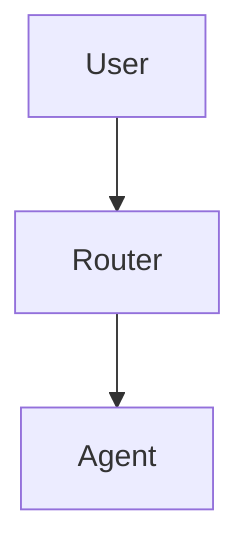

# Documentation Standards

```
Document ID: DOC-REF-0001
Domain: Reference
Owner: Core Platform
Status: Approved
Version: 1.0
Last Updated: 2026-04-16
```

Every page in the Memex DocSite must follow this standard template to ensure consistency, traceability, and completeness.

---

## Standard Template

All documentation pages must include the following sections:

### 1. YAML Frontmatter

```yaml
---
title: "Page Title"
doc_id: "DOC-CATEGORY-NNNN"
last_updated: "YYYY-MM-DD"
source_ref: "URL or project name"
---
```

| Field | Format | Description |
|-------|--------|-------------|
| `title` | String | Display title for the page |
| `doc_id` | `DOC-{CAT}-{NNNN}` | Unique document identifier |
| `last_updated` | `YYYY-MM-DD` | Last modification date |
| `source_ref` | URL or name | Original source/project reference |

### 2. Document ID Badge

Immediately after the H1 heading, include a metadata code block:

````markdown
```
Document ID: DOC-MOD-0042
Domain: Module
Owner: Core Platform
Status: Active
Version: 1.0
Last Updated: 2026-04-16
```
````

| Field | Description |
|-------|-------------|
| `Document ID` | Unique `DOC-{CAT}-{NNNN}` identifier |
| `Domain` | Category name (Architecture, Module, Security, etc.) |
| `Owner` | Responsible team |
| `Status` | Active, Approved, Draft, or Deprecated |
| `Version` | Semantic version of the document |
| `Last Updated` | ISO date of last modification |

### 3. Source Citations & References

A table listing all external projects, libraries, and sources:

```markdown
| # | Source | URL / Path | License | Notes |
|---|--------|------------|---------|-------|
| 1 | Ollama | https://ollama.ai | MIT | LLM inference engine |
```

### 4. Changelog (Source → Implementation)

Tracks how the original project was adapted for the Hive:

```markdown
| Date | Change | Source Version | Hive Version | Author |
|------|--------|----------------|--------------|--------|
| 2026-01-15 | Initial integration | v0.1.0 | Phase 3 | Hive Team |
```

### 5. Overview

A concise description of what the component does and why it exists.

### 6. Usage in the Hive

Three subsections:

- **When This Module Is Invoked** — intents, triggers, conditions
- **How to Use** — step-by-step from the UI or API
- **Configuration** — environment variables and settings table

### 7. Maintenance & Updates

Three subsections:

- **How to Update** — commands, Docker steps, procedures
- **Dependencies** — upstream projects, internal deps
- **Health Checks** — verification commands and endpoints

### 8. Functionality Testing

Two subsections:

- **Automated Tests** — pytest files, CI commands
- **Manual Verification** — step-by-step manual checks

### 9. UI, Screenshots & Examples

All images **must** use the lightbox format for expandable zoom:

```markdown
<figure markdown="span">
  { loading=lazy }
  <figcaption>Caption describing the screenshot</figcaption>
</figure>
```

!!! tip "Image Best Practices"
    - Use PNG for screenshots, SVG for diagrams
    - Store images in `docs/assets/` with descriptive names
    - Include `{ loading=lazy }` on every image for glightbox zoom
    - Add a `<figcaption>` for accessibility

For placeholder screenshots:

```markdown
!!! example "Screenshot Needed"
    <!-- TODO: Add screenshot of [specific element] -->
```

### 10. Related Documentation

Links to other relevant DocSite pages using relative paths:

```markdown
- [Architecture: Topic](../architecture/topic.md)
- [Module: Name](../modules/name.md)
```

---

## Document ID Categories

| Category | Prefix | Used For |
|----------|--------|----------|
| Architecture | `DOC-ARCH-NNNN` | Architecture docs, deep dives |
| Module | `DOC-MOD-NNNN` | Core and specialized module docs |
| Procedure | `DOC-PROC-NNNN` | Operational procedures |
| Tutorial | `DOC-TUT-NNNN` | Step-by-step tutorials |
| Admin Guide | `DOC-ADM-NNNN` | Admin and deployment docs |
| Developer Guide | `DOC-DEV-NNNN` | Developer reference |
| User Guide | `DOC-USR-NNNN` | End-user documentation |
| Troubleshooting | `DOC-TSH-NNNN` | Troubleshooting guides |
| Reference | `DOC-REF-NNNN` | Glossary, env vars, standards |
| Service | `DOC-SVC-NNNN` | External service integrations |
| Tool | `DOC-TOOL-NNNN` | Agent tool documentation |
| FAQ | `DOC-FAQ-NNNN` | Frequently asked questions |
| Security | `DOC-SEC-NNNN` | Security documentation |

---

## Using the Documentation Standards Agent

The Doc Standards Agent (`/standardize-doc`) automatically applies this template to any document.

### From the Hive Chat (Admin Only)

```
/standardize-doc                          # Full DocSite alignment scan + auto-fix
/standardize-doc --dry-run                # Scan only — compliance report, no changes
/standardize-doc docs/my-document.md      # Standardize a single file
/standardize-doc docs/my-document.md --full-rewrite
/standardize-doc docs/my-document.md --urls https://github.com/project/README.md
```

### From VS Code / CLI

```bash
# Full DocSite alignment (scan + auto-fix all non-compliant docs)
python -m agents.specialized.doc_standards_agent

# Full scan — report only, no changes
python -m agents.specialized.doc_standards_agent --dry-run

# Single file
python -m agents.specialized.doc_standards_agent docs/my-doc.md
python -m agents.specialized.doc_standards_agent docs/my-doc.md --full-rewrite
python -m agents.specialized.doc_standards_agent docs/my-doc.md --dry-run
python -m agents.specialized.doc_standards_agent docs/my-doc.md --urls https://example.com/docs
```

### Options

| Flag | Description |
|------|-------------|
| `--model` | Override LLM model for content generation |
| `--source-ref` | Set the source reference URL or project name |
| `--urls` | External URLs to fetch for citation enrichment |
| `--full-rewrite` | Complete LLM rewrite instead of incremental enhancement |
| `--dry-run` | Analyze only — show compliance report without modifying |

### What the Agent Does

**Single-file mode** (`/standardize-doc <filepath>`):

1. **Analyzes** the document structure against this standard
2. **Assigns** a persistent Document ID (`DOC-CATEGORY-NNNN`)
3. **Enforces** YAML frontmatter with all required fields
4. **Generates** missing sections using the LLM
5. **Fetches** external URLs for citation context (if provided)
6. **Applies** glightbox attributes to all images for zoom/expand
7. **Reports** before/after compliance metrics

**Batch mode** (`/standardize-doc` with no file):

1. **Discovers** all `.md` files in `docs-site/docs/` and `docs/`
2. **Scans** every file and computes compliance percentages
3. **Reports** a full compliance table sorted by worst-first
4. **Auto-fixes** every file below 80% compliance (incremental enhancement)
5. **Summarizes** total fixed, failed, and remaining

---

## Expandable Content Guidelines

### Images & Screenshots

All images automatically support click-to-zoom via the glightbox plugin. Use the `{ loading=lazy }` attribute:

```markdown
{ loading=lazy }
```

### Mermaid Diagrams

Mermaid diagrams render inline and support zoom via glightbox:

````markdown

````

### Tables

Large tables automatically get horizontal scroll. Wrap in a div for extra control:

```html
<div class="table-wrapper" markdown>
| Col 1 | Col 2 | Col 3 | Col 4 | Col 5 |
|-------|-------|-------|-------|-------|
| data  | data  | data  | data  | data  |
</div>
```

---

## Related Documentation

- [Reference: Changelog](changelog.md)
- [Reference: Contributing](contributing.md)
- [Reference: Environment Variables](environment-variables.md)


