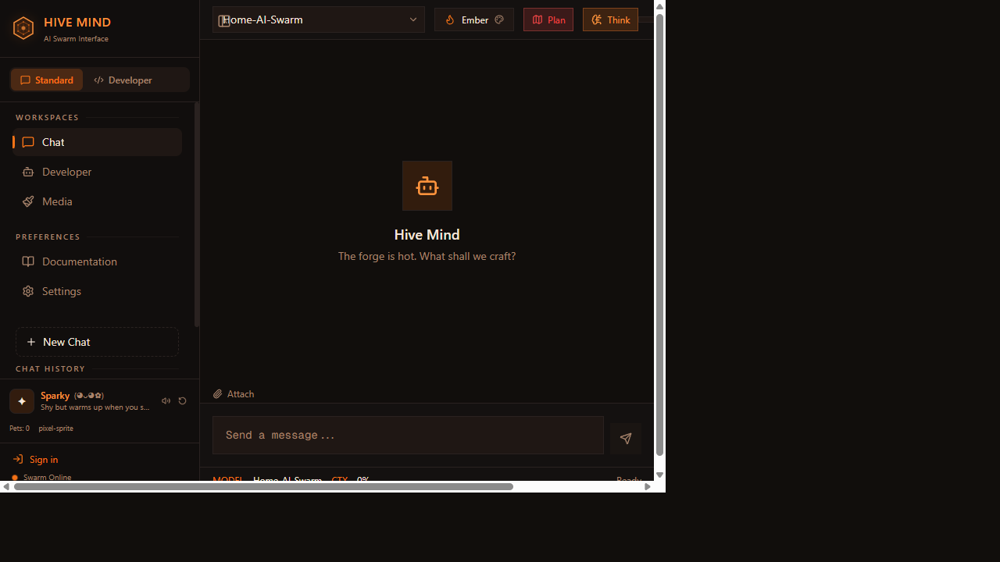

# Buddy Companion System — User Guide


---

## Overview

The Buddy is a virtual companion that lives in the chat sidebar. It's a pixel-art creature that levels up as you use the Hive, offers contextual tips, tracks streaks, and earns achievements. Inspired by the [claude-buddy](https://github.com/rooben-me/claude-buddy) project with a full leveling and evolution system.



---

## Source References

| Source | Type | Relevance |
|--------|------|-----------|
| [claude-buddy](https://github.com/rooben-me/claude-buddy) | Open source | Original companion concept — sidebar creature with reactions |
| [Tamagotchi](https://en.wikipedia.org/wiki/Tamagotchi) (Bandai, 1996) | Product reference | Virtual pet lifecycle, care mechanics, evolution stages |
| [RPG XP/leveling curve design](https://blog.kongregate.com/level-design-and-xp-curves/) | Game design | Fibonacci-inspired XP thresholds for satisfying progression |
| [Pixel art sprite conventions](https://lospec.com/pixel-art-tutorials) | Art reference | 16×16 viewBox, limited palette, `imageRendering: pixelated` |
| [Zustand](https://github.com/pmndrs/zustand) | Open source | Frontend state management with localStorage persist |

---

## Changelog: Source → Hive Implementation

??? info "View full changelog table"

    | Feature | claude-buddy (Source) | Hive Implementation | Delta |
    |---------|----------------------|---------------------|-------|
    | Companion concept | Static SVG buddy with name/personality | 6 species, 4 evolution stages, mood-driven SVG | Massively expanded visual system |
    | Reactions | Text bubbles on chat events | Text bubbles + mood-driven eye/accent changes | Added visual mood feedback |
    | XP / Leveling | Not present | 21-level Fibonacci curve, 5 XP event types | Entirely new system |
    | Evolution | Not present | 4 visual stages (Egg → Hatchling → Juvenile → Elder) | Entirely new — sprite transforms per stage |
    | Achievements | Not present | 11 achievements with badge display | Entirely new gamification layer |
    | Contextual tips | Not present | Backend-served tips with context awareness + cooldown | Entirely new intelligence layer |
    | Streaks | Not present | Daily usage tracking with 🔥 display | Entirely new habit system |
    | Backend persistence | No backend (browser only) | SQLite + FastAPI endpoints (7 routes) | Added server-side persistence |
    | Mute/Release | Release only | Mute (silent tracking) + Release (full reset) | Added mute option |
    | Species | Single species | 6 species with distinct palettes and features | 6× variety |
    | State sync | localStorage only | Zustand (instant) + backend SQLite (durable) | Dual-layer persistence |


---

## Getting Started

### Hatching

Click the **"Hatch a Companion"** button at the bottom of the chat sidebar. The system randomly assigns:

- **Species**: One of 6 pixel-art creatures
- **Name**: A randomly generated name (e.g., "Nibbles", "Pixelloop", "Glitch")
- **Personality**: A behavioral trait (e.g., "Curious and quietly encouraging")

??? info "Species Catalog"

    | Species | Visual Style | Body Color | Accent Color |
    |---------|-------------|------------|-------------|
    | Pixel Sprite | Blue ethereal sprite with star sparkles | `#4a90d9` → `#2a5a8a` | Cyan glow |
    | Byte Bat | Purple bat with extending wings | `#7b68ee` → `#4a3a8a` | Violet aura |
    | Data Fox | Orange fox with fluffy tail | `#d2691e` → `#8b4513` | Warm amber |
    | Circuit Cat | Slate-grey cat with cyan whiskers | `#708090` → `#2f4f4f` | Cyan accents |
    | Logic Lizard | Green lizard with back spikes | `#228b22` → `#006400` | Lime highlights |
    | Hash Hamster | Golden hamster with round cheeks | `#daa520` → `#b8860b` | Gold shimmer |

    Colors shift darker through evolution stages. Stage 3 (Elder) adds crown sparkle overlay.


---

## Interactions

### Petting

Click the buddy sprite to pet it. Each pet:
- Awards **+2 XP**
- Triggers a reaction animation (e.g., *"\*purrs contentedly\*"*, *"\*does a backflip\*"*)
- Counts toward pet-related achievements

### Reactions

The buddy automatically reacts to chat events:

| Event | Reaction Examples |
|-------|-------------------|
| Message sent | *"\*perks up\*"*, *"\*tilts head\*"* |
| Response received | *"\*nods approvingly\*"*, *"\*bounces\*"* |
| Error occurs | *"\*hides behind console\*"*, *"\*flinches\*"* |
| Tool use | *"\*leans forward\*"*, *"\*scribbles notes\*"* |
| Level up | *"\*glows brightly!\*"*, *"\*does a victory dance!\*"* |

### Mute / Release

- **Mute** (🔈): Suppresses reaction bubbles but the buddy continues tracking XP.
- **Release** (↩️): Resets the buddy completely. Requires a new hatch.

---

## Leveling System

??? info "XP Awards Table"

    | Action | XP |
    |--------|-----|
    | Pet | +2 |
    | Message sent | +1 |
    | Response received | +2 |
    | Tool use | +3 |
    | Error (survival) | +1 |


### Level Thresholds

??? info "Full level progression table (21 levels)"

    Levels follow a Fibonacci-inspired progression:

    | Level | XP Required | Level | XP Required |
    |-------|-------------|-------|-------------|
    | 0 | 0 | 11 | 2,000 |
    | 1 | 10 | 12 | 2,700 |
    | 2 | 20 | 13 | 3,600 |
    | 3 | 50 | 14 | 4,800 |
    | 4 | 100 | 15 | 6,300 |
    | 5 | 200 | 16 | 8,200 |
    | 6 | 350 | 17 | 10,600 |
    | 7 | 550 | 18 | 13,700 |
    | 8 | 800 | 19 | 17,600 |
    | 9 | 1,100 | 20 | 22,600 |
    | 10 | 1,500 | | |


---

## Evolution Stages

Your buddy visually evolves at milestone levels:

??? info "Evolution Stages Table"

    | Stage | Level | Name | Visual Change |
    |-------|-------|------|---------------|
    | 0 | 0–4 | Egg | Base sprite |
    | 1 | 5–9 | Hatchling | Extended features (wings, tails, spikes) |
    | 2 | 10–14 | Juvenile | Glowing aura overlay |
    | 3 | 15+ | Elder | Crown sparkles + full aura |

    Each species has distinct colors per stage — bodies darken and accents intensify.

    **Sparky companion widget (expanded):**

    

    **Sidebar with companion:**

    


---

## Achievements

??? info "Achievement List"

    | Achievement | Condition |
    |-------------|----------|
    | First Hatch | Hatch your first companion |
    | Pet Pal | Pet your buddy 10 times |
    | Pet Master | Pet your buddy 100 times |
    | Level 5 | Reach level 5 |
    | Level 10 | Reach level 10 |
    | Level 20 | Reach level 20 |
    | 3-Day Streak | Use the Hive 3 days in a row |
    | Week Warrior | 7-day streak |
    | Month Master | 30-day streak |
    | Chatterbox | Send 100 messages |
    | Task Master | Complete 10 tasks |


Achievements appear as badges in the expanded buddy panel.

---

## Contextual Tips

The buddy periodically shows helpful tips in a speech bubble. Tips are contextual:

??? info "Contextual Tips Examples"

    | Context | Example Tips |
    |---------|-------------|
    | General | "Try the /research mode for multi-step analysis" |
    | Error | "Stack traces often have the answer in the last frame" |
    | Long session | "Stretch your legs — your code will still be here" |
    | New session | "Welcome back! Your buddy missed you" |
    | Streak | "Day 3 of your streak — keep it going!" |


Tips auto-dismiss after 15 seconds or can be clicked to dismiss immediately. A 60-second cooldown prevents tip spam.

---

## Streaks

The system tracks daily usage streaks:

- **Active day**: Any day where you interact with the Hive.
- **Streak counter**: Increments each consecutive day.
- **Streak display**: Shows a 🔥 flame icon with count in the buddy header.
- **Streak break**: Missing a day resets the counter to 0.

---

## UI Layout

??? info "Collapsed View"

    The buddy shows as a compact bar at the bottom of the sidebar:

    ```
    ┌──────────────────────────────────────┐
    │ [Sprite] Nibbles  Lv.7  (◕ᴗ◕✿)  🔥3 ▲ │
    │ ████████████░░░░░  (XP progress bar)    │
    └─────────────────────────────────────────┘
    ```


??? info "Expanded View"

    ```
    ┌──────────────────────────────────────────┐
    │  💬 "Try the /research mode for..."      │  ← Tip bubble
    │                                          │
    │          ┌────────┐                      │
    │          │ Sprite │  (64px, clickable)   │
    │          │  (pet) │                      │
    │          └────────┘                      │
    │                                          │
    │  Species: circuit-cat                    │
    │  Stage: Hatchling (1/3)                  │
    │  XP: 245 / 350                           │
    │  Pets: 42                                │
    │  Personality: Calm and methodical...     │
    │                                          │
    │  🏆 Achievements (3)                     │
    │  [⭐ First Hatch] [⭐ Pet Pal] [⭐ Lv5] │
    │                                          │
    │  [🔈 Mute]  [↩️ Release]    circuit-cat · Lv.7 │
    └──────────────────────────────────────────┘
    ```

    ---

    ## Data Persistence

    | Layer | Storage | Scope |
    |-------|---------|-------|
    | Frontend | Zustand + localStorage (`hive-buddy`) | Browser-local, instant |
    | Backend | SQLite (`~/.hive/buddy.db`) | Server-persisted, synced on load |

    The frontend state is the source of truth for immediate interactions. Backend sync happens:
    - On widget mount (pulls server state)
    - On XP award (fire-and-forget POST to backend)

    ---

    ## API Endpoints

    | Method | Path | Description |
    |--------|------|-------------|
    | `GET` | `/v1/buddy` | Get current buddy state |
    | `PUT` | `/v1/buddy` | Update buddy state |
    | `POST` | `/v1/buddy/xp` | Award XP for an event |
    | `GET` | `/v1/buddy/habits` | Get habit tracking summary |
    | `GET` | `/v1/buddy/tip?context=general` | Get a contextual tip |
    | `GET` | `/v1/buddy/achievements` | List all achievements |

    ---

    ## Maintenance & Update Guide

    ### Adding a New Species

    1. **Sprite**: Add a new case to the species switch in `ui/src/components/buddy/buddy-sprite.tsx`:
       - Define 4 color palettes (one per stage)
       - Add species-specific SVG elements (body shape, features)
    2. **Store**: Add the species ID to the `SPECIES` array in `ui/src/lib/stores/buddy-store.ts`.
    3. **Backend**: No changes needed — species is stored as a string.

    ### Adding New Achievements

    1. Add the achievement definition to `agents/buddy_service.py` in the `ACHIEVEMENTS` list.
    2. Add the check logic to `_check_achievements()` in the same file.
    3. Frontend auto-fetches from `/v1/buddy/achievements` — no UI changes needed.

    ### Modifying XP Curves

    XP thresholds are defined in `ui/src/lib/stores/buddy-store.ts` in the `LEVEL_THRESHOLDS` array. The backend mirrors this in `agents/buddy_service.py`. To change the curve:

    1. Update `LEVEL_THRESHOLDS` in **both** files.
    2. Existing buddies will recalculate their level on next XP award.

    ### Adding New Tip Categories

    1. Add tips to `agents/buddy_service.py` in the `TIPS` dictionary under a new context key.
    2. Frontend requests tips via `GET /v1/buddy/tip?context=<key>`.
    3. The `buddy-tips.tsx` component auto-renders any returned tip.

    ### Updating Dependencies

    | Component | Update path |
    |-----------|-------------|
    | Zustand | `npm update zustand` in `ui/` |
    | SQLite (backend) | Built into Python stdlib — no update needed |
    | lucide-react icons | `npm update lucide-react` in `ui/` |
    | SVG sprites | No dependency — inline SVG in buddy-sprite.tsx |

    ---

    ## Functionality Testing

    ### Backend API Tests

    No dedicated test file exists yet. Recommended test file: `tests/test_buddy_service.py`

    ```bash
    # Recommended test coverage:
    # - Hatch creates a new buddy with valid species/name/personality
    # - XP award increments correctly and triggers level-up
    # - Level calculation matches Fibonacci thresholds
    # - Achievement unlock triggers at correct conditions
    # - Tip endpoint returns context-appropriate tips
    # - Streak tracking increments on consecutive days
    # - Streak resets after missed day
    # - Release deletes buddy data
    pytest tests/test_buddy_service.py -v
    ```

    ### Manual UI Testing

    | Test Case | Steps | Expected Result |
    |-----------|-------|----------------|
    | Hatch | Click "Hatch a Companion" | Random species, name, personality assigned |
    | Pet | Click sprite | +2 XP, reaction text, XP bar advances |
    | Level up | Pet repeatedly until threshold | Level counter increments, ✨ animation |
    | Evolution | Reach level 5 / 10 / 15 | Sprite visually changes (features, glow, crown) |
    | Tip display | Wait ~60s or change context | Speech bubble appears with relevant tip |
    | Tip dismiss | Click speech bubble | Bubble disappears, 60s cooldown starts |
    | Mute | Click mute button | Reactions stop, XP still tracks |
    | Release | Click release button | Buddy removed, "Hatch" button returns |
    | Streak | Use on consecutive days | 🔥 counter increments daily |
    | Persistence | Refresh page | All buddy state (XP, level, name) preserved |
    | Backend sync | Check `~/.hive/buddy.db` | SQLite reflects current state |

    ### API Testing

    ```bash
    # Get buddy state
    curl http://localhost:8008/v1/buddy

    # Award XP
    curl -X POST http://localhost:8008/v1/buddy/xp \
      -H "Content-Type: application/json" \
      -d '{"event": "pet"}'

    # Get tip
    curl "http://localhost:8008/v1/buddy/tip?context=general"

    # List achievements
    curl http://localhost:8008/v1/buddy/achievements
    ```

    ---

    **Source of Truth**

    | Component | File |
    |-----------|------|
    | Zustand store (state + logic) | `ui/src/lib/stores/buddy-store.ts` |
    | SVG sprite renderer | `ui/src/components/buddy/buddy-sprite.tsx` |
    | Tip speech bubble | `ui/src/components/buddy/buddy-tips.tsx` |
    | Main widget | `ui/src/components/buddy/buddy-widget.tsx` |
    | Backend service | `agents/buddy_service.py` |
    | API endpoints | `agents/main.py` (buddy section) |


