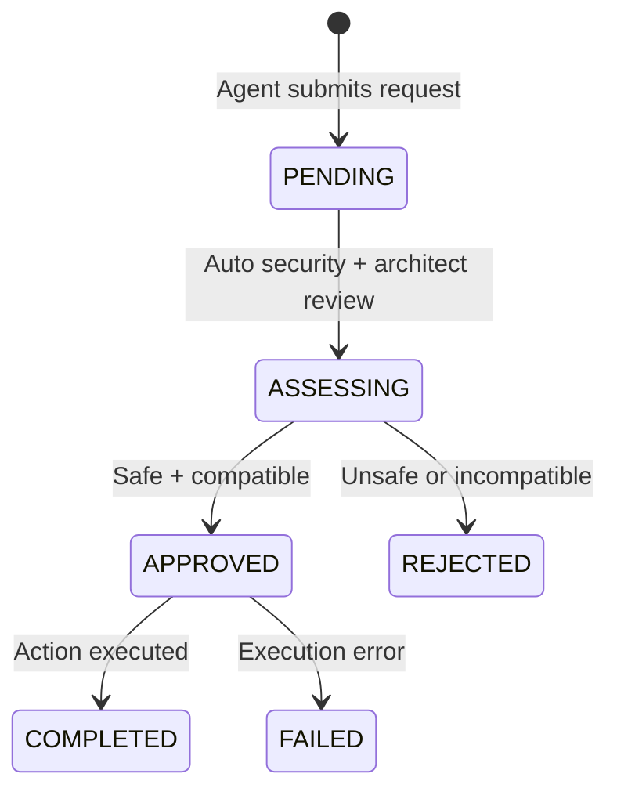

# Governance Requests

The governance system gates sensitive operations behind an approval workflow.

## How to Access

- **UI**: Navigate to **Governance** workspace
- **Automatic**: Triggered when an agent requests a restricted action

## When Governance Activates

Governance requests are created when agents attempt to:

- Install a new package
- Use a model not in the approved list
- Escalate permissions
- Access restricted resources
- Enable new features

## Workflow

### Request Types

| Type | Description | Auto-Approval? |
|------|-------------|----------------|
| `PACKAGE` | Install a Python/system package | If security assessment passes |
| `MODEL` | Use a new or restricted model | Admin review required |
| `PERMISSION` | Escalate tool access level | Admin review required |
| `FEATURE` | Enable a new system feature | Admin review required |
| `GROUNDING_WEB` | Grant internet/web search grounding access | Admin review required |
| `GROUNDING_DOCS` | Grant knowledge-base document grounding access | Admin review required |
| `OTHER` | Miscellaneous requests | Security assessment only |

### Assessment Process

1. **Security Assessment**: The security agent checks for known vulnerabilities, blocklisted packages, and risk factors
2. **Architect Review**: The architect agent checks compatibility with the current system
3. **Auto-Decision**: If both assessments pass, the request is auto-approved. If either flags a concern, it stays pending for admin review

## Viewing and Managing Requests

In the Governance workspace:

- **Pending**: Requests awaiting review
- **Approved**: Completed approvals
- **Rejected**: Declined requests with reasons

Admin users can add notes and manually approve or reject pending requests.

## Grounding Permission Requests

When you click a locked grounding toggle (🔒 Web or 🔒 Docs) in the chat toolbar, the system automatically submits a governance request of type `GROUNDING_WEB` or `GROUNDING_DOCS`. You do not need to fill in the form manually.

Once an admin approves the request, the permission is written instantly and the toggle becomes active on your next page load.

See [Grounding](grounding.md) for the complete user walkthrough.

## Related

- [Module: Governance](../modules/governance.md) — internal implementation
- [Architecture: Security Model](../architecture/security-model.md) — MAESTRO framework
- [API Reference: Governance](../developer-guide/api/governance.md) — REST endpoints

