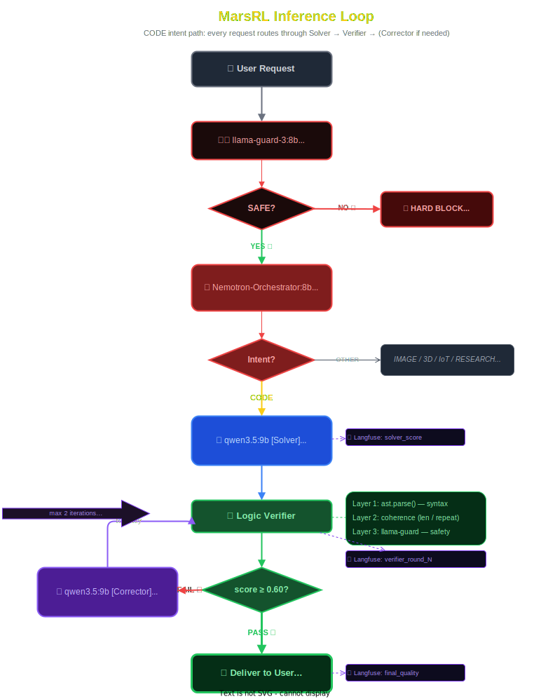

# Agentic Hive: Technical Architecture & Design Specification

## 1. Executive Summary

The **Agentic Hive** is a decentralized, multi-agent orchestration system designed for autonomy, creativity, and real-world interaction. Unlike monolithic LLM applications, the Hive employs a **Swarm Intelligence** architecture where specialized agents — bound by strict identity, security, and reinforcement-learning optimization protocols — collaborate to solve complex tasks.

**Current Version:** 4.0 (gemma4:31b + MarsRL)
**Core Innovation:** The Hive now uses an inference-time **MarsRL loop** (Solver → Verifier → Corrector) for all coding tasks, with Langfuse process-reward scoring at each step. This implements the methodology published in MarsRL (Nov 2025) and MiniMax Forge (Feb 2026) using `gemma4:31b` as the primary model.

---

## 2. Hardware & Network Topology

> [!NOTE]
> The system operates on a **three-node hybrid** architecture across dedicated hardware.

### 2.1 Node Specifications

| Node                                    | Role                          | Hardware                              | Key Services                                                            |
| --------------------------------------- | ----------------------------- | ------------------------------------- | ----------------------------------------------------------------------- |
| **Hopper** (192.168.2.102)              | Control Plane                 | x86 low-power                         | SPIRE, PostgreSQL, Langfuse, ClickHouse, Redis, MinIO                   |
| **Lovelace** (192.168.2.101)            | Heavy Inference + Generation  | Dual RTX 5060 Ti (32 GB VRAM), 32 GB RAM | Ollama (`gemma4:31b`, `qwen3.6:27b`, etc.), ComfyUI, Voice Services |
| **Turing** (192.168.2.103)              | Gateway + Agent Runtime       | **No GPU** (3070 Ti removed — CPU only) | Traefik, agent_runtime, hive_ui, Prometheus, Grafana, Loki, Redis      |

---

## 3. MarsRL Inference-Time Loop

### 3.1 Design Philosophy

The Hive rejects the "One Model Fits All" approach. It uses **role-specialized inference**:

- **gemma4:31b**: Primary model — reasoning, coding, planning, conversation (20 GB VRAM).
- **qwen3.6:27b**: Fallback / alternative large model (17.4 GB VRAM).
- **qwen2.5-coder:14b**: Specialist coding model.
- **llama-guard-3:8b**: Safety screening and content moderation (CPU on Turing).
- **church.py intent classifier**: Fast multi-agent routing and coordination (no separate LLM needed — deterministic keyword rules).

### 3.2 MarsRL Loop Flow

### 3.3 Verifier Layers

| Layer         | Check                                   | Failure Penalty | Hard Block? |
| ------------- | --------------------------------------- | --------------- | ----------- |
| 1 — AST Parse | Python syntax valid                     | -0.40 score     | No          |
| 2 — Coherence | Non-empty, no repetition, no truncation | -0.25 score     | No          |
| 3 — Safety    | llama-guard-3:8b content check          | score = 0.0     | **Yes**     |

Pass threshold: score ≥ 0.60

---

## 4. Agent Methodology

### 4.1 Specialized Agent Breakdown

#### A. The Solver / Corrector (gemma4:31b)

- **Model**: `gemma4:31b`
- **Role**: Primary MarsRL Solver for first-pass generation; Corrector for fixing failed outputs.
- **Context**: 128K tokens.
- **Fallback**: `qwen3.6:27b`

#### B. The Router / Orchestrator (church.py intent classifier)

- **Implementation**: Deterministic keyword rules in `agents/church.py`
- **Role**: Intent classification, multi-agent coordination (IMAGE / CODE / CHAT / etc.).
- **No separate LLM needed** — replaced nemotron-orchestrator with fast rule-based classifier.

#### C. The Safety Verifier (llama-guard-3:8b)

- **Role**: Content moderation, jailbreak detection, safety hard-blocking.

---

## 5. Diagnostic Tooling

### 7.1 Text Generation WebUI (Token Inspector)

**Profile**: `diagnostic`

- Investigating why Corrector produces a specific fix.
- Tuning system prompts.

---

**Version**: 4.0.0
**Status**: Production
**Date**: 2026-05-04

---

## Source References

<strong>Source of Truth — Canonical Files</strong> (click to expand)

| Source | Type | Relevance |
|--------|------|----------|
| `agents/main.py` | Implementation | FastAPI runtime, MarsRL endpoint |
| `agents/mars_loop.py` | Implementation | Solver → Verifier → Corrector pipeline |
| `agents/config.py` | Configuration | Model routing, node IPs |
| `agents/governance.py` | Implementation | MAESTRO compliance layer |
| `control_plane/docker-compose.yml` | Infrastructure | Control Plane services |
| `execution_plane/docker-compose.yml` | Infrastructure | Execution Plane services |
| `turing_gateway/docker-compose.yml` | Infrastructure | Gateway services |

<strong>Changelog</strong> (click to expand)

| Date | Author | Changes |
|------|--------|--------|
| 2026-05-04 | AI-Copilot | v4.0 — gemma4:31b as primary, dual RTX 5060 Ti (32 GB), Turing GPU removal, model registry, tiered VRAM queue, Hopper node name |
| 2026-04-16 | AI-Copilot | Added source references, changelog, maintenance guide, testing section |
| 2026-03-12 | AI-Copilot | v3.1 — Qwen 3.5 9B standardization, Dell Turing topology |

---

## Maintenance & Update Guide

- Update when the node topology changes (new nodes, IP changes).
- Update when the model lineup changes (new default model).
- Update architectural diagrams when new planes or services are added.

---

## Functionality Testing

| Claim | How to Verify |
|-------|---------------|
| MarsRL loop operational | POST to `/chat` with a complex prompt → verify Solver → Verifier → Corrector in Langfuse traces |
| 3-node connectivity | Ping all 3 node IPs from any node → verify reachability |
| All services running | `docker ps` on each node → verify expected containers |
