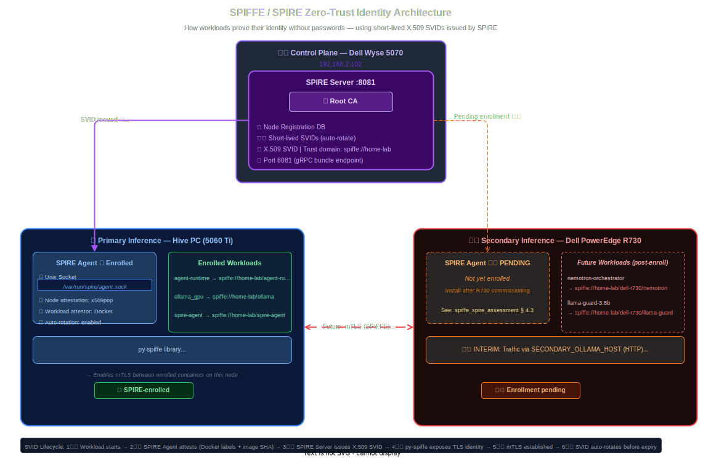

# MAESTRO Evaluation: Identity & Trust

## Canonical Standards

- [Identity and Token Trust Standard](../security/identity_token_trust_standard.md)
- [Key Lifecycle and Rotation Runbook](../security/key_lifecycle_rotation_runbook.md)
- [Multi-user Identity Scoping Standard](../security/multi_user_identity_scoping_standard.md)
- [Feature Control Traceability Matrix](feature_control_traceability_matrix.md)

**Component**: Agent Registry, RBAC & SPIFFE/SPIRE Workload Identity
**Date**: 2026-02-22 (updated 2026-03-17)
**Status**: ✅ Fully Compliant — JWT-ACE capability gating live; Gateway Node SPIRE enrollment pending

## 1. Component Description

The "Passport Control" of the Hive. It defines WHO agents are and WHAT they can do.

## 2. MAESTRO Layer Alignment

- **Layer 7 (Identity & Trust)**: Authentication, RBAC, and Reputation.

## 3. Compliance Evidence

### L7: Immutable Identity

- **Requirement**: "Every agent must have a verifiable ID."
- **Implementation**:
  - `AgentCard` class enforces `name`, `role`, `id`, and `capabilities`.
  - Registry is a global singleton loaded at startup (`agents/registry.py`).
  - Dynamically created/spawned agents are not supported (reducing risk).
- **Verification**: `agents/registry.py` architecture.

### L7: Role-Based Access Control (RBAC)

- **Requirement**: "Agents operate within specific capability boundaries."
- **Implementation**:
  - The `SecurityAgent` calls `validate_permission(agent, capability)`.
  - Example: `Art Director` has `image_gen.generate` but _not_ `file_ops.write`.
  - Example: `Architect` has `file_ops.write`.
- **Verification**: `agents/security_agent.py` permission check.

### L7: API Authentication (Identity Enforcement)

- **Requirement**: "External requests must have authenticated origin."
- **Implementation**:
  - `agent-runtime` checks `X-Swarm-Source` header against `VALID_API_KEYS`.
  - Requests without valid keys are rejected (HTTP 401).
  - Identity (`user` field) is overwritten by the system based on the key, preventing spoofing.
- **Verification**: `agents/main.py` middleware logic.

### L7: Workload Identity (SPIFFE)

> **Interactive diagram**: Open [`docs/architecture/spiffe_flow.drawio`](../architecture/spiffe_flow.drawio) for the full identity flow.
> Export as SVG → save as `docs/assets/spiffe_flow.drawio.svg`.

- **Requirement**: "Workloads must have cryptographically verifiable identity independent of the network."
- **Implementation**:
  - **SPIRE Server** (Control Node): Issues short-lived X.509 SVIDs to attested workloads.
  - **SPIRE Agent** (Hive PC): ✅ Enrolled — validates Docker labels + image SHA before delivering SVIDs.
  - **SPIRE Agent** (Gateway Node): ⚠️ Pending — must be enrolled after hardware commissioning.
  - **py-spiffe**: Agents fetch SVIDs from `unix:///var/run/spire/agent.sock`, enabling mTLS.
  - **SVIDs**: Short-lived (1 hour), auto-rotated. Trust domain: `spiffe://home-lab`.
- **Verification**: [identity_verification_2026-02-08.txt](../evidence/identity_verification_2026-02-08.txt)

### L7: JWT-ACE Capability Gating (Phase 5 — 2026-03-17)

- **Requirement**: "Per-request authorization tokens scoped to the minimum capabilities needed."
- **Implementation**:
  - JWT-ACE (JSON Web Token — Agent Capability Envelope) adds a short-lived, capability-scoped token layer on top of the existing API key and SPIFFE identity systems.
  - Tokens are issued per-request and carry an explicit list of allowed capabilities derived from the agent's intent.

| Control | Status | Evidence |
|---------|--------|----------|
| Per-request ephemeral tokens | ✅ Implemented | `agents/security/token_issuer.py` |
| Capability-based access control | ✅ Implemented | `agents/security/capability_gate.py` |
| Thread-local token propagation | ✅ Implemented | `agents/security/execution_context.py` |
| Intent-to-capability mapping | ✅ Implemented | `agents/intent_capabilities.py` |
| Token expiry enforcement | ✅ Implemented | 1-hour default TTL |
| SPIRE signing fallback | ✅ Implemented | HS256 primary, RS256 via SPIRE when available |
| Audit trail via Langfuse | ✅ Implemented | Token claims in trace metadata |
| Tool-level enforcement | ⚠️ Optional | Tools can validate but don't enforce by default |

- **Verification**: Token issuer unit tests; Langfuse trace metadata includes `jwt_sub`, `jwt_caps`, and `jwt_exp` fields for every instrumented request.

## 4. Residual Risks

- **Identity Spoofing (Internal)**: Since the Registry is in-memory Python, a compromised `main.py` could overwrite it. This is mitigated by L5 Container Isolation (immutable code volume in production), though currently we mount code for dev.
- **Tool-level enforcement opt-in**: JWT-ACE tokens are issued and propagated, but individual tools are not yet required to validate them. A compromised tool could bypass capability checks. Planned mitigation: make enforcement mandatory and fail-closed in a future phase.
- **HS256 shared secret**: The primary signing key is a symmetric secret (`JWT_SECRET`). If leaked, tokens can be forged. Mitigated by short TTL (1 hour) and planned migration to RS256-only via SPIRE once Gateway Node enrollment is complete.
