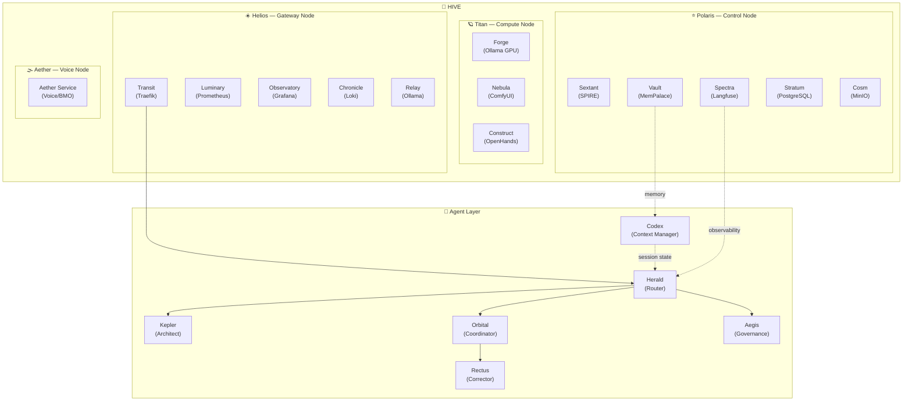
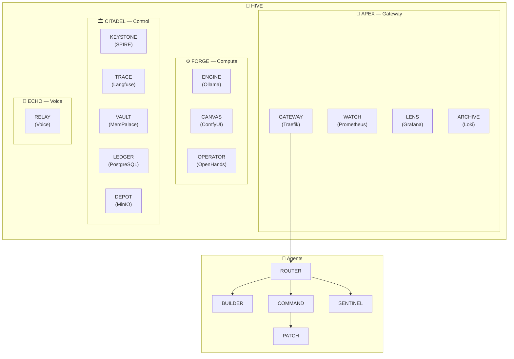

# Memex Ecosystem — Naming Scheme Options

**Date:** April 20, 2026  
**Status:** ✅ **DECIDED — Option G (Computing Pioneers) implemented on April 20, 2026**  
**Context:** Replacing informal node/service/agent names (R730, Justin-PC, Wyse 5070, BMO, etc.) with a consistent naming scheme across the full stack — env vars, docker-compose, Prometheus labels, Python source, and documentation.  
**Hive** stays as the top-level brand in all options.

---

## ✅ Final Selection: Option G — Computing Pioneers

> 25 names. Zero collisions. Every name earns its place.

### Nodes

| Physical Machine | Pioneer | Env Var | Why |
|---|---|---|---|
| R730 (Gateway) | **Turing** | `TURING_IP` | Defined the boundary of computation |
| Justin-PC (Compute) | **Lovelace** | `LOVELACE_IP` | The first programmer — where algorithms become output |
| Wyse 5070 (Control) | **Hopper** | `HOPPER_IP` | Invented the compiler, coined "debugging", the authority |
| Pi / BMO (Voice) | **Shannon** | `SHANNON_IP` | Founded information theory — signal vs. noise |

### Services

| Current Tool | Pioneer Name | Person | Why |
|---|---|---|---|
| Traefik | **babbage** | Charles Babbage | Original mechanical router |
| Prometheus | **jacquard** | Joseph Jacquard | First automated pattern detector |
| Grafana | **hollerith** | Herman Hollerith | Invented statistical tabulation |
| Loki | **knuth** | Donald Knuth | *TAOCP* — master log of all knowledge |
| Redis | **ritchie** | Dennis Ritchie | C/Unix — fast, foundational |
| ComfyUI | **wozniak** | Steve Wozniak | Made machines beautiful to use |
| Ollama (gateway) | **mccarthy** | John McCarthy | Coined "AI", built first inference systems |
| Ollama (compute) | **minsky** | Marvin Minsky | Society of Mind, deeper AI engine |
| OpenHands | **engelbart** | Douglas Engelbart | *Augmenting Human Intellect* |
| SPIRE | **diffie** | Whitfield Diffie | Public-key cryptography — identity and trust |
| Langfuse | **floyd** | Robert Floyd | Cycle detection — tracing what's really happening |
| MemPalace | **bush** | Vannevar Bush | Memex — associative knowledge retrieval |
| PostgreSQL | **codd** | Edgar Codd | Invented the relational model |
| MinIO | **backus** | John Backus | FORTRAN/BNF — structured, typed storage |

### Agents

| Python File | Pioneer | Person | Philosophy |
|---|---|---|---|
| church.py | **Church** | Alonzo Church | Church-Turing thesis — defines what is routable |
| leibniz_agent.py | **Leibniz** | Gottfried Leibniz | Universal calculus — formal architecture of reasoning |
| lamport.py | **Lamport** | Leslie Lamport | Paxos/Raft — distributed consensus |
| dijkstra_agent.py | **Dijkstra** | Edsger Dijkstra | Correctness: "Testing shows presence of bugs, never absence" |
| liskov.py | **Liskov** | Barbara Liskov | Substitution principle — what is and isn't allowed |
| brooks.py | **Brooks** | Fred Brooks | *No Silver Bullet* — managing complexity over time |
| kay_service.py | **Kay** | Alan Kay | Invented the personal computing experience |

---

## Pronunciation Reference

| Name | Pronunciation |
|---|---|
| Jacquard | zhah-**KAR** |
| Hollerith | **HOL**-er-ith |
| Leibniz | **LYEB**-nits |
| Dijkstra | **DIKE**-strah |
| Wozniak | **WOZ**-nee-ak |
| Engelbart | **ENG**-ul-bart |
| Lamport | **LAM**-port |
| Liskov | **LIZ**-kov |

---

*For the full brainstorm history (Options A–H), see below.*

---

## Brainstorm History

## Current State (Baseline)

| Layer | Current Name | Role |
|---|---|---|
| Node | R730 | Gateway, edge ingress, monitoring |
| Node | Justin-PC | GPU compute, AI inference, ComfyUI |
| Node | Wyse 5070 / Controle Node | Control plane, identity (SPIRE), observability |
| Node | Pi / BMO | Voice interface |
| Env var | `GATEWAY_NODE_IP` | R730 IP |
| Env var | `EXECUTION_NODE_IP` | Justin-PC IP |
| Env var | `CONTROL_NODE_IP` | Wyse IP |
| Agent | router.py | Request routing & intent classification |
| Agent | architect_agent.py | Code generation & planning |
| Agent | coordinator.py | Multi-worker orchestration |
| Agent | corrector_agent.py | Error correction |
| Agent | governance.py | Authorization & policy enforcement |
| Agent | context_manager.py | Session state management |
| Agent | buddy_service.py | Voice/ambient layer |

---

## Option A — Celestial Hierarchy ⭐ *Team Vote: Approved*

> Nodes named after stars/stellar objects by role. Agents named after astronomical figures. Clean theme with strong functional metaphors.

### Nodes

| Current | Option A | Rationale |
|---|---|---|
| R730 | **Helios** | The sun — visible edge, illuminates (monitors) everything |
| Justin-PC | **Titan** | Saturn's largest moon — massive gravitational pull, GPU powerhouse |
| Wyse 5070 | **Polaris** | The north star — fixed reference point, always at center |
| Pi / BMO | **Aether** | The ambient fifth element — pervasive, voice layer |

### Env Vars

| Current | Option A |
|---|---|
| `GATEWAY_NODE_IP` | `HELIOS_IP` |
| `EXECUTION_NODE_IP` | `TITAN_IP` |
| `CONTROL_NODE_IP` | `POLARIS_IP` |

### Services (docker-compose names)

| Current | Option A | Node |
|---|---|---|
| traefik | **transit** | Helios |
| prometheus | **luminary** | Helios |
| grafana | **observatory** | Helios |
| loki | **chronicle** | Helios |
| redis | **flux** | shared |
| ComfyUI | **nebula** | Titan |
| Ollama (gateway) | **relay** | Helios |
| Ollama (compute) | **forge** | Titan |
| OpenHands | **construct** | Titan |
| SPIRE | **sextant** | Polaris |
| Langfuse | **spectra** | Polaris |
| MemPalace | **vault** | Polaris |
| PostgreSQL | **stratum** | Polaris |
| MinIO | **cosm** | Polaris |

### Agents

| Current File | Option A Name | Display Name |
|---|---|---|
| router.py | **herald.py** | Herald |
| architect_agent.py | **kepler_agent.py** | Kepler |
| coordinator.py | **orbital.py** | Orbital |
| corrector_agent.py | **rectus_agent.py** | Rectus |
| governance.py | **aegis.py** | Aegis |
| context_manager.py | **codex.py** | Codex |
| buddy_service.py | **aether_service.py** | Aether |

### Topology Diagram (Option A)

---

## Option B — Installation Codenames

> Nodes named like classified facilities/installations. Services and agents use role-functional ALLCAPS codenames. Military/tech facility feel.

### Nodes

| Current | Option B | Rationale |
|---|---|---|
| R730 | **APEX** | Forward-facing, first contact |
| Justin-PC | **FORGE** | Where the work happens |
| Wyse 5070 | **CITADEL** | Authority, policy, identity |
| Pi / BMO | **ECHO** | Signal repeater |

### Env Vars

| Current | Option B |
|---|---|
| `GATEWAY_NODE_IP` | `APEX_IP` |
| `EXECUTION_NODE_IP` | `FORGE_IP` |
| `CONTROL_NODE_IP` | `CITADEL_IP` |

### Services

| Current | Option B |
|---|---|
| traefik | GATEWAY |
| prometheus | WATCH |
| grafana | LENS |
| loki | ARCHIVE |
| redis | CACHE |
| ComfyUI | CANVAS |
| Ollama (compute) | ENGINE |
| OpenHands | OPERATOR |
| SPIRE | KEYSTONE |
| Langfuse | TRACE |
| MemPalace | VAULT |
| PostgreSQL | LEDGER |
| MinIO | DEPOT |

### Agents

| Current | Option B |
|---|---|
| router.py | ROUTER |
| architect_agent.py | BUILDER |
| coordinator.py | COMMAND |
| corrector_agent.py | PATCH |
| governance.py | SENTINEL |
| context_manager.py | CACHE |
| buddy_service.py | RELAY |

### Topology Diagram (Option B)

---

## Option C — Greek / Norse Mythology

> Nodes named after deities matched to function. Rich semantic depth; some names are widely recognized in tech (Hermes, Prometheus already common).

> ⚠️ **Conflict:** Prometheus is already a well-known monitoring tool in the stack — naming a node "Prometheus" would clash with the service name.

### Nodes

| Current | Option C | Rationale |
|---|---|---|
| R730 | **Hermes** | Messenger, boundary crosser, guide |
| Justin-PC | **Hephaestus** (or **Vulcan**) | God of the forge — GPU/craft |
| Wyse 5070 | **Athena** | Wisdom, strategy, governance |
| Pi / BMO | **Apollo** | Voice, communication, the arts |

### Env Vars

| Current | Option C |
|---|---|
| `GATEWAY_NODE_IP` | `HERMES_IP` |
| `EXECUTION_NODE_IP` | `HEPHAESTUS_IP` |
| `CONTROL_NODE_IP` | `ATHENA_IP` |

### Services

| Current | Option C |
|---|---|
| traefik | charon (ferryman at boundaries) |
| prometheus | argus (hundred-eyed watcher) |
| grafana | iris (rainbow, messenger) |
| loki | mnemosyne (goddess of memory/records) |
| redis | hermes-cache |
| ComfyUI | muse |
| Ollama (compute) | prometheus (fire-giver) ⚠️ clash |
| OpenHands | daedalus |
| SPIRE | janus (two-faced, gatekeeper of identity) |
| Langfuse | oracle |
| MemPalace | lethe / mneme |
| PostgreSQL | styx (foundational, unchanging) |
| MinIO | aether-store |

### Agents

| Current | Option C |
|---|---|
| router.py | moirai.py (Fates — route destiny) |
| architect_agent.py | daedalus_agent.py |
| coordinator.py | zeus.py |
| corrector_agent.py | nemesis_agent.py |
| governance.py | themis.py (justice/order) |
| context_manager.py | mnemosyne.py ⚠️ clash with service |
| buddy_service.py | apollo_service.py |

### Notes / Risks

- Multiple name clashes (Prometheus service vs node concept, Mnemosyne service vs agent)
- Long names (Hephaestus) create awkward env vars (`HEPHAESTUS_IP`)
- Strong recognizability in engineering culture
- Requires a myth glossary for onboarding

---

## Option D — Abstract Tiers (Infrastructure-Style)

> Hierarchical, no mythology. Clean for technical documentation and new team members. No external cultural references to learn.

### Nodes

| Current | Option D | Rationale |
|---|---|---|
| R730 | **VANTAGE** | At the boundary, high vantage point |
| Justin-PC | **CORE** | Raw compute at center |
| Wyse 5070 | **LOCUS** | The fixed point of control |
| Pi / BMO | **RELAY** | Signal repeater |

### Env Vars

| Current | Option D |
|---|---|
| `GATEWAY_NODE_IP` | `VANTAGE_IP` |
| `EXECUTION_NODE_IP` | `CORE_IP` |
| `CONTROL_NODE_IP` | `LOCUS_IP` |

### Services

| Current | Option D |
|---|---|
| traefik | edge-proxy |
| prometheus | metrics |
| grafana | dashboards |
| loki | logs |
| redis | cache |
| ComfyUI | image-gen |
| Ollama (compute) | inference |
| OpenHands | workbench |
| SPIRE | identity |
| Langfuse | traces |
| MemPalace | memory |
| PostgreSQL | db |
| MinIO | storage |

### Agents

| Current | Option D |
|---|---|
| router.py | herald.py |
| architect_agent.py | builder_agent.py |
| coordinator.py | arbiter.py |
| corrector_agent.py | corrector_agent.py (unchanged) |
| governance.py | guardian.py |
| context_manager.py | context_manager.py (unchanged) |
| buddy_service.py | voice_service.py |

### Notes

- Most approachable for new engineers — self-documenting names
- Less memorable / distinguishable (CORE, LOCUS are generic)
- Service names risk clashing with k8s/cloud naming conventions
- Weakest team identity / brand feel

---

## Comparison Matrix

| Criterion | A — Celestial | B — Codenames | C — Mythology | D — Abstract |
|---|:---:|:---:|:---:|:---:|
| Memorability | ⭐⭐⭐⭐⭐ | ⭐⭐⭐⭐ | ⭐⭐⭐⭐ | ⭐⭐ |
| Functional clarity | ⭐⭐⭐⭐ | ⭐⭐⭐ | ⭐⭐⭐ | ⭐⭐⭐⭐⭐ |
| Onboarding ease | ⭐⭐⭐⭐ | ⭐⭐⭐ | ⭐⭐ | ⭐⭐⭐⭐⭐ |
| Brand identity | ⭐⭐⭐⭐⭐ | ⭐⭐⭐⭐ | ⭐⭐⭐⭐⭐ | ⭐⭐ |
| Name clashes (fewer = better) | ⭐⭐⭐⭐⭐ | ⭐⭐⭐⭐ | ⭐⭐ | ⭐⭐⭐ |
| Env var ergonomics | ⭐⭐⭐⭐⭐ | ⭐⭐⭐⭐ | ⭐⭐ | ⭐⭐⭐⭐ |
| Implementation risk | Low | Low | High | Low |

---

## Implementation Impact (All Options)

Regardless of which option is chosen, the following files require changes:

| Category | Files | Estimated Changes |
|---|---|---|
| Core config | `network.env`, `agents/config.py`, `docs-site/mkdocs.yml` | ~40 |
| Docker Compose | `turing_gateway/`, `execution_plane/`, `control_plane/` | ~80 |
| Prometheus | `config/prometheus/prometheus.yml` | ~15 |
| Agent files | 7 Python files renamed + all imports updated | ~60 |
| Agent code | `agents/main.py`, inference, grpc, mempalace | ~70 |
| Documentation | `docs-site/docs/`, `topology.md`, `port_map.md`, `README.md` | ~200 |
| **Total** | **~85–100 files** | **~400–500 replacements** |

> ✅ `turing_gateway/` — directory renamed from `r730_gateway/` (April 20, 2026).

---

*Generated: April 20, 2026 — Hive v3.4*
