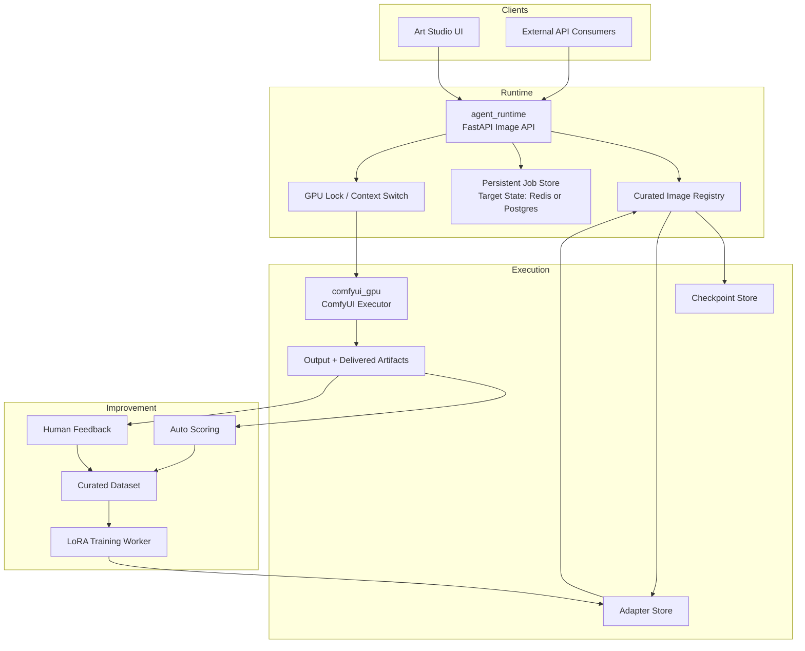
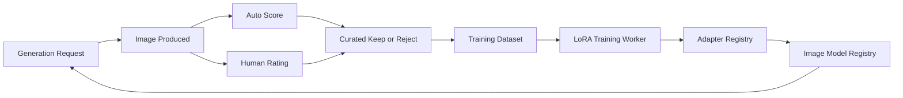

# Image Generation Hive Guide

**Status**: Active design and implementation guide  
**Audience**: Operators, builders, and future maintainers of Art Studio  
**Last Updated**: 2026-04-18

---

## 1. Purpose

This guide defines how image generation should work inside the Hive so it is:

- powerful enough to use the best available image models
- accurate enough to favor prompt fidelity and task-fit over raw speed
- trainable over time through adapters and curated feedback loops
- operationally safe inside the existing multi-service GPU environment

This is not a generic diffusion guide. It is the functional design for the Hive image subsystem.

---

## 2. Current Runtime State

### What runs today

- FastAPI endpoint: `/v1/art/generate/image`
- Backend implementation: `agents/specialized/image_gen.py`
- Runtime host: `agent_runtime`
- Image executor: `comfyui_gpu`
- Current live checkpoint inventory: `v15PrunedEmaonly_v15PrunedEmaonly.safetensors`
- Current effective family: SD1.5

### What changed in this iteration

- Added a curated image model registry above raw ComfyUI checkpoints
- Added profile-based selection so clients can ask for a capability, not just a filename
- Preserved direct checkpoint selection for compatibility
- Added resolved model metadata so artifacts record the actual selected checkpoint
- Added Redis-backed art job persistence with API-compatible status polling
- Added a dedicated image LoRA worker service with queue-backed run planning
- Added image training endpoints for queued plan-only or trainer-command-based runs

### Why this matters

Raw checkpoint names are not a stable product API. The Hive should expose image capabilities and styles, while keeping ComfyUI as the execution engine underneath.

---

## 3. Model Strategy

The Hive should use a layered image strategy instead of a single checkpoint.

### Recommended profile tiers

| Profile | Role | Best Use | Trainable | Notes |
|--------|------|----------|-----------|-------|
| `auto` | Adaptive selector | Normal client default | No | Picks best available curated profile |
| `flux-dev-quality` | Quality-first | High fidelity, photoreal, prompt adherence | Yes | Strongest target when available |
| `flux-schnell-preview` | Fast ideation | Quick prompt iteration | Yes | Lower latency than quality path |
| `sdxl-general` | Balanced quality | General artwork, scenes, stronger composition | Yes | Best practical fallback for a modern default |
| `sdxl-turbo-preview` | Fast preview | Cheap preview renders | Yes | Good for UI-side iteration |
| `sd15-fast-legacy` | Compatibility | 3D bootstrap, older workflows, emergency fallback | Yes | Keep for compatibility, not as end-state default |

### Operational recommendation

- Keep SD1.5 only as a legacy and 3D bootstrap path
- Prefer SDXL as the near-term practical default if FLUX is not yet installed
- Add FLUX as the quality ceiling once the checkpoint and inference cost are acceptable
- Train adapters, not full base checkpoints

---

## 4. Functional Flow

### Runtime request flow

```mermaid
flowchart LR
    A[Client or UI] --> B[FastAPI /v1/art/generate/image]
    B --> C[Curated Model Registry]
    C --> D[Resolved Profile]
    D --> E[Resolved Checkpoint]
    E --> F[ComfyUI Prompt Builder]
    F --> G[ComfyUI GPU Executor]
    G --> H[Generated Image]
    H --> I[Structural Verification]
    I --> J[Semantic Verification]
    J --> K[Artifact Delivery]
    K --> L[Metadata Sidecar]
```

### What each layer does

1. API receives the prompt and requested profile.
2. Registry resolves that profile to the best available checkpoint.
3. Backend builds a ComfyUI prompt using model-appropriate defaults.
4. ComfyUI executes the workflow on the image GPU.
5. Backend verifies the output structurally and semantically.
6. Final artifact is copied into `delivered_artifacts` with metadata.

---

## 5. Visual Architecture

### Service topology

### Design rule

ComfyUI is the execution backend, not the product contract. The Hive contract is the curated registry plus job lifecycle plus training loop.

---

## 6. Training Over Time

The Hive should improve image quality through adapter training, not by repeatedly swapping base checkpoints.

### Training approach

- base model remains stable
- adapters capture house style, character consistency, product-photo format, 3D-friendly layout, and other domain traits
- feedback determines which generations become training data

### Recommended training method

- primary method: LoRA or LyCORIS
- training worker: separate dedicated container or service
- deployment artifact: versioned adapter plus metadata

### Training flywheel

### What to store for each sample

- prompt
- negative prompt
- seed
- width and height
- resolved profile
- resolved checkpoint
- workflow name
- output path
- automated scores
- user feedback label

---

## 7. Implementation Phases

### Phase 1: Curated inference layer

- expose curated image profiles through the API
- resolve profiles to raw checkpoints internally
- record resolved checkpoint metadata on artifacts

Status: implemented

### Phase 2: Persistent jobs

- move image jobs from in-memory state to Redis or Postgres
- survive backend restarts
- expose richer job lifecycle and timing data

Status: implemented with Redis-backed art job records and memory fallback

### Phase 3: GPU-aware scheduling

- route image generation through the existing GPU lock
- coordinate image, text, and training workloads cleanly

Status: pending

### Phase 4: Training worker

- add dedicated image training service for LoRA or LyCORIS
- register adapters and rollout policies

Status: partially implemented
Current worker behavior: prepares dataset manifests, resolves the selected base profile to a checkpoint, writes a training plan, and can execute a trainer command when `IMAGE_LORA_TRAINER_COMMAND` is configured

### Phase 5: Closed-loop optimization

- add scoring, user preference capture, and dataset curation
- retrain adapters on approved data

Status: pending

---

## 8. Active API Surface

### Catalog and generation

- `GET /v1/art/models`
- `GET /api/v1/media/comfyui/checkpoints`
- `POST /v1/art/generate/image`
- `GET /v1/art/jobs/{job_id}`

### Image training

- `POST /api/v1/media/training/image-lora`
- `GET /api/v1/media/training/image-lora/{run_id}`

Image training runs currently support plan-only execution by default. When the worker is given an `IMAGE_LORA_TRAINER_COMMAND`, it can progress from dataset planning into actual trainer execution.

---

## 9. Immediate Operational Guidance

### If only SD1.5 is installed

- use `sd15-fast-legacy`
- do not treat it as the long-term quality default
- prioritize adding SDXL before adding training complexity

### If SDXL is installed

- make `sdxl-general` the preferred quality profile
- use `sdxl-turbo-preview` for rapid iteration

### If FLUX is installed

- use `flux-dev-quality` as the highest-fidelity path
- use `flux-schnell-preview` for ideation

---

## 10. Success Criteria

The Hive image subsystem is in the right state when:

- clients request stable profile IDs instead of raw checkpoint filenames
- image jobs survive restarts
- resolved model metadata is visible for every artifact
- training produces versioned adapters instead of base-model drift
- feedback affects future generations through curated retraining

---

## 11. Source References

- `agents/specialized/image_gen.py`
- `agents/main.py`
- `agents/media_job_store.py`
- `agents/training/image_lora_worker.py`
- `agents/utils/gpu_queue.py`
- `agents/workspace_paths.py`
- `execution_plane/docker-compose.yml`
