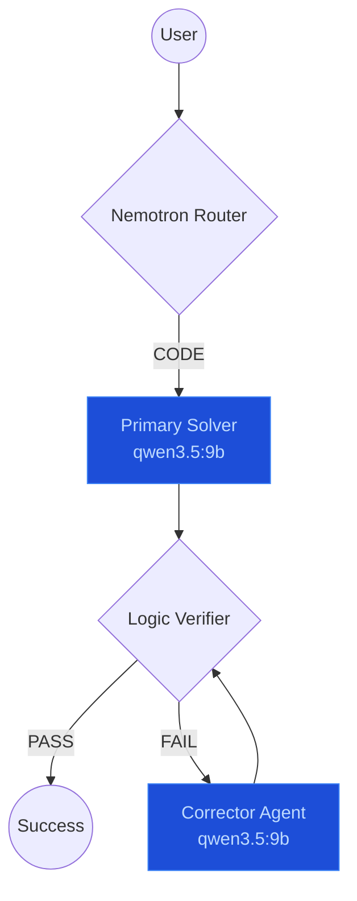

# Home AI Lab: Agentic Hive

A distributed, multi-agent "Swarm Intelligence" system for home automation, coding, and creative tasks.

## 🚀 MarsRL Inference Loop

The Hive uses a **Solver → Verifier → Corrector** loop for high-speed, self-correcting code generation.

## 🏗️ Hardware Topology (3 Nodes)

The Hive scales across dedicated hardware to match the right model to the right workload.

- **Dell Wyse 5070 (Control Plane)**: SPIRE, PostgreSQL, Langfuse, ClickHouse.
- **R730 Server (Primary Gateway)**: `nemotron-orchestrator:8b` (Routing) + `llama-guard-3:8b` (Safety) + `qwen3.5:9b` (Inference).
- **Justin-PC (Heavy Inference)**: RTX 5060 Ti (16GB) — `qwen3.5:9b` (Secondary Solver) + ComfyUI.

### VRAM Optimization
- **High context/Primary tasks**: `qwen3.5:9b` is handled by the R730 or Justin-PC depending on current load.
- **Why separate?** Frees Justin-PC's RTX 5060 Ti from routing overhead, dedicating resources to heavy inference and generative art.

## 🛡️ Security & Identity (MAESTRO)
- **SPIFFE/SPIRE**: Zero-trust workload identity for all inter-agent communication.
- **Output Validation**: 3-layer Verifier (Python AST + Coherence + Safety).
- **Auditability**: Full Langfuse traces with process-reward scores for every response.

---
_Version 3.1 | 2026-03-12 | Qwen 3.5 Standard_
