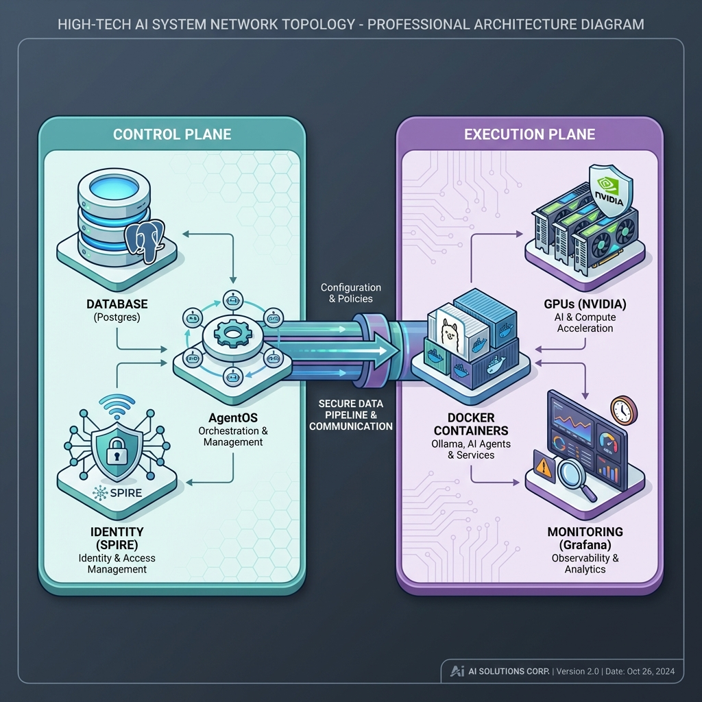
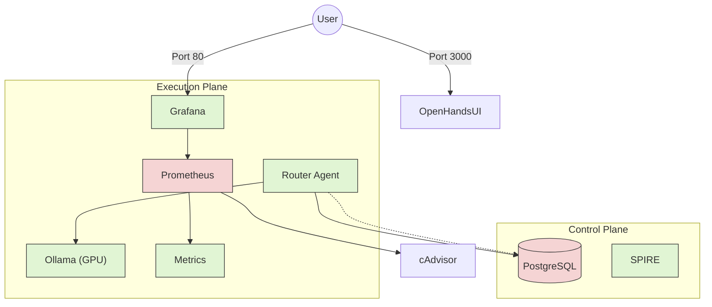

# AI Home Lab: Distributed Agent Swarm

This project contains the configuration and source code for a local, privacy-focused AI Lab using a **Functional Swarm** architecture.

## Architecture

The system is designed to run on a split-compute infrastructure:

### 1. Control Plane (Dell Wyse 5070)
- **Role**: Swarm Controller, Memory Store.
- **Stack**: Docker, Agno AgentOS, PostgreSQL.
- **Task**: Hosts the state and routes high-level instructions.

### 2. Execution Plane (Main PC - "Justin-PC")
- **Role**: Heavy Inference, Logic Validation, & **Observability**.
- **Stack**: Docker (WSL2), Ollama, OpenHands, **Prometheus, Grafana**.
- **Isolation**: Fully containerized environment. Agents run in Docker, and code execution is sandboxed.
- **Hardware Allocation**:
    - **Primary GPU (RTX 5060 Ti - 16GB)**: `qwen2.5-coder:14b` (Architect Agent).
    - **Secondary GPU (RTX 3070 Ti - 8GB)**: `llama-guard-3:8b` (Security/Validator Agent).
- **System Memory**: 32GB (Bottleneck Mitigation via distributed offloading).

### 3. Networking & Ports
The Swarm uses the following internal ports:
- **11434**: Ollama API (Inference).
- **3000**: OpenHands UI/API (Sandbox) & Grafana Dashboard (Port 80 mapped).
- **5432**: PostgreSQL (Agent Memory on Control Plane).
- **9090**: Prometheus (Metrics).

### 4. Accessing the Ecosystem
- **Dashboard (Grafana)**: `http://localhost/` (Running on Main PC)
- **Workbench (OpenHands)**: `http://localhost:3000/`
- **API (Ollama)**: `http://localhost:11434/`

*Tip: Use **Tailscale** to access these via consistent hostnames (e.g., `http://dell-control-plane`) regardless of network changes.*

## Structure

- `/control_plane`: Docker Compose files for the Dell Wyse node.
- `/execution_plane`: Docker Compose setup for the Main PC (Ollama + Agents).
- `/agents`: Python source code for the Agno (Phidata) agents.

## Getting Started

1. **Setup Control Plane**: Copy `control_plane` to the Dell Wyse and run `docker-compose up -d`.
2. **Setup Execution Plane**: Ensure Docker Desktop & WSL2 are installed. Run `docker-compose up -d` in `execution_plane`.
3. **Launch Swarm**: The agents will auto-start within the container. Monitor logs with `docker logs -f agent-runtime`.
