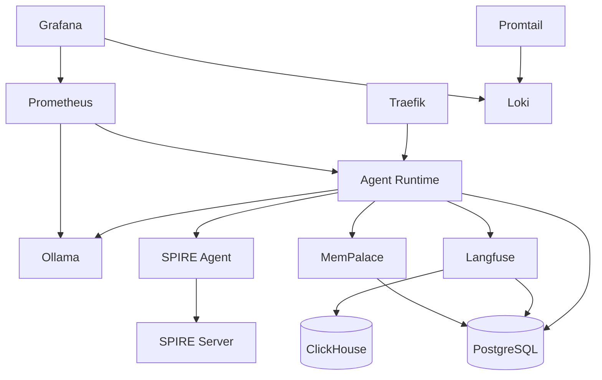

# Docker Compose Files

Each node has its own `docker-compose.yml` defining the services that run on that node.

## File Locations

| Node | File | Services |
|------|------|----------|
| Control | `control_plane/docker-compose.yml` | SPIRE Server, PostgreSQL, Langfuse, ClickHouse, MemPalace, MinIO, Redis |
| Execution | `execution_plane/docker-compose.yml` | SPIRE Agent, Ollama, Agent Runtime, ComfyUI, Voice Engine, BMO, OpenHands |
| Gateway | `r730_gateway/docker-compose.yml` | SPIRE Agent, Traefik, Prometheus, Grafana, Loki, Promtail, AlertManager, Ollama, Redis, Docs Site |

## Common Patterns

### GPU Access

Services needing GPU access use the NVIDIA runtime:

```yaml
services:
  ollama:
    deploy:
      resources:
        reservations:
          devices:
            - driver: nvidia
              count: all
              capabilities: [gpu]
```

### Volume Mounts

Persistent data uses named volumes:

```yaml
volumes:
  ollama_data:
  workspace_data:
  postgres_data:
```

### Network Configuration

```yaml
networks:
  ai_lab_net:
    external: true
  internal:
    driver: bridge
```

### Environment File

All compose files reference the shared `network.env`:

```bash
docker compose --env-file ../network.env up -d
```

Or in the compose file:

```yaml
services:
  agent-runtime:
    env_file:
      - ../network.env
```

## Service Dependencies



## Useful Commands

```bash
# Start all services on a node
docker compose --env-file ../network.env up -d

# View logs for a service
docker compose logs -f agent-runtime

# Restart a single service
docker compose restart agent-runtime

# Rebuild after code changes
docker compose build --no-cache agent-runtime
docker compose up -d agent-runtime

# Stop all services
docker compose down

# Stop and remove volumes (DESTRUCTIVE)
docker compose down -v
```

## Related

- [Configuration: Environment](environment.md) — variable reference
- [Architecture: Topology](../../architecture/topology.md) — node layout
