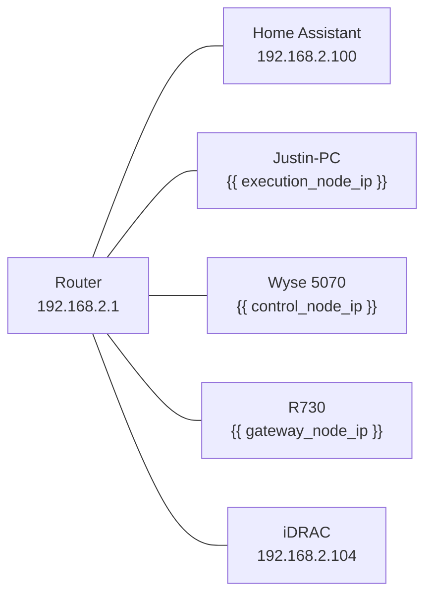

# Networking

Network topology, DNS, remote access, and firewall configuration.

## LAN Layout



All nodes sit on a single flat 192.168.2.0/24 subnet.

## Static IP Assignments

| Node | IP | MAC (example) |
|------|-----|---------------|
| Home Assistant | 192.168.2.100 | (DHCP reservation) |
| Justin-PC (Exec) | {{ execution_node_ip }} | (DHCP reservation) |
| Wyse 5070 (Ctrl) | {{ control_node_ip }} | (DHCP reservation) |
| R730 (Gateway) | {{ gateway_node_ip }} | (DHCP reservation) |
| iDRAC | 192.168.2.104 | (static) |

!!! tip "DHCP Reservations"
    Configure IP reservations in your router instead of static IPs on each host. This keeps network config centralized.

## Docker Networks

Each node uses Docker Compose networks. Cross-node communication uses host IPs.

| Network | Node | Purpose |
|---------|------|---------|
| `ai_lab_net` | Gateway | Traefik ↔ local services |
| `saltbox` | Gateway | Shared with Saltbox media stack |
| `control_net` | Control | Internal control plane services |
| `exec_net` | Execution | Internal execution plane services |

## Remote Access (Tailscale)

Tailscale provides encrypted remote access without port forwarding.

| Property | Value |
|----------|-------|
| **Tailnet DNS** | `*.tail*.ts.net` |
| **Enabled Nodes** | R730, Justin-PC |
| **MagicDNS** | Enabled |

Access services remotely:

```
http://r730.tail12345.ts.net/swarm/v1/chat/completions
http://r730.tail12345.ts.net/grafana
```

!!! info "Tailscale Setup"
    Install Tailscale on nodes that need remote access. No router port forwarding needed.

## Firewall Rules

### Required Ports Between Nodes

| Source | Destination | Port | Protocol | Purpose |
|--------|-------------|------|----------|---------|
| Gateway | Execution | {{ agent_runtime_port }} | TCP | Agent Runtime |
| Gateway | Execution | {{ ollama_port }} | TCP | Ollama |
| Gateway | Execution | 8188 | TCP | ComfyUI |
| Execution | Control | 8081 | TCP | SPIRE |
| Execution | Control | 5432 | TCP | PostgreSQL |
| Execution | Control | 3000 | TCP | Langfuse |
| Execution | Control | 8200 | TCP | MemPalace |
| Gateway | Control | 5432 | TCP | PostgreSQL (Grafana) |
| All | Gateway | 80, 443 | TCP | Traefik |

### External Access

Only the Gateway node exposes ports externally (via Tailscale or LAN):

| Port | Service | Access |
|------|---------|--------|
| 80 | Traefik HTTP | LAN + Tailscale |
| 443 | Traefik HTTPS | LAN + Tailscale |
| 8080 | Traefik Dashboard | LAN only |

## DNS

No custom DNS required. Services reference each other by IP address in `network.env`. Local names are resolved via:

- Docker internal DNS (within compose networks)
- Tailscale MagicDNS (for remote access)
- `/etc/hosts` entries (optional, for convenience)

## Related

- [Architecture: Topology](../../architecture/topology.md) — physical layout details
- [Reference: Port Map](../port-map.md) — complete port registry
- [Troubleshooting: Network](../../troubleshooting/network.md) — connectivity issues
