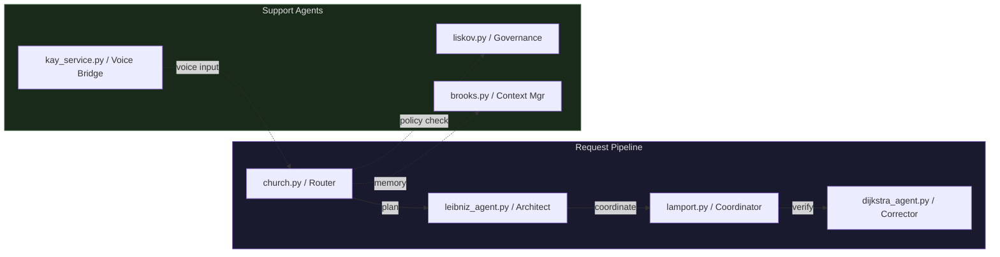

# Pioneer Naming Scheme

All infrastructure components use names from Computing Pioneers. Named projects (MemPalace, ComfyUI, etc.) retain their original names; the Pioneer container name is used as the operational handle.

> **Adopted:** April 20, 2026

---

## Node Overview

---

## Nodes

| Pioneer | Former Name | Role | IP | Env Var |
|---------|-------------|------|----|---------|
| **Turing** | R730 | Gateway · Monitoring · Reverse Proxy | `192.168.2.103` | `TURING_IP` |
| **Lovelace** | Justin-PC | Compute · GPU · AI Inference | `192.168.2.101` | `LOVELACE_IP` |
| **Hopper** | Wyse 5070 | Control Plane · Orchestration | `192.168.2.102` | `HOPPER_IP` |
| **BMO** | Pi / BMO | Voice · IoT · Edge | `192.168.2.106` | `BMO_IP` |

---

## Containers by Node

### Turing

| Pioneer Name | Tool | Purpose |
|---|---|---|
| `babbage` | Traefik | Reverse proxy / TLS termination |
| `jacquard` | Prometheus | Metrics collection |
| `hollerith` | Grafana | Metrics visualization |
| `knuth` | Loki | Log aggregation |
| `mccarthy` | Ollama (gateway) | LLM request routing |
| `diffie` | SPIRE agent | Identity attestation |

### Lovelace

| Pioneer Name | Tool | Purpose |
|---|---|---|
| `minsky` | Ollama (compute) | GPU-backed LLM inference |
| `wozniak` | ComfyUI | Image/video generation |
| `engelbart` | OpenHands | AI coding agent |

### Hopper

| Pioneer Name | Tool | Purpose |
|---|---|---|
| `diffie` | SPIRE server | SPIFFE identity authority |
| `floyd` | Langfuse | LLM observability/tracing |
| `bush` | MemPalace | Vector memory store |
| `codd` | PostgreSQL | Relational database |
| `backus` | MinIO | Object storage |
| `ritchie` | Redis | Message bus / cache |

---

## Agent Modules

| File | Pioneer | Role |
|---|---|---|
| `agents/church.py` | Alonzo Church | Router — intent dispatch |
| `agents/leibniz_agent.py` | Gottfried Leibniz | Architect — task planning |
| `agents/lamport.py` | Leslie Lamport | Coordinator — multi-agent sync |
| `agents/dijkstra_agent.py` | Edsger Dijkstra | Corrector — output validation |
| `agents/liskov.py` | Barbara Liskov | Governance — policy enforcement |
| `agents/brooks.py` | Fred Brooks | Context Manager — memory window |
| `agents/kay_service.py` | Alan Kay | Kay Service — voice/UI bridge |

---

## Naming Rules

| Category | Rule | Example |
|---|---|---|
| Physical nodes | Pioneer name only | `deploy to Turing`, `SSH into Hopper` |
| Containers | Pioneer name only | `check jacquard metrics`, `restart bush` |
| Named projects | Original name + Pioneer ref | `MemPalace (bush)`, `ComfyUI (wozniak)` |
| Env vars | Pioneer prefix + `_IP` / `_HOST` | `HOPPER_IP`, `TURING_HOST` |
| Agent files | Pioneer last name | `church.py`, `liskov.py` |

---

## Former → Current Quick Reference

| Old Name | Pioneer Name | Type |
|---|---|---|
| R730 | Turing | Node |
| Justin-PC | Lovelace | Node |
| Wyse 5070 / Controle Node | Hopper | Node |
| Pi / BMO | BMO *(retained)* | Node |
| `r730_gateway/` | `turing_gateway/` | Directory |
| traefik | babbage | Container |
| prometheus | jacquard | Container |
| grafana | hollerith | Container |
| loki | knuth | Container |
| redis | ritchie | Container |
| ollama (gateway) | mccarthy | Container |
| ollama (compute) | minsky | Container |
| ComfyUI container | wozniak | Container |
| OpenHands container | engelbart | Container |
| SPIRE | diffie | Container |
| Langfuse | floyd | Container |
| MemPalace container | bush | Container |
| postgres container | codd | Container |
| minio container | backus | Container |
| router.py / herald.py | church.py | Agent |
| architect_agent.py | leibniz_agent.py | Agent |
| coordinator.py | lamport.py | Agent |
| corrector_agent.py | dijkstra_agent.py | Agent |
| governance.py / aegis.py | liskov.py | Agent |
| context_manager.py / codex.py | brooks.py | Agent |
| buddy_service.py | kay_service.py | Agent |
