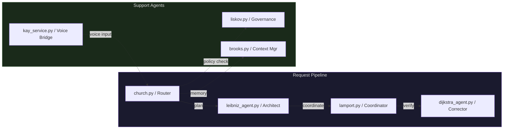

# Pioneer Naming Scheme

Pioneer names apply to the **4 physical nodes** and **externally-facing services** only. Internal infrastructure services use their canonical tool names.

> **Adopted:** April 20, 2026 · **Scoped down to nodes + external services:** April 22, 2026 — the original scheme below applied pioneer names to every container; it was narrowed two days later so internal tools stay recognizable by their real names, and only the nodes plus a couple of externally-facing services (`babbage`/Traefik, `hollerith`/Grafana) keep pioneer handles.

---

## Node Overview

```mermaid
graph TB
    subgraph TURING["Turing — 192.168.2.103"]
        direction TB
        T_role["Gateway · Monitoring · Proxy"]
        babbage["babbage / Traefik"]
        hollerith["hollerith / Grafana"]
        prometheus["prometheus"]
        loki["loki"]
        ollama_t["ollama / gateway"]
        spire_agent["spire-agent"]
        redis_t["redis"]
    end

    subgraph LOVELACE["Lovelace — 192.168.2.101"]
        direction TB
        L_role["Compute · GPU · AI Inference"]
        ollama_l["ollama / compute"]
        comfyui["comfyui"]
        openhands["openhands"]
    end

    subgraph HOPPER["Hopper — 192.168.2.102"]
        direction TB
        H_role["Control Plane · Orchestration"]
        spire_server["spire-server"]
        langfuse["langfuse-web"]
        mempalace["mempalace"]
        postgres["postgres"]
        minio["minio"]
        redis_h["redis"]
    end

    subgraph BMO["BMO — 192.168.2.106"]
        direction TB
        B_role["Voice · IoT · Edge"]
    end

    style TURING fill:#2a1040,stroke:#8855cc,color:#ddd
    style LOVELACE fill:#0a2840,stroke:#3388cc,color:#ddd
    style HOPPER fill:#0a3020,stroke:#33aa66,color:#ddd
    style BMO fill:#3a1a00,stroke:#cc7733,color:#ddd
```

---

## Nodes

| Pioneer | Former Name | Role | IP | Env Var |
|---------|-------------|------|----|---------|
| **Turing** | R730 | Gateway · Monitoring · Reverse Proxy | `192.168.2.103` | `TURING_IP` |
| **Lovelace** | Justin-PC | Compute · GPU · AI Inference | `192.168.2.101` | `LOVELACE_IP` |
| **Hopper** | Wyse 5070 / Controle Node | Control Plane · Orchestration | `192.168.2.102` | `HOPPER_IP` |
| **BMO** | Pi / BMO *(name retained — separate project)* | Voice · IoT · Edge | `192.168.2.106` | `BMO_IP` |

---

## Services by Node

### Turing (Gateway/Monitoring)

**Externally-facing — Pioneer names:**

| Container | Tool | Purpose |
|---|---|---|
| `babbage` | Traefik | Reverse proxy / TLS termination (managed by Saltbox) |
| `hollerith` | Grafana | Metrics visualization |
| `hive-ui` | Hive UI (Next.js) | Memex unified interface |

**Internal — tool names:**

| Container | Tool | Purpose |
|---|---|---|
| `prometheus` | Prometheus | Metrics collection |
| `loki` | Loki | Log aggregation |
| `ollama` | Ollama (gateway) | LLM request routing (Turing GPU) |
| `spire-agent` | SPIRE agent | Identity attestation |
| `redis` | Redis | Message bus / cache |

### Lovelace (Compute/GPU) — tool names

| Container | Tool | Purpose |
|---|---|---|
| `ollama` | Ollama (compute) | GPU-backed LLM inference |
| `comfyui` | ComfyUI | Image/video generation |
| `openhands` | OpenHands | AI coding agent |

### Hopper (Control Plane) — tool names

| Container | Tool | Purpose |
|---|---|---|
| `spire-server` | SPIRE server | SPIFFE identity authority |
| `langfuse-web` | Langfuse | LLM observability/tracing |
| `mempalace` | MemPalace | Vector memory store |
| `postgres` | PostgreSQL | Relational database |
| `minio` | MinIO | Object storage |
| `redis` | Redis | Message bus / cache |

---

## Agent Modules

```mermaid
graph LR
    subgraph PIPELINE["Request Pipeline"]
        church["church.py / Router"]
        leibniz["leibniz_agent.py / Architect"]
        lamport["lamport.py / Coordinator"]
        dijkstra["dijkstra_agent.py / Corrector"]
    end

    subgraph SUPPORT["Support Agents"]
        liskov["liskov.py / Governance"]
        brooks["brooks.py / Context Mgr"]
        kay["kay_service.py / Voice Bridge"]
    end

    church -->|plan| leibniz
    leibniz -->|coordinate| lamport
    lamport -->|verify| dijkstra
    church -.->|policy check| liskov
    church -.->|memory| brooks
    kay -.->|voice input| church

    style PIPELINE fill:#1a1a2e,stroke:#6644aa,color:#ddd
    style SUPPORT fill:#1a2a1a,stroke:#446644,color:#ddd
```

| File | Pioneer | Role |
|---|---|---|
| `agents/church.py` | Alonzo Church | Router — intent dispatch |
| `agents/leibniz_agent.py` | Gottfried Leibniz | Architect — task planning |
| `agents/lamport.py` | Leslie Lamport | Coordinator — multi-agent sync |
| `agents/dijkstra_agent.py` | Edsger Dijkstra | Corrector — output validation |
| `agents/liskov.py` | Barbara Liskov | Governance — policy enforcement |
| `agents/brooks.py` | Fred Brooks | Context Manager — memory window |
| `agents/kay_service.py` | Alan Kay | Kay Service — voice/UI bridge |

---

## Naming Rules

| Category | Rule | Example |
|---|---|---|
| Physical nodes | Pioneer name only | `deploy to Turing`, `SSH into Hopper` |
| Externally-facing services | Pioneer name | `hollerith` (Grafana), `babbage` (Traefik) |
| Internal infrastructure | Tool / product name | `prometheus`, `loki`, `redis`, `postgres` |
| Named AI projects | Project name | MemPalace, ComfyUI, OpenHands |
| Env vars | Pioneer prefix for nodes | `TURING_IP`, `HOPPER_IP` |
| Agent files | Pioneer last name | `church.py`, `liskov.py` |

---

## Former → Current Quick Reference

| Old Name | Current Name | Type |
|---|---|---|
| R730 | Turing | Node |
| Justin-PC | Lovelace | Node |
| Wyse 5070 / Controle Node | Hopper | Node |
| Pi / BMO | BMO *(name retained — separate project, consumes Memex services)* | Node |
| `r730_gateway/` | `turing_gateway/` | Directory |
| babbage | babbage | Container (Traefik — kept, external) |
| hollerith | hollerith | Container (Grafana — kept, external) |
| jacquard *(original scheme, retired 2026-04-22)* | prometheus | Container |
| knuth *(original scheme, retired 2026-04-22)* | loki | Container |
| ritchie *(original scheme, retired 2026-04-22)* | redis | Container |
| mccarthy *(original scheme, retired 2026-04-22)* | ollama | Container |
| minsky *(original scheme, retired 2026-04-22)* | ollama | Container |
| wozniak *(original scheme, retired 2026-04-22)* | comfyui | Container |
| engelbart *(original scheme, retired 2026-04-22)* | openhands | Container |
| diffie *(original scheme, retired 2026-04-22)* | spire-server / spire-agent | Container |
| floyd *(original scheme, retired 2026-04-22)* | langfuse-web / langfuse-worker | Container |
| bush *(original scheme, retired 2026-04-22)* | mempalace | Container |
| codd *(original scheme, retired 2026-04-22)* | postgres | Container |
| backus *(original scheme, retired 2026-04-22)* | minio | Container |
| router.py / herald.py | church.py | Agent |
| architect_agent.py / kepler_agent.py | leibniz_agent.py | Agent |
| coordinator.py / orbital.py | lamport.py | Agent |
| corrector_agent.py / rectus_agent.py | dijkstra_agent.py | Agent |
| governance.py / aegis.py | liskov.py | Agent |
| context_manager.py / codex.py | brooks.py | Agent |
| buddy_service.py / aether_service.py | kay_service.py | Agent |
