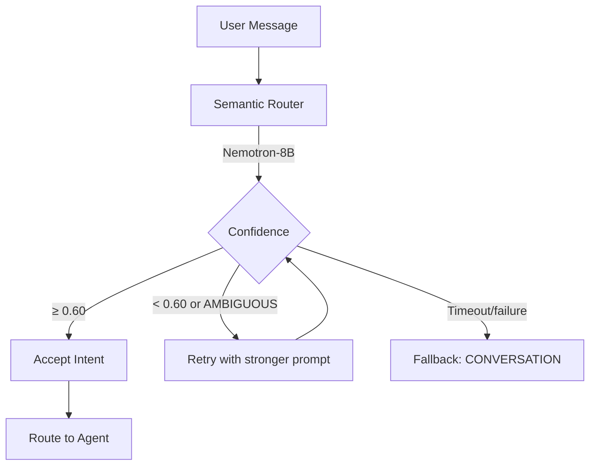
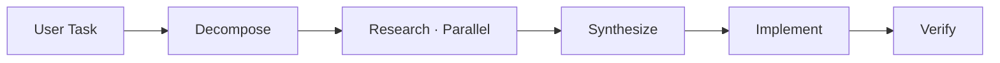
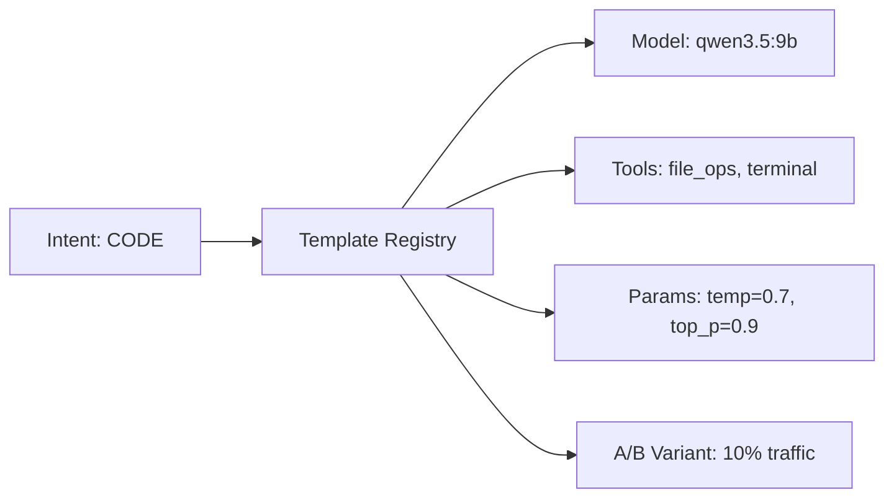

# Agent System

How Agent Swarm classifies user intent, selects the right agent, and orchestrates complex tasks.

## Semantic Router

The router is the "frontal cortex" of the system. It uses {{ router_model }} to classify every user message into one of 14 intents.

### Intent Categories

| Intent | Description | Routes To |
|--------|-------------|-----------|
| `CONVERSATION` | Chat, questions, small talk | MarsRL Loop |
| `CODE` | Programming, debugging, scripts | MarsRL Loop |
| `DEVOPS` | Docker, CI/CD, Linux | MarsRL Loop |
| `DATA` | SQL, analytics, CSV, stats | MarsRL Loop |
| `IMAGE` | 2D art, photos, illustrations | Image Agent → ComfyUI |
| `3D` | 3D models, meshes, geometry | 3D Pipeline |
| `ACTION_FIGURE` | Posable figure design | Action Figure Agent |
| `RESEARCH` | Deep analysis, comparison | Coordinator |
| `DOCUMENTATION` | Writing, reformatting, summaries | MarsRL Loop |
| `TRAIN` | Teaching preferences / rules | Memory System |
| `IOT_CONTROL` | Smart home device control | IoT Agent → Home Assistant |
| `IOT_DEV` | Firmware, circuits, MQTT | IoT Dev Agent |
| `VISION` | Analyzing images | Vision Agent (Moondream) |
| `COORDINATE` | Complex multi-step tasks | Coordinator |

### Classification Flow



### Router Output

```json
{
    "intent": "CODE",
    "confidence": 0.92,
    "reasoning": "User requested a Python function implementation",
    "disambiguation_question": null
}
```

## Agent Roles

### Core Agents

| Agent | File | Model | Purpose |
|-------|------|-------|---------|
| **Solver / Architect** | `architect_agent.py` | {{ solver_model }} | Primary response generation |
| **Verifier** | `verifier_agent.py` | Multi-layer | Output validation |
| **Corrector** | `corrector_agent.py` | {{ solver_model }} | Error correction |
| **Security Agent** | `security_agent.py` | — | Command safety, blocklist enforcement |

### Specialized Agents

| Agent | File | Purpose |
|-------|------|---------|
| **Image Gen** | `specialized/image_gen.py` | ComfyUI pipeline orchestration |
| **BMO Agent** | `specialized/bmo_agent.py` | BMO character voice personality |
| **IoT Agent** | `specialized/iot_agent.py` | Home Assistant device control |
| **Voice Assistant** | `specialized/voice_assistant.py` | Voice interaction handler |
| **Action Figure** | `specialized/action_figure_agent.py` | Articulated figure design |
| **Forge Agent** | `specialized/forge_agent.py` | 3D model reconstruction |

## Coordinator

The Coordinator handles `COORDINATE` and `RESEARCH` intents by orchestrating multiple agents in parallel.

### Phases



| Phase | Description |
|-------|-------------|
| **Decompose** | LLM breaks the task into subtasks |
| **Research** | Parallel workers investigate unknowns |
| **Synthesize** | Merge findings into a coherent plan |
| **Implement** | Execute the plan with appropriate agents |
| **Verify** | Fresh worker validates the results |

### Worker Roles

```python
# Role → Agent mapping
"architect" → Architect Agent
"coder"     → Architect Agent  
"devops"    → Architect Agent
"analyst"   → Data Analyst Agent
"researcher"→ Research Worker
"verifier"  → Verification Worker
```

Workers communicate via a shared scratchpad (filesystem-based) for intermediate artifacts.

## ExpertiseTemplate System

The template registry controls which model, parameters, and tools are used for each intent:



Templates support:

- **Default models** per intent
- **A/B testing** with percentage-based traffic splitting
- **Version tracking** for rollback
- **Parameter overrides** per template

## Key Files

| File | Purpose |
|------|---------|
| `agents/semantic_router.py` | Intent classification using Nemotron |
| `agents/router.py` | Request handling, token issuance, agent dispatch |
| `agents/coordinator.py` | Multi-worker orchestration |
| `agents/mars_loop.py` | MarsRL verification pipeline |
| `agents/expertise/template_registry.py` | Model/parameter resolution |
| `agents/intent_capabilities.py` | Intent → capability mapping |

## Related

- [Architecture: Data Flow](data-flow.md) — full request lifecycle
- [Architecture: MarsRL](marsrl.md) — quality verification details
- [Module: Router](../modules/router.md) — implementation reference
- [Module: Coordinator](../modules/coordinator.md) — orchestration details
- [Developer Guide: Adding Agents](../developer-guide/adding-agents.md) — create new agents


