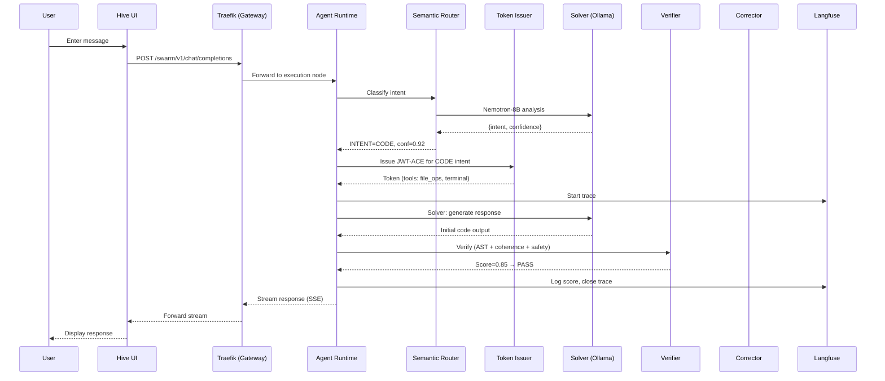
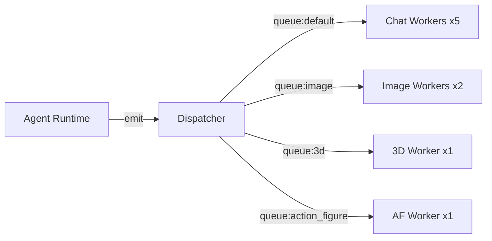

# Data Flow

How a request travels from user input to final response.

## Full Request Lifecycle



## Phase Breakdown

### 1. Request Ingress

The Hive UI sends a `POST /swarm/v1/chat/completions` request to the Traefik reverse proxy on the Gateway node. Traefik routes requests matching `/swarm/*` to the Agent Runtime on the Execution node.

### 2. Intent Classification

The Semantic Router uses {{ router_model }} to classify the user's message into one of 14 intent categories. The classification includes:

- **Intent**: The category (CODE, IMAGE, CONVERSATION, etc.)
- **Confidence**: 0.0–1.0 score
- **Reasoning**: Short explanation of why this intent was chosen

If confidence is below 0.60 or the intent is `AMBIGUOUS`, the router retries with stronger prompts or falls back to `CONVERSATION`.

### 3. Token Issuance

The Token Issuer generates a JWT-ACE ephemeral capability token scoped to the intent. The token encodes:

- Allowed tools (e.g., `file_ops`, `terminal` for CODE intent)
- Security level (L1–L7)
- Expiration time
- Session ID and owner ID

### 4. Agent Execution

Depending on the intent, the request is dispatched to the appropriate agent:

| Intent | Agent | Pipeline |
|--------|-------|----------|
| CODE, CONVERSATION, DEVOPS, DATA | MarsRL Loop | Solver → Verifier → Corrector |
| IMAGE | Image Agent | ComfyUI pipeline |
| 3D, ACTION_FIGURE | 3D Pipeline | Concept art → mesh reconstruction |
| COORDINATE | Coordinator | Decompose → Research → Synthesize → Implement |
| IOT_CONTROL | IoT Agent | Home Assistant API calls |
| VISION | Vision Agent | VLM (Moondream) image analysis |

### 5. MarsRL Verification

For coding and conversation requests, the MarsRL loop runs:

1. **Solver** generates the initial response using {{ solver_model }}
2. **Verifier** checks: AST syntax → coherence → safety (llama-guard-3)
3. If score < 0.60, the **Corrector** rewrites (up to 2 iterations)
4. Each step is traced in Langfuse with process-reward scores

### 6. Response Streaming

The response streams back as Server-Sent Events through the same path:

```
Agent Runtime → Traefik → Hive UI
```

Event types: `status` (progress updates), `thought` (reasoning), `response` (content), `tool_call` (tool invocations), `error`.

## Event Bus (Dispatcher)

For async tasks (image generation, 3D rendering), the Dispatcher queues events into Redis-backed queues:



Queue concurrency limits prevent GPU memory exhaustion.

## Related

- [Architecture: MarsRL](marsrl.md) — verification loop details
- [Architecture: Agent System](agent-system.md) — agent roles and routing
- [Module: Router](../modules/router.md) — semantic routing internals
- [Module: Dispatcher](../modules/dispatcher.md) — event bus details
