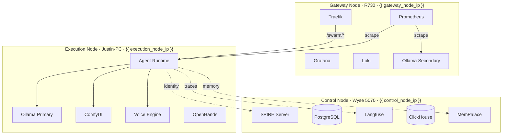

# Architecture

Technical design documentation for the Agent Swarm system.

## Sections

| Section | Description |
|---------|-------------|
| [Topology](topology.md) | Physical 3-node layout, hardware, network |
| [Data Flow](data-flow.md) | Request lifecycle from user input to response |
| [MarsRL Loop](marsrl.md) | Inference-time quality verification |
| [Security Model](security-model.md) | SPIFFE/SPIRE, JWT-ACE, MAESTRO |
| [Agent System](agent-system.md) | Agent roles, routing, intent classification |
| [Memory System](memory-system.md) | Persistent knowledge, preferences, MemPalace |
| [Observability](observability.md) | Prometheus, Grafana, Langfuse, Loki |
| [Architecture Decisions](decisions/index.md) | ADR index and records |
