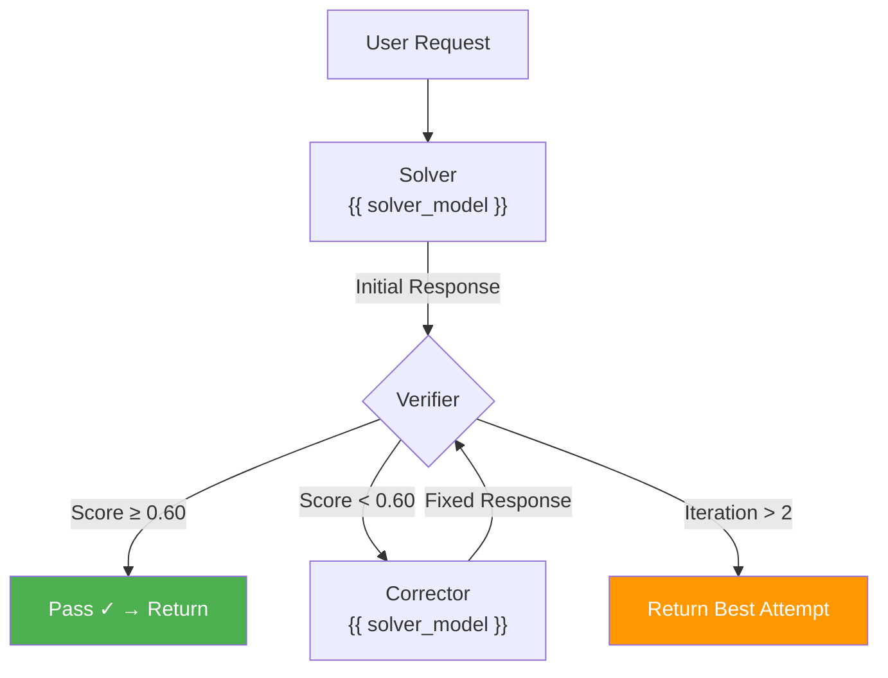

---
title: MarsRL Loop
---

# MarsRL Loop

MarsRL (Mars Reinforcement Learning) is the inference-time quality verification loop at the core of Agent Swarm. It implements a Solver → Verifier → Corrector pipeline that catches and fixes errors before they reach the user.

## Design



## Roles

| Role | Model | Purpose |
|------|-------|---------|
| **Solver** | {{ solver_model }} | Generate the initial response |
| **Verifier** | Multi-layer (AST + Coherence + llama-guard-3) | Validate correctness and safety |
| **Corrector** | {{ solver_model }} | Fix problems identified by the Verifier |

## Verifier Layers

The Verifier runs three sequential checks. Each adds or subtracts from the score:

| Layer | Check | Score Impact | Hard Block? |
|-------|-------|-------------|-------------|
| **1. AST Parse** | Python syntax validity via `ast.parse()` | −0.40 if invalid | No |
| **2. Coherence** | Non-empty output, no repetition loops | −0.25 if failed | No |
| **3. Safety** | Content safety via {{ verifier_model }} | Score → 0.0 | **Yes** |

### Scoring

- Starting score: **1.0**
- Pass threshold: **≥ 0.60**
- Maximum correction iterations: **2**
- Safety failure: Hard block, score forced to 0.0

### VerifierResult

```python
@dataclass
class VerifierResult:
    passed: bool      # True if score ≥ 0.60
    reason: str       # Failure explanation (if failed)
    score: float      # 0.0 – 1.0
```

## Key Files

| File | Purpose |
|------|---------|
| `agents/mars_loop.py` | `MarsRLLoop` class — orchestrates the Solver → Verifier → Corrector cycle |
| `agents/verifier_agent.py` | Verifier implementation — AST, coherence, safety checks |
| `agents/corrector_agent.py` | Corrector implementation — rewrites failed responses |
| `agents/architect_agent.py` | Solver/Architect agent — generates initial responses |

## Configuration

| Parameter | Value | Description |
|-----------|-------|-------------|
| `max_iter` | 2 | Maximum correction loops |
| `pass_threshold` | 0.60 | Minimum score to pass |
| `stream_timeout` | 60.0s | Timeout for solver/corrector generation |

## MarsLoopResult

Every invocation returns a structured result:

```python
@dataclass
class MarsLoopResult:
    response: str                # Final response text
    iterations: int              # How many solver/corrector rounds ran
    solver_score: float          # 1.0 if passed first try
    corrector_invoked: bool      # True if corrector was needed
    final_score: float           # Verifier's final score
    trace_id: Optional[str]      # Langfuse trace ID
    token: Optional[str]         # JWT-ACE token used
    template_metadata: dict      # Template version info
    metadata: dict               # Additional context
```

## Langfuse Tracing

Every MarsRL invocation is traced in Langfuse:

- **Trace**: One per user request
- **Spans**: Solver generation, Verifier check, Corrector (if invoked)
- **Scores**: Process-reward scores at each step
- **Metadata**: Intent, model, template version, token scope

Access traces at `http://{{ hopper_ip }}:3000`.

## When MarsRL Applies

MarsRL runs for:

- `CODE` intent — full AST + coherence + safety verification
- `CONVERSATION` intent — coherence + safety verification (AST skipped for non-code)
- `DEVOPS`, `DATA`, `DOCUMENTATION` — coherence + safety

MarsRL does **not** run for:

- `IMAGE`, `3D`, `ACTION_FIGURE` — routed to creative pipelines
- `IOT_CONTROL` — routed directly to Home Assistant tools
- `VISION` — routed to VLM

## Related

- [Architecture: Data Flow](data-flow.md) — where MarsRL fits in the request lifecycle
- [Getting Started: Concepts](../getting-started/concepts.md) — simplified explanation
- [Module: MarsRL Loop](../modules/mars-loop.md) — implementation reference
- [Decision: ADR-004 MarsRL](decisions/adr-004-marsrl.md) — design rationale


