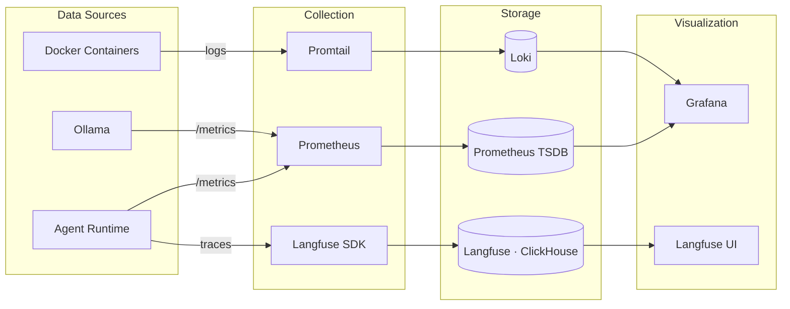

# Observability

Agent Swarm uses a multi-layer observability stack: Langfuse for LLM tracing, Prometheus + Grafana for metrics, and Loki for centralized logging.

## Stack Overview



## Langfuse — LLM Tracing

Langfuse provides end-to-end tracing for every LLM interaction.

| Property | Value |
|----------|-------|
| **URL** | `http://{{ control_node_ip }}:3000` |
| **Backend** | ClickHouse + PostgreSQL |
| **Node** | Control Plane |

### What's Traced

Every MarsRL invocation creates a Langfuse trace containing:

- **Trace**: One per user request (session, intent, model)
- **Spans**: Solver generation, Verifier checks, Corrector fixes
- **Scores**: Process-reward scores (0.0–1.0) at each step
- **Metadata**: Intent, template version, token scope, iteration count

### Accessing Traces

1. Open Langfuse at `http://{{ control_node_ip }}:3000`
2. Navigate to **Traces**
3. Filter by session ID, model, or score

## Prometheus — Metrics

Time-series metrics collected via scraping.

| Property | Value |
|----------|-------|
| **URL** | `http://{{ gateway_node_ip }}:9091` |
| **Retention** | 90 days |
| **Scrape Interval** | 15 seconds |
| **Node** | Gateway |

### Scrape Targets

| Target | Endpoint | Metrics |
|--------|----------|---------|
| Agent Runtime | `{{ execution_node_ip }}:{{ agent_runtime_port }}/metrics` | Request counts, latency, agent state |
| cAdvisor (Justin) | `{{ execution_node_ip }}:8081/metrics` | Container CPU, memory, network |
| cAdvisor (R730) | Internal :8080/metrics | Container resources |
| Ollama | `{{ ollama_port }}/metrics` | Model load times, inference counts |

### Key Metrics

| Metric | Type | Description |
|--------|------|-------------|
| `agent_state` | Gauge | Current agent activity state |
| `workflow_steps_total` | Counter | Workflow step completions |
| `capability_gating_events_total` | Counter | Capability gate allow/deny |
| `http_requests_total` | Counter | API request count by endpoint |
| `http_request_duration_seconds` | Histogram | Request latency distribution |

## Grafana — Dashboards

| Property | Value |
|----------|-------|
| **URL** | `http://{{ gateway_node_ip }}:3001` |
| **Auth** | admin / (configured) |
| **Node** | Gateway |

Pre-built dashboards cover:

- **System Overview**: Node health, container status, resource usage
- **Agent Performance**: Request throughput, MarsRL scores, intent distribution
- **GPU Utilization**: VRAM usage, model loading, inference times
- **Alerts**: Active alert status and history

## Loki — Logs

Centralized log aggregation via Promtail.

| Property | Value |
|----------|-------|
| **URL** | `http://{{ gateway_node_ip }}:3100` |
| **Node** | Gateway |
| **Sources** | All Docker containers across all nodes |

### Querying Logs

In Grafana, use the Loki data source with LogQL:

```logql
{container_name="agent-runtime"} |= "error"
{container_name=~"ollama.*"} | json | level="error"
```

## AlertManager

| Property | Value |
|----------|-------|
| **URL** | `http://{{ gateway_node_ip }}:9093` |
| **Notifications** | Email (SMTP) + ntfy push |

Alert routing: Prometheus → AlertManager → Email + ntfy.

## Key Files

| File | Purpose |
|------|---------|
| `agents/metrics.py` | Prometheus metric definitions |
| `agents/logger_setup.py` | Logging configuration |
| `r730_gateway/config/prometheus/prometheus.yml` | Scrape configuration |
| `r730_gateway/config/alertmanager/alertmanager.yml` | Alert routing |
| `r730_gateway/config/loki/loki-config.yml` | Loki storage configuration |

## Related

- [Admin: Monitoring](../admin-guide/operations/monitoring.md) — dashboard setup
- [Admin: Configure Alerting](../procedures/configure-alerting.md) — alert configuration
- [Module: Langfuse Service](../modules/services/langfuse.md) — service details
