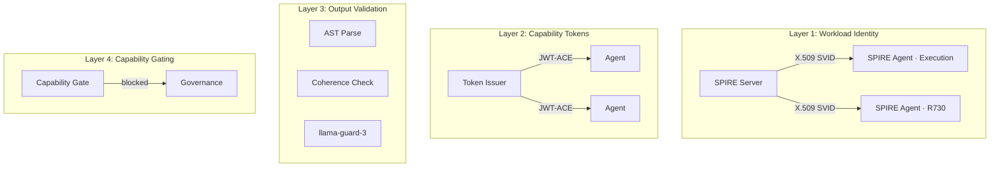
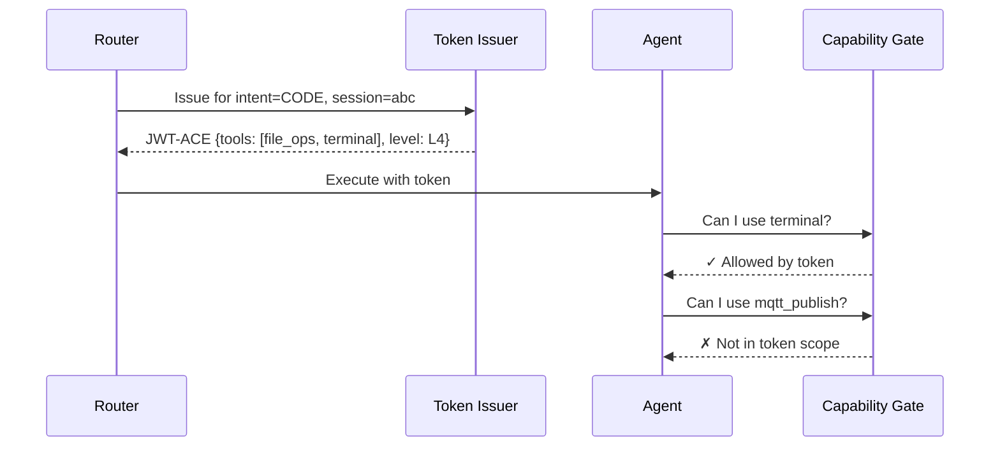

# Security Model

Agent Swarm implements a defense-in-depth security architecture using SPIFFE/SPIRE for workload identity, JWT-ACE for per-request capability tokens, and the MAESTRO framework for layered security controls.

## Overview



## SPIFFE / SPIRE

Every service in Agent Swarm has a cryptographic identity.

### How It Works

1. **SPIRE Server** (Control Node, port 8081) is the certificate authority
2. **SPIRE Agents** run on Execution and Gateway nodes
3. Each workload receives an **X.509 SVID** (SPIFFE Verifiable Identity Document)
4. Services authenticate via **mutual TLS** — no passwords or API keys needed

### Trust Domain

```
spiffe://home-ai-lab
```

### SPIFFE IDs

| Workload | SPIFFE ID |
|----------|-----------|
| Execution Node | `spiffe://home-ai-lab/execution-node` |
| Gateway Node | `spiffe://home-ai-lab/r730-gateway` |
| Agent Runtime | `spiffe://home-ai-lab/agent-runtime` |

### Configuration

- SPIRE Server: `control_plane/config/spire/server.conf`
- SPIRE Agent (Execution): `execution_plane/config/spire/agent.conf`
- SPIRE Agent (Gateway): `r730_gateway/config/spire/agent.conf`
- Key Manager: `disk` (keys persist across restarts)

!!! warning "Join Tokens"
    SPIRE join tokens are one-time use. Generate a fresh token from the Control Plane before each agent start.

## JWT-ACE Tokens

Per-request ephemeral capability tokens that scope what each agent can do.

### Token Lifecycle



### Token Contents

| Claim | Description |
|-------|-------------|
| `intent` | The classified intent (CODE, IMAGE, etc.) |
| `tools` | List of allowed tool names |
| `level` | Security level (L1–L7) |
| `session_id` | Conversation session identifier |
| `owner_id` | User identity |
| `exp` | Expiration timestamp |

### Security Levels

| Level | Description | Example Intents |
|-------|-------------|-----------------|
| L1 | Read-only, minimal access | CONVERSATION |
| L2 | Standard user operations | CODE, RESEARCH |
| L3 | Tool execution allowed | DEVOPS, DATA |
| L4 | File system access | CODE with dev_mode |
| L5 | Network operations | IOT_CONTROL |
| L6 | System-level operations | COORDINATE |
| L7 | Full administrative access | Admin-only |

## MAESTRO Framework

The MAESTRO framework defines 7 security layers. Agent Swarm is 98% compliant.

| Layer | Domain | Status |
|-------|--------|--------|
| **L1** | Asset Inventory | ✅ Complete — all services cataloged |
| **L2** | Threat Modeling | ✅ Complete — attack surfaces documented |
| **L3** | Access Control | ✅ Complete — SPIFFE + JWT-ACE |
| **L4** | Input Validation | ✅ Complete — schema validation on all endpoints |
| **L5** | Output Validation | ✅ Complete — MarsRL 3-layer verifier |
| **L6** | Active Defense | ✅ Complete — security agent, command blocklist |
| **L7** | Monitoring | ✅ Complete — Langfuse traces, Prometheus alerts |

## Authorization Middleware

The `authorization_middleware.py` enforces security on every request:

- **Public routes**: `/`, `/v1/models`, `/log` — no auth required
- **Protected routes**: All others — SPIFFE authentication required
- **Socket path**: `unix:///var/run/spire/agent.sock`

### Command Blocklist

The security agent maintains a blocklist of dangerous commands:

- `rm -rf /`, `mkfs`, `dd if=/dev/zero` — filesystem destruction
- `curl | bash`, `wget | sh` — arbitrary code execution
- `chmod 777`, `chown root` — permission escalation

Blocked commands trigger a governance request instead of execution.

## Audit Logging

All security-relevant events are logged:

- Token issuance and validation
- Capability gate decisions (allow/deny)
- Governance request submissions
- Security agent blocks
- SPIFFE attestation events

Logs flow to Loki for aggregation and Langfuse for trace correlation.

## Key Files

| File | Purpose |
|------|---------|
| `agents/security/spiffe_auth.py` | SPIFFE workload authentication |
| `agents/security/token_issuer.py` | JWT-ACE token generation |
| `agents/security/capability_gate.py` | Per-tool access control |
| `agents/security/authorization_middleware.py` | FastAPI middleware |
| `agents/security/execution_context.py` | Request-scoped token context |
| `agents/security/audit_logger.py` | Security event logging |
| `agents/security_agent.py` | Active defense agent |

## Related

- [Getting Started: Concepts](../getting-started/concepts.md#spiffe--spire) — simplified explanation
- [Admin: SPIRE Configuration](../admin-guide/configuration/spire.md) — setup details
- [Procedure: Rotate SPIRE Keys](../procedures/rotate-spire-keys.md) — key rotation runbook
- [Decision: ADR-001 JWT Profiles](decisions/adr-001-jwt-profiles.md)
- [Troubleshooting: SPIRE](../troubleshooting/spire.md)
