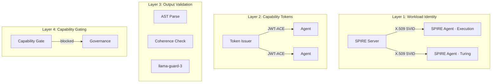
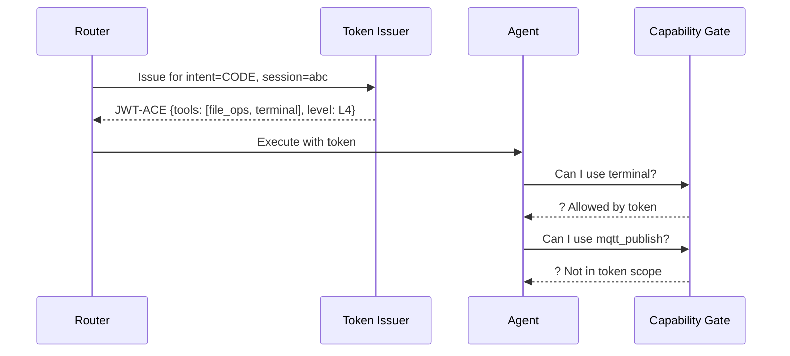

# Security Model

Memex implements a defense-in-depth security architecture using SPIFFE/SPIRE for workload identity, JWT-ACE for per-request capability tokens, and the MAESTRO framework for layered security controls.

## Overview


```mermaid
graph TB
    subgraph Identity["Layer 1: Workload Identity"]
        SPIRE[SPIRE Server]
        SA1[SPIRE Agent · Execution]
        SA2[SPIRE Agent · Turing]
        SPIRE -->|X.509 SVID| SA1
        SPIRE -->|X.509 SVID| SA2
    end

    subgraph Tokens["Layer 2: Capability Tokens"]
        TI[Token Issuer]
        TI -->|JWT-ACE| Agent1[Agent]
        TI -->|JWT-ACE| Agent2[Agent]
    end

    subgraph Validation["Layer 3: Output Validation"]
        V1[AST Parse]
        V2[Coherence Check]
        V3[llama-guard-3]
    end

    subgraph Gating["Layer 4: Capability Gating"]
        CG[Capability Gate]
        GOV[Governance]
        CG -->|blocked| GOV
    end
```

## SPIFFE / SPIRE

Every service in Memex has a cryptographic identity.

### How It Works

1. **SPIRE Server** (Control Node, port 8081) is the certificate authority
2. **SPIRE Agents** run on Execution and Gateway nodes
3. Each workload receives an **X.509 SVID** (SPIFFE Verifiable Identity Document)
4. Services authenticate via **mutual TLS** — no passwords or API keys needed

### Trust Domain

```
spiffe://home-ai-lab
```

### SPIFFE IDs

| Workload | SPIFFE ID |
|----------|-----------|
| Execution Node | `spiffe://home-ai-lab/execution-node` |
| Gateway Node | `spiffe://home-ai-lab/Turing-gateway` |
| Agent Runtime | `spiffe://home-ai-lab/agent-runtime` |

### Configuration

- SPIRE Server: `control_plane/config/spire/server.conf`
- SPIRE Agent (Execution): `execution_plane/config/spire/agent.conf`
- SPIRE Agent (Gateway): `turing_gateway/config/spire/agent.conf`
- Key Manager: `disk` (keys persist across restarts)

!!! warning "Join Tokens"
    SPIRE join tokens are one-time use. Generate a fresh token from the Control Plane before each agent start.

## JWT-ACE Tokens

Per-request ephemeral capability tokens that scope what each agent can do.

### Token Lifecycle


```mermaid
sequenceDiagram
    participant Router
    participant Issuer as Token Issuer
    participant Agent
    participant Gate as Capability Gate

    Router->>Issuer: Issue for intent=CODE, session=abc
    Issuer-->>Router: JWT-ACE {tools: [file_ops, terminal], level: L4}
    Router->>Agent: Execute with token
    Agent->>Gate: Can I use terminal?
    Gate-->>Agent: ? Allowed by token
    Agent->>Gate: Can I use mqtt_publish?
    Gate-->>Agent: ? Not in token scope
```

### Token Contents

| Claim | Description |
|-------|-------------|
| `intent` | The classified intent (CODE, IMAGE, etc.) |
| `tools` | List of allowed tool names |
| `level` | Security level (L1–L7) |
| `session_id` | Conversation session identifier |
| `owner_id` | User identity |
| `exp` | Expiration timestamp |

### Security Levels

| Level | Description | Example Intents |
|-------|-------------|-----------------|
| L1 | Read-only, minimal access | CONVERSATION |
| L2 | Standard user operations | CODE, RESEARCH |
| L3 | Tool execution allowed | DEVOPS, DATA |
| L4 | File system access | CODE with dev_mode |
| L5 | Network operations | IOT_CONTROL |
| L6 | System-level operations | COORDINATE |
| L7 | Full administrative access | Admin-only |

### Capability Taxonomy

JWT-ACE tokens embed an `EphemeralAgentCard` that lists exactly which capabilities the agent may exercise. The `@capability_gate` decorator checks the current thread-local token against this taxonomy before any tool call executes:

| Capability | Allowed Actions |
|------------|-----------------|
| `file_read` | Read files in approved paths |
| `file_write` | Write/create files in workspace |
| `terminal_exec` | Execute shell commands (sandboxed) |
| `iot_control` | Home Assistant API calls |
| `image_generate` | ComfyUI API calls |
| `voice_generate` | TTS / RVC API calls |
| `web_search` | External search |

```python
@capability_gate("terminal_exec")
def run_shell_command(cmd: str) -> str:
    # Blocked if the current JWT doesn't include "terminal_exec"
    ...
```

If the capability is missing, `@capability_gate` raises `CapabilityDeniedError` before any execution occurs — the tool call never runs.

## MAESTRO Framework

The MAESTRO framework defines 7 security layers. Memex is 98% compliant.

| Layer | Domain | Status |
|-------|--------|--------|
| **L1** | Asset Inventory | ? Complete — all services cataloged |
| **L2** | Threat Modeling | ? Complete — attack surfaces documented |
| **L3** | Access Control | ? Complete — SPIFFE + JWT-ACE |
| **L4** | Input Validation | ? Complete — schema validation on all endpoints |
| **L5** | Output Validation | ? Complete — MarsRL 3-layer verifier |
| **L6** | Active Defense | ? Complete — security agent, command blocklist |
| **L7** | Monitoring | ? Complete — Langfuse traces, jacquard alerts |

## Authorization Middleware

The `authorization_middleware.py` enforces security on every request:

- **Public routes**: `/`, `/v1/models`, `/log` — no auth required
- **Protected routes**: All others — SPIFFE authentication required
- **Socket path**: `unix:///var/run/spire/agent.sock`

### Command Blocklist

The security agent maintains a blocklist of dangerous commands:

- `rm -rf /`, `mkfs`, `dd if=/dev/zero` — filesystem destruction
- `curl | bash`, `wget | sh` — arbitrary code execution
- `chmod 777`, `chown root` — permission escalation

Blocked commands trigger a governance request instead of execution.

### Security Agent (Runtime)

The `SecurityAgent` (`agents/security_agent.py`) is a second input-screening layer that complements llama-guard:

- **Regex-based blocking** — patterns for shell injection, directory traversal, and credential theft
- **Dependency gating** — validates package names before `pip install` execution
- **Command allowlist** — terminal commands are checked against approved patterns (see Command Blocklist above)
- **Audit logging** — every blocked request is logged with reason and request context

## Drift Governance

The `drift` tool monitors the codebase continuously for policy violations and code pattern deviations. Every agent-generated code commit is drift-checked before merge; violations are logged to the audit trail.

### Approved Patterns (Required)

| Pattern | Reason |
|---------|--------|
| `try/except` with specific exception types | Prevents silent failures |
| `os.getenv()` for all secrets | No hardcoded credentials |
| Structured logging via `setup_logger()` | Consistent audit trail |
| Docker user-namespace remapping | Non-root container execution |

### Blocked Patterns (Fail-on-Detection)

| Pattern | Reason Blocked |
|---------|----------------|
| `eval(...)` | Arbitrary code execution |
| `exec(...)` | Arbitrary code execution |
| Hardcoded IP/password strings in source | Secrets exfiltration risk |
| Bare `except:` (no exception type) | Masks security errors |
| `subprocess.shell=True` without review | Shell injection risk |

## Docker Security Isolation

| Control | Configuration |
|---------|---------------|
| User namespace remapping | Non-root containers (`userns-remap: default`) |
| Network segmentation | Each tier has its own Docker network; cross-tier only via declared ports |
| Volume permissions | Minimal read-only mounts; write access only where required |
| No privileged mode | Exception: cAdvisor (requires host access for metrics) |
| Secrets injection | All secrets via `.env` file, never in compose YAML or source |
| Container restart policy | `always` for core services; `no` for training/diagnostic profiles |

## Secret Management

All secrets are managed via `.env` files, never committed to git.

| Secret | File | Used By |
|--------|------|---------|
| `LANGFUSE_SECRET_KEY` / `LANGFUSE_PUBLIC_KEY` | `execution_plane/.env` | Agent runtime Langfuse auth |
| `REDIS_PASSWORD` | `execution_plane/.env` | GPU mutex authentication |
| `TEMPLATE_DB_URL` | `execution_plane/.env` | PostgreSQL swarm schema connection |
| `AGNO_DB_URL` | `execution_plane/.env` | Agno session store |
| `HOME_ASSISTANT_TOKEN` | `execution_plane/.env` | Home Assistant API auth |
| `SPIRE_JOIN_TOKEN` | `execution_plane/.env` | SPIRE agent enrollment |
| `JWT_SECRET_KEY` | `execution_plane/.env` | JWT-ACE token signing |
| `GRAFANA_ADMIN_PASSWORD` | `turing_gateway/.env` | Grafana admin account |

!!! danger "Default credential audit"
    Review the following on every deployment:

    - Grafana: `admin/admin` — change immediately
    - PostgreSQL: `langfuse/langfuse` — change in both control_plane and turing_gateway `.env`
    - Authentik: set via first-run wizard

## Authentik SSO

Authentik provides Single Sign-On authentication for all gateway-exposed services:

- Provider: Traefik forward-auth (`authentik@file` / `authentik@docker` middleware)
- Protected services: ComfyUI, VS Code IDEs, OpenHands, and any future service tagged with the Authentik middleware
- Authentication flows: local username/password plus optional MFA

Services with **no** Authentik protection (internal only, not exposed via Traefik): Prometheus, Loki, and internal compose networks.

## Audit Logging

All security-relevant events are logged:

- Token issuance and validation
- Capability gate decisions (allow/deny)
- Governance request submissions
- Security agent blocks
- SPIFFE attestation events

Logs flow to knuth for aggregation and Langfuse for trace correlation. Every request also generates a **Langfuse trace** that serves as the authoritative audit record:

| Field | Content |
|-------|---------|
| `trace_id` | UUID, referenced in `swarm.performance_history` |
| `name` | `mars_loop` |
| `session_id` | Per-user session identifier |
| `input` / `output` | First 4,000 chars of request / response |
| `metadata.intent` | Classified intent (CODE, RESEARCH, etc.) |
| `metadata.template_id` | Which ExpertiseTemplate was used |
| `metadata.token_capabilities` | JWT-ACE capabilities granted |

Spans per request: `solver_generation`, `verifier_round_1..N`, `corrector_generation`. Scores per request: `verifier_round_1..N`, `solver_score`, `final_quality`, `training_candidate`.

## Open Security Items

| Item | Risk | Mitigation |
|------|------|-----------|
| Gateway Node not SPIRE-enrolled | Medium — no mTLS from Gateway Node workloads | JWT-ACE covers runtime identity |
| Grafana anonymous viewer | Low — read-only, internal only | Restrict to Authentik auth when public |
| Redis port not exposed (Control Node) | Low — GPU mutex fail-open | Manual sudo on Control Node console |
| Traefik TLS (HTTPS) | Medium — HTTP only on LAN | Add TLS certs (Let's Encrypt / self-signed) |

## Key Files

| File | Purpose |
|------|---------|
| `agents/security/spiffe_auth.py` | SPIFFE workload authentication |
| `agents/security/token_issuer.py` | JWT-ACE token generation |
| `agents/security/capability_gate.py` | Per-tool access control |
| `agents/security/authorization_middleware.py` | FastAPI middleware |
| `agents/security/execution_context.py` | Request-scoped token context |
| `agents/security/audit_logger.py` | Security event logging |
| `agents/security_agent.py` | Active defense agent |

## Related

- [Getting Started: Concepts](../getting-started/concepts.md#spiffe--spire) — simplified explanation
- [Admin: SPIRE Configuration](../admin-guide/configuration/spire.md) — setup details
- [Procedure: Rotate SPIRE Keys](../procedures/rotate-spire-keys.md) — key rotation runbook
- [Decision: ADR-001 JWT Profiles](decisions/adr-001-jwt-profiles.md)
- [Troubleshooting: SPIRE](../troubleshooting/spire.md)


