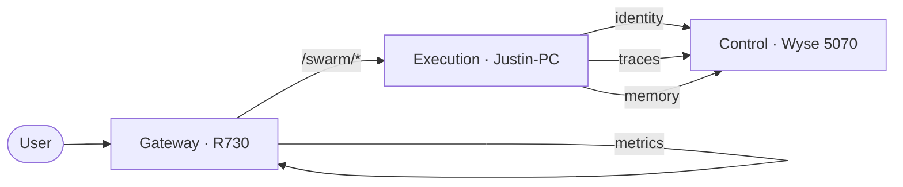

# Overview

Agent Swarm is a self-hosted, distributed multi-agent AI system that runs entirely on local hardware. No data leaves your network. No external AI APIs are called. Everything — inference, storage, identity, monitoring — runs on three physical machines connected over a local LAN.

## What It Does

### Intelligent Chat and Coding

Every request goes through a **MarsRL quality loop**: a Solver generates a response, a Verifier validates it (syntax, coherence, safety), and a Corrector fixes problems. The result is higher-quality output than a single model pass.

### Creative Media

- **Image generation** using ComfyUI with FLUX and Stable Diffusion XL pipelines
- **3D model generation** using TripoSG and Hunyuan3D
- **Action figure design** with articulated joint specifications for 3D printing

### Voice Interaction

BMO — a physical robot character — responds with a cloned voice via RVC synthesis. Text-to-speech is handled by Qwen3-TTS (1.7B parameters) running locally.

### Smart Home Control

Natural language control of Home Assistant devices. Ask the system to turn on lights, check sensor readings, or manage automations. Hardware prototyping is supported through Wokwi ESP32/Arduino simulation.

### Autonomous Code Execution

Sandboxed VS Code environments (OpenHands) for executing code in isolation. The system can write, test, and iterate on code without affecting the host.

## Architecture at a Glance

The system runs across three nodes:

| Node | Machine | IP | Role |
|------|---------|-----|------|
| **Control Plane** | Dell Wyse 5070 | {{ control_node_ip }} | Identity (SPIRE), databases (PostgreSQL, ClickHouse), observability (Langfuse), memory (MemPalace) |
| **Execution Plane** | Justin-PC (RTX 5060 Ti 16GB) | {{ execution_node_ip }} | GPU inference (Ollama), Agent Runtime (FastAPI), ComfyUI, Voice Engine, OpenHands |
| **Gateway** | Dell PowerEdge R730 (RTX 3070 Ti 8GB) | {{ gateway_node_ip }} | Reverse proxy (Traefik), monitoring (Prometheus, Grafana, Loki), secondary inference |

## Security Model

- **SPIFFE/SPIRE**: Every service gets a cryptographic workload identity (X.509 SVID)
- **JWT-ACE**: Each request gets an ephemeral capability token scoped to its intent
- **MAESTRO**: L1–L7 security framework (98% compliant)
- **Output Validation**: 3-layer verification — AST parse, coherence heuristics, llama-guard-3 safety check

## What's Next

- [Quickstart for Users](quickstart-user.md) — start using the system now
- [Core Concepts](concepts.md) — understand the key mental models
- [Architecture Deep-Dive](../architecture/index.md) — full technical details
