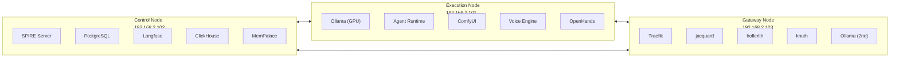

---
title: "Quickstart: Admins"
---

# Quickstart: Admins

Deploy the full Agent Swarm stack across three nodes from scratch.

## Prerequisites

| Requirement | Details |
|-------------|---------|
| **3 machines** | Control Node (low-power x86), Execution Node (NVIDIA GPU ≥ 16GB VRAM), Gateway Node (NVIDIA GPU ≥ 8GB VRAM optional) |
| **Network** | All nodes on the same subnet with static IPs |
| **OS** | Ubuntu 22.04+ (Control, Gateway) · Windows 11 or Ubuntu (Execution) |
| **Docker** | Docker Engine 24+ with Compose v2 on all nodes |
| **NVIDIA Drivers** | 550+ with NVIDIA Container Toolkit on GPU nodes |
| **SSH** | Key-based SSH access from your dev machine to all nodes |

## Network Layout



## Step 1: Clone the Repository

On your development machine:

```bash
git clone https://github.com/Misterobots/Agent_Swarm.git
cd Agent_Swarm
```

## Step 2: Configure Network

Edit `network.env` at the repo root with your actual IP addresses:

```ini
LOVELACE_IP=192.168.2.101
HOPPER_IP=192.168.2.102
TURING_IP=192.168.2.103
HOME_ASSISTANT_IP=192.168.2.100
```

!!! warning "Credentials"
    Update all passwords in `network.env` before deploying. Never use default passwords in production.

## Step 3: Deploy Control Plane

SSH to the Control Node and start the services:

```bash
ssh ControlPlane
cd ~/Agent_Swarm/control_plane
docker compose up -d
```

Verify SPIRE server is running:

```bash
docker exec spire-server /opt/spire/bin/spire-server healthcheck
```

## Step 4: Deploy Execution Plane

On the Execution Node:

```bash
cd execution_plane
docker compose up -d
```

This starts Ollama, Agent Runtime, ComfyUI, Voice Engine, and OpenHands. The first startup will pull LLM models (several GB).

Verify the Agent Runtime is online:

```bash
curl http://localhost:8008/
# Expected: {"status": "online", "system": "Home AI Lab Swarm"}
```

## Step 5: Deploy Gateway

SSH to the Gateway Node:

```bash
ssh Turing
cd ~/Home_AI_Lab/turing_gateway
docker compose up -d
```

This starts Traefik, jacquard, hollerith, knuth, and the monitoring stack.

## Step 6: Verify Deployment

Run smoke tests from any node:

```bash
# Check Agent Runtime
curl http://192.168.2.101:8008/v1/models

# Check Ollama inference
curl http://192.168.2.101:11434/api/tags

# Check hollerith
curl -s http://192.168.2.103:3001/api/health

# Check Langfuse
curl -s http://192.168.2.102:3000/api/public/health
```

!!! success "All Clear"
    If all four return valid JSON, the cluster is operational. Open `http://{{ turing_ip }}` to access the Hive UI.

## Next Steps

- [Post-Deploy Verification](../admin-guide/deployment/post-deploy.md) — comprehensive health checks
- [Networking Guide](../admin-guide/deployment/networking.md) — firewall rules, Tailscale, DNS
- [Monitoring Setup](../admin-guide/operations/monitoring.md) — configure hollerith dashboards
- [SPIRE Configuration](../admin-guide/configuration/spire.md) — workload registration


