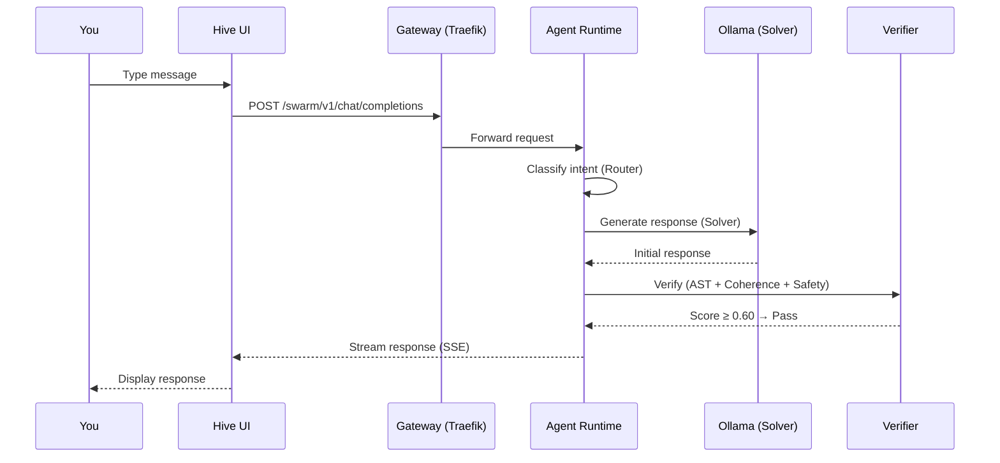

# Quickstart: Users

This guide gets you from zero to chatting with the Hive in under five minutes.

## Prerequisites

- A device on the same network as the Hive (or connected via Tailscale)
- A modern web browser (Chrome, Firefox, Edge)

## Step 1: Open the Hive UI

Navigate to the Hive Mind interface:

```
http://{{ gateway_node_ip }}
```

You'll see the main dashboard with a sidebar listing available workspaces.

!!! tip "Remote Access"
    If you're outside the local network, connect via Tailscale first, then access the gateway node's Tailscale IP.

## Step 2: Start a Conversation

1. Click **Chat** in the sidebar
2. Type a message in the input box and press ++enter++
3. Watch the status indicators — you'll see the system route your request, run the MarsRL verification loop, and stream the response

### What Happens Behind the Scenes



## Step 3: Explore Workspaces

The sidebar organizes features into workspaces:

| Workspace | What It Does |
|-----------|--------------|
| **Chat** | General conversation and coding assistance |
| **Art Studio** | Image generation with FLUX and SD-XL |
| **Voice** | Talk to BMO with voice synthesis |
| **Tools** | File operations, web browsing, terminal |
| **IoT** | Control Home Assistant devices |
| **Training** | Monitor and trigger model fine-tuning |
| **Governance** | View and approve capability requests |
| **Monitor** | System health, metrics, logs |
| **Settings** | Preferences, model selection |

## Step 4: Generate an Image

1. Navigate to **Art Studio**
2. Enter a description: *"A cyberpunk cityscape at night with neon reflections on wet streets"*
3. The router detects the `IMAGE` intent and delegates to the ComfyUI pipeline
4. The generated image appears as an artifact card with a download button

## Step 5: Check System Status

Click **Monitor** in the sidebar to see:

- Node health (all three machines)
- Active model information
- GPU utilization
- Recent Langfuse traces

## Common Access Points

| Interface | URL | Purpose |
|-----------|-----|---------|
| Hive Mind UI | `http://{{ gateway_node_ip }}` | Primary interface |
| Grafana | `http://{{ gateway_node_ip }}:3001` | Monitoring dashboards |
| Langfuse | `http://{{ control_node_ip }}:3000` | LLM trace viewer |
| ComfyUI | `http://{{ gateway_node_ip }}/comfy` | Image workflow editor |

## Next Steps

- [Chat Guide](../user-guide/chat.md) — deeper dive into chat features
- [Art Studio Guide](../user-guide/art-studio.md) — image generation workflows
- [FAQ](../faq/general.md) — answers to common questions
