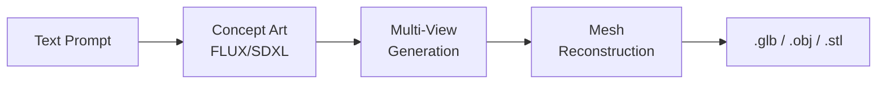

# 3D Pipeline

3D model generation, reconstruction, and articulated figure design.

## Files

| File | Purpose |
|------|---------|
| `agents/specialized/forge_agent.py` | 3D model reconstruction |
| `agents/specialized/action_figure_agent.py` | Articulated figure design |

## Pipeline



## Supported Formats

| Format | Use Case |
|--------|----------|
| `.glb` | Web viewer (Three.js), general 3D |
| `.obj` | 3D modeling software import |
| `.stl` | 3D printing |

## Action Figure Agent

Specialized pipeline for articulated figure design:

1. Generate T-pose concept art
2. Create orthographic views (front, side, back)
3. Reconstruct mesh with joint markers
4. Define articulation points
5. Export as rigged .glb

## Three.js Viewer

Generated 3D models include an embedded HTML viewer using Three.js:

```html
<!-- Auto-generated viewer -->
<script src="three.min.js"></script>
<script>
    const loader = new GLTFLoader();
    loader.load('model.glb', (gltf) => {
        scene.add(gltf.scene);
    });
</script>
```

## Output Storage

```
delivered_artifacts/
└── 3d/
    ├── model_20260410_abc123.glb
    ├── model_20260410_abc123.obj
    └── model_20260410_abc123_viewer.html
```

## Related

- [User Guide: 3D Generation](../user-guide/3d-generation.md) — user-facing guide
