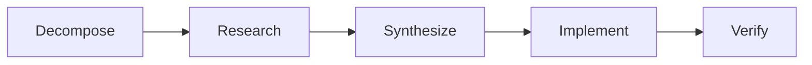

# Coordinator

Multi-agent orchestration for complex, multi-step tasks.

## Files

| File | Purpose |
|------|---------|
| `agents/coordinator.py` | Coordinator class — phases and workers |

## When Used

The Coordinator handles `COORDINATE` and `RESEARCH` intents — tasks that require:

- Breaking a problem into subtasks
- Parallel research or investigation
- Multiple agent capabilities in one request
- Verification of the assembled result

## Phases



| Phase | Description | Workers |
|-------|-------------|---------|
| **Decompose** | LLM breaks the task into subtasks | 1 (coordinator) |
| **Research** | Workers investigate in parallel | Up to 5 |
| **Synthesize** | Merge findings into a plan | 1 (coordinator) |
| **Implement** | Execute the plan | 1–3 |
| **Verify** | Fresh worker validates results | 1 |

## Worker Roles

```python
WORKERS = {
    "architect": ArchitectAgent,
    "coder": ArchitectAgent,
    "devops": ArchitectAgent,
    "analyst": DataAnalyst,
    "researcher": ResearchWorker,
    "verifier": VerificationWorker,
}
```

## Scratchpad

Workers communicate via a shared scratchpad — a filesystem directory containing intermediate artifacts:

```
workspace/coordinator_sessions/{session_id}/
├── plan.json           # Decomposed task plan
├── research_1.md       # Worker 1 findings
├── research_2.md       # Worker 2 findings
├── synthesis.md        # Merged findings
├── implementation.md   # Final output
└── verification.md     # Verification report
```

## Configuration

| Setting | Value | Description |
|---------|-------|-------------|
| Max workers | 5 | Parallel research workers |
| Timeout per phase | 120s | Phase execution limit |
| Max total time | 600s | Total coordination limit |

## Example Flow

User: *"Compare Python web frameworks for a REST API and build a prototype"*

1. **Decompose**: Split into "research frameworks" + "build prototype"
2. **Research**: 3 workers investigate Flask, FastAPI, Django REST
3. **Synthesize**: Merge into comparison table with recommendation
4. **Implement**: Coder builds FastAPI prototype
5. **Verify**: Verifier checks code runs and matches requirements

## Related

- [Architecture: Agent System](../architecture/agent-system.md) — routing to coordinator
- [User Guide: Research Mode](../user-guide/research-mode.md) — user-facing guide
