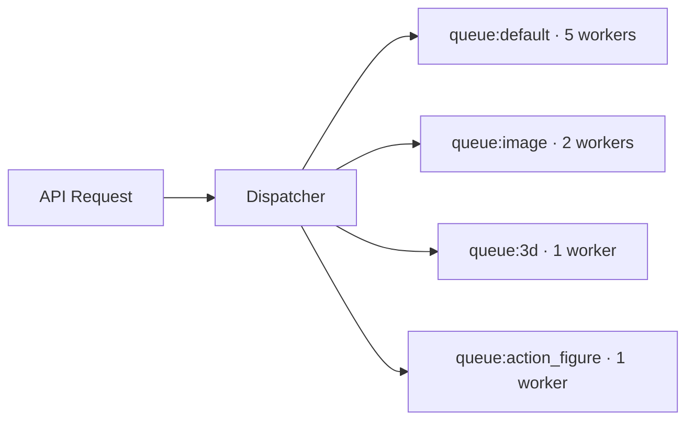

# Dispatcher

Event bus and async task queue management.

## Files

| File | Purpose |
|------|---------|
| `agents/dispatcher.py` | Dispatcher class — queue routing and concurrency |

## Purpose

The Dispatcher manages async task execution for long-running operations that shouldn't block the chat response:

- Image generation (10–60 seconds)
- 3D model rendering (30–120 seconds)
- Batch operations

## Queue Architecture

## Queue Configuration

| Queue | Workers | Purpose |
|-------|---------|---------|
| `default` | 5 | Chat, code, general tasks |
| `image` | 2 | ComfyUI image generation |
| `3d` | 1 | 3D mesh reconstruction |
| `action_figure` | 1 | Articulated figure design |

Worker counts are limited to prevent GPU memory exhaustion.

## Task Lifecycle

1. API receives request, router classifies intent
2. If async (IMAGE, 3D): Dispatcher queues the task, returns task ID immediately
3. Worker picks up task from queue
4. Worker executes (calls ComfyUI, 3D pipeline, etc.)
5. Result is stored; task status updated to `completed`
6. Client polls `GET /v1/tasks/{task_id}` for result

## Redis Backend

The Dispatcher uses Redis for queue persistence:

- Tasks survive container restarts
- Workers dequeue atomically
- Failed tasks can be retried

## Related

- [Architecture: Data Flow](../architecture/data-flow.md) — event flow
- [Developer: Tasks API](../developer-guide/api/tasks.md) — task endpoints

