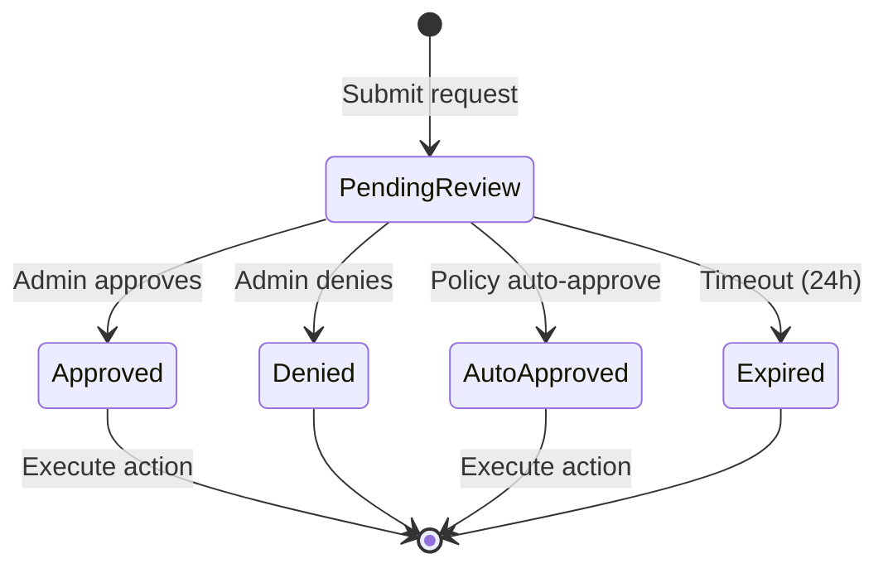

# Governance

Request approval workflow for privileged operations.

## Files

| File | Purpose |
|------|---------|
| `agents/governance.py` | Governance engine — state machine, assessment, persistence |

## Purpose

When an agent attempts a privileged or risky operation (dangerous commands, system changes), the Governance module intercepts and routes the request through an approval workflow.

## State Machine



## Request Types

| Type | Triggers |
|------|----------|
| `PACKAGE` | Agent or user requests a `pip install` or `apt install` |
| `MODEL` | Agent requests access to a restricted or new model |
| `PERMISSION` | Escalating file/tool access levels |
| `FEATURE` | Enabling a new system feature |
| `GROUNDING_WEB` | User requests internet/web search grounding access |
| `GROUNDING_DOCS` | User requests knowledge-base document grounding access |
| `OTHER` | Any miscellaneous privileged request |
| `privilege_escalation` | Requesting higher security level |

## Assessment

The governance engine performs a risk assessment:

```python
risk = assess_risk(action, command, context)
# Returns: LOW, MEDIUM, HIGH, CRITICAL
```

| Risk | Action |
|------|--------|
| LOW | Auto-approve |
| MEDIUM | Notify admin, execute |
| HIGH | Require admin approval |
| CRITICAL | Block, notify admin |

## Storage

Governance state is persisted in `workflow_state/governance_requests.json`.

## Related

- [Architecture: Security Model](../architecture/security-model.md) — security context
- [User Guide: Governance](../user-guide/governance-requests.md) — user-facing guide
- [Developer: Governance API](../developer-guide/api/governance.md) — API reference


