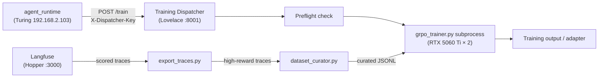

# Training Dispatcher

The Training Dispatcher is a FastAPI service running on **Lovelace** (`{{ lovelace_ip }}:8001`). It accepts GRPO training job requests from Turing's `agent_runtime`, runs preflight checks, and manages `grpo_trainer.py` subprocesses using Lovelace's dual RTX 5060 Ti (32 GB VRAM).

## Files

| File | Purpose |
|------|---------|
| `agents/training/dispatcher.py` | FastAPI application — authentication, job queue, subprocess management |
| `agents/training/dataset_curator.py` | HuggingFace dataset downloader, security scanner, GRPO formatter |
| `agents/training/export_traces.py` | Langfuse trace exporter → GRPO JSONL |
| `agents/config.py` | `ARCHETYPE_TRAINING_CONFIGS` — per-archetype dataset and epoch settings |
| `config/source_whitelist.json` | Approved HuggingFace org slugs |

---

## Architecture



**Data flow:**

1. Langfuse stores agent traces scored by MarsRL.
2. `export_traces.py` filters traces above the reward threshold (0.85) and exports them as GRPO JSONL.
3. `dataset_curator.py` downloads additional HuggingFace datasets, applies security scanning, and converts to GRPO format.
4. `dispatcher.py` receives a training job, validates the archetype, launches `grpo_trainer.py`.
5. Caller polls `GET /train/{job_id}` until status is `completed` or `failed`.

---

## Authentication

All endpoints except `GET /health` require:

```
X-Dispatcher-Key: <DISPATCHER_SECRET>
```

`DISPATCHER_SECRET` is set in `execution_plane/.env` (Lovelace) and `network.env` (shared, so Turing's `agent_runtime` picks it up).

If `DISPATCHER_SECRET` is unset, all authenticated endpoints return **503** — the service is in locked mode.

---

## Endpoints

| Method | Path | Auth | Description |
|--------|------|------|-------------|
| `GET` | `/health` | None | Liveness — returns status + available archetypes |
| `POST` | `/train` | Required | Submit a training job |
| `GET` | `/train/{job_id}` | Required | Poll job status |
| `GET` | `/jobs` | Required | List last 50 jobs (newest first) |
| `DELETE` | `/train/{job_id}` | Required | Cancel a running job |

See the [Training API Reference](../developer-guide/api/training.md) for full request/response schemas.

---

## Archetype Configs

Archetypes are defined in `ARCHETYPE_TRAINING_CONFIGS` in `agents/config.py`:

| Archetype | Datasets | Epochs | Use Case |
|-----------|----------|--------|----------|
| `coder` | `glaive-code-assistant`, `code-feedback` | 3 | Code generation and review |
| `coordinator` | `hermes-function-calling`, `slim-orca` | 2 | Tool use and task delegation |
| `researcher` | `openhermes`, `slim-orca` | 2 | Multi-step reasoning |
| `creative` | `openhermes` | 2 | Creative writing and ideation |

Submitting an unknown archetype returns `422 Unprocessable Entity`.

---

## Dataset Curator

### Curated Datasets

| Key | HuggingFace ID | Default Samples | Format |
|-----|---------------|-----------------|--------|
| `glaive-function-calling` | `glaiveai/glaive-function-calling-v2` | 5,000 | conversations |
| `hermes-function-calling` | `NousResearch/hermes-function-calling-v1` | 5,000 | conversations |
| `openhermes` | `teknium/OpenHermes-2.5` | 10,000 | conversations |
| `glaive-code-assistant` | `glaiveai/glaive-code-assistant-v3` | 5,000 | conversations |
| `slim-orca` | `Open-Orca/SlimOrca` | 10,000 | conversations |
| `code-feedback` | `m-a-p/CodeFeedback-Filtered-Instruction` | 10,000 | conversations |
| `the-stack-v2` | `bigcode/the-stack-v2-train-smol-ids` | 5,000 | code |

### Security Pipeline

Each sample passes two gates before being written to the output JSONL:

1. **Source whitelist** (`config/source_whitelist.json`) — dataset org must be in 18 approved HuggingFace orgs. Missing whitelist file → fail-open (dev mode).
2. **llama-guard pre-scan** — first 20 tokens sent to `llama-guard-3:8b` on Turing. Non-`safe` response → sample written to `_rejected.jsonl`. Network error → fail-open.

!!! tip "Fail-open policy"
    Both security gates are fail-open. This keeps local development unblocked when Turing or the whitelist file is unavailable. Strict mode is a future enhancement.

### Code Format Converter

Datasets with `"format": "code"` (e.g., `the-stack-v2`) use `_code_to_grpo()`, which wraps raw source files in a single instruction → completion turn:

```json
{"prompt": "Provide the following code file:\n\n", "completion": "<source code>"}
```

---

## Trace Exporter

`export_traces.py` queries Langfuse for high-reward traces and converts them to GRPO JSONL:

### Reward Threshold

Default: **0.85** (configurable via `EXPORT_MIN_SCORE` env var).

```bash
# Example: raise threshold for stricter quality
EXPORT_MIN_SCORE=0.90 python -m training.export_traces
```

### Deduplication

- **ID dedup**: tracks exported trace IDs in `exported_ids.json` (persists across runs).
- **Content dedup**: skips samples whose output fingerprint (first 100 chars) was already seen in the current run.

### Topic Diversity

When `total_limit` is set, exports are capped per topic bucket to avoid imbalanced datasets:

| Topic | Keywords |
|-------|---------|
| `code` | function, class, import, def, ... |
| `math` | equation, calculate, proof, ... |
| `tool_use` | call, invoke, function, tool, ... |
| `creative` | story, poem, write, describe, ... |
| `general` | *(everything else)* |

Cap per topic = `total_limit ÷ number_of_topics`.

---

## Docker Service

Defined in `execution_plane/docker-compose.yml` as `training-dispatcher`:

```yaml
training-dispatcher:
  image: home-ai-lab/agent-runtime:latest
  container_name: training_dispatcher
  ports:
    - "8001:8001"
  env_file:
    - ../network.env
  environment:
    - DISPATCHER_SECRET=${DISPATCHER_SECRET}
  deploy:
    resources:
      reservations:
        devices:
          - driver: nvidia
            count: all
            capabilities: [gpu]
```

### Starting / Stopping

```bash
# Start
cd execution_plane
docker compose up -d training-dispatcher

# Check logs
docker logs -f training_dispatcher

# Stop
docker compose stop training-dispatcher
```

---

## Job State

!!! warning "In-memory state"
    Job history is stored in-memory only. A container restart clears all job records. A future phase will persist state to Redis or SQLite.

| Status | Meaning |
|--------|---------|
| `running` | Subprocess is active |
| `completed` | Subprocess exited with code 0 |
| `failed` | Subprocess exited with non-zero code |
| `cancelled` | `DELETE /train/{job_id}` was called |

---

## Related

- [Training API Reference](../developer-guide/api/training.md)
- [Module: Config — Archetype Configs](config.md#archetype-training-configs)
- [Admin: Environment Variables](../admin-guide/configuration/environment.md#training-dispatcher)
- [Phase 2–4 Implementation Report](https://github.com/Misterobots/Agent_Swarm/blob/main/docs/TRAINING_PIPELINE_PHASES_2_3_4.md) (in repo `docs/` outside the doc site)
