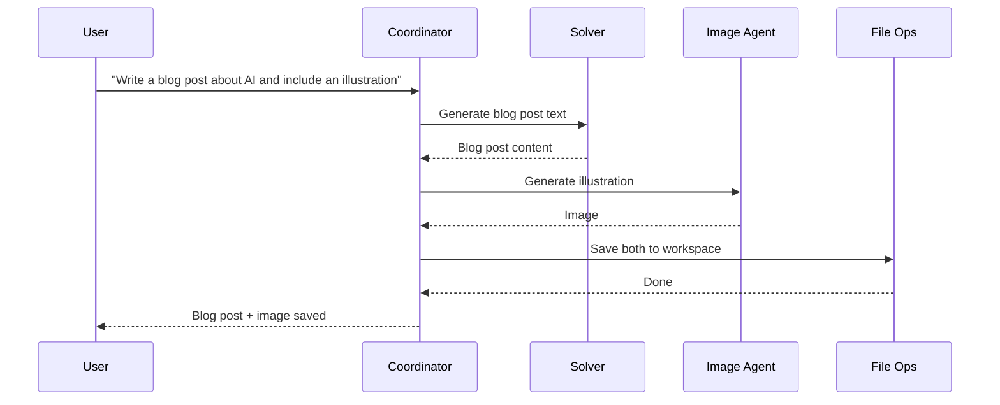

# Multi-Agent Workflow

Orchestrate multiple agents to handle complex, multi-step tasks.

## What You'll Learn

- How agents collaborate on complex requests
- How the Coordinator manages agent handoffs
- How to craft prompts that trigger multi-agent flows

## Step 1: Understand Agent Collaboration

When a task requires multiple capabilities, the Coordinator orchestrates:

## Step 2: Try a Multi-Step Request

> Research the history of neural networks, write a summary, and create an infographic showing the timeline

This triggers:

1. **Search Tool** — gathers research material
2. **Solver** — writes the summary
3. **Image Agent** — creates the timeline infographic

## Step 3: Code + Documentation

> Write a Python function to calculate Fibonacci numbers, add docstrings, and create a test file

This triggers:

1. **Solver** — writes the function
2. **Solver** — adds documentation
3. **File Ops** — saves the code
4. **Solver** — writes tests
5. **File Ops** — saves the test file

## Step 4: IoT + Voice

> When someone says "movie time", dim the living room lights to 20% and turn on the TV

This combines:

1. **IoT Agent** — creates the automation
2. **Voice understanding** — sets up the trigger phrase

## Tips

- Be explicit about what you want: list each step
- Use "and" or numbered lists to signal multi-step tasks
- Complex workflows may take longer — watch the streaming output

## Next Steps

- [Architecture: Agent System](../architecture/agent-system.md) — how agents interact
- [Modules: Coordinator](../modules/coordinator.md) — orchestration details

