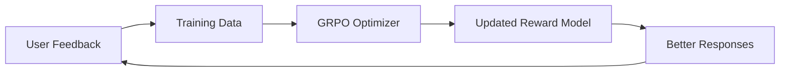

# Train Model Preferences

Teach Memex your preferences using GRPO training.

## What You'll Learn

- How to provide preference feedback
- How feedback is collected and stored
- How GRPO training improves responses

## Step 1: Interact Naturally

Use the system normally. Over time, you'll notice responses you like and responses you'd change.

## Step 2: Provide Explicit Feedback

When you see a response you like or dislike:

- **Thumbs up** — marks the response as preferred
- **Thumbs down** — marks it as rejected
- **Edit and resubmit** — teaches the correct response

## Step 3: Teach Preferences via Chat

You can also state preferences directly:

> Remember that I prefer concise answers with code examples
> I like responses formatted as bullet points

These are stored in Skills Memory under your `owner_id`.

## Step 4: View Training Data

Training pairs are stored in `training_data/`:

```json
{
    "prompt": "Explain Docker volumes",
    "chosen": "Docker volumes persist data...",
    "rejected": "Volumes in Docker are..."
}
```

## Step 5: Run GRPO Training

!!! note "Admin Only"
    Training requires admin access.

```bash
# Trigger training
curl -X POST http://{{ turing_ip }}/swarm/v1/training/trigger \
    -H "Content-Type: application/json" \
    -d '{"owner_id": "user-123"}'
```

The MarsRL loop uses your preference data to fine-tune response quality.

## How It Works



## Next Steps

- [User Guide: Training](../user-guide/training-interface.md) — full training reference
- [Architecture: MarsRL](../architecture/marsrl.md) — how MarsRL works


