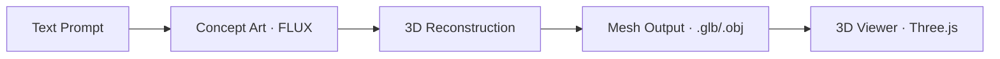

# 3D Generation

Create 3D models, meshes, and articulated action figures for 3D printing.

## How to Access

- **UI**: Navigate to **Art Studio** → 3D tab, or use Chat
- **Chat**: Describe what you want — the router detects `3D` or `ACTION_FIGURE` intent

## Quick Example

> *"Create a low-poly medieval shield with ornate carvings"*

The system routes to the 3D generation pipeline, generates concept art, and passes it through the 3D reconstruction pipeline using TripoSG or Hunyuan3D.

## Detailed Usage

### Pipeline

### Action Figures

The `ACTION_FIGURE` intent triggers a specialized pipeline that generates:

- Articulated joint specifications
- Separate mesh parts for assembly
- 3D-printable output with tolerances

> *"Design a sci-fi robot action figure with 12 points of articulation"*

### Supported Formats

| Format | Description |
|--------|-------------|
| `.glb` | Binary glTF — viewable in the UI's Three.js viewer |
| `.obj` | Wavefront OBJ — compatible with slicers for 3D printing |
| `.stl` | STL mesh — direct 3D printing format |

### 3D Viewer

The Hive Mind UI includes a built-in Three.js 3D viewer. Generated models are rendered directly in the browser with orbit controls, lighting, and material preview.

## Tips & Common Patterns

!!! tip "Concept Art First"
    For best results, generate concept art first (`IMAGE` intent), then ask to convert it to 3D. The two-stage pipeline produces better geometry than text-to-3D alone.

!!! warning "VRAM Intensive"
    3D generation queues are limited to 1 concurrent job to prevent GPU memory exhaustion. Check the dispatcher queue status in Monitor if jobs seem delayed.

## Related

- [Art Studio](art-studio.md) — image generation pipeline
- [Tutorial: Create an Action Figure](../tutorials/build-3d-model.md)
- [Module: Dispatcher](../modules/dispatcher.md) — queue configuration for 3D jobs
