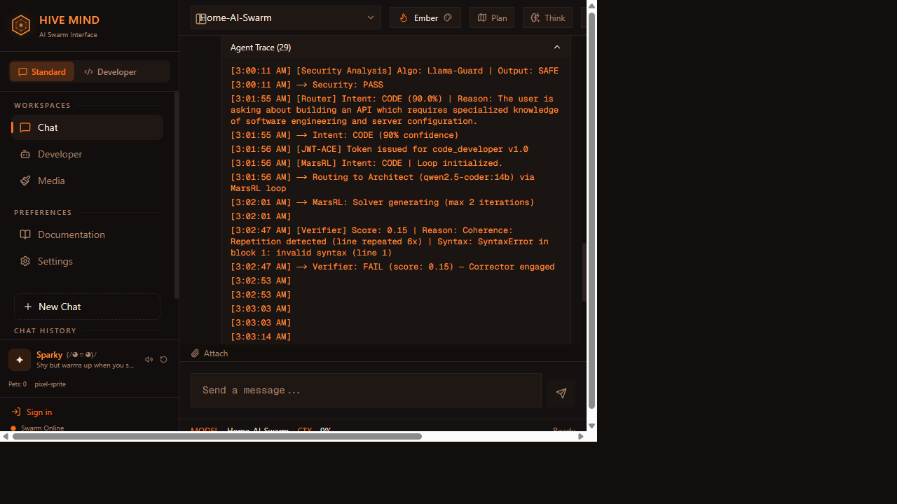
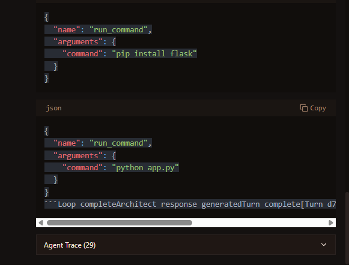
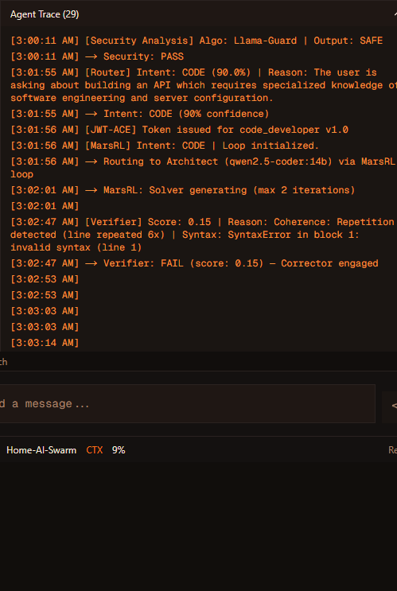

# Plan Mode & Think Mode — User Guide


---

## Overview

Plan Mode and Think Mode are two cognitive-enhancement toggles available in the chat toolbar. They change **how** the agent approaches your request — not just what it does.

| Mode | Purpose | Icon |
|------|---------|------|
| **Plan Mode** | Decomposes your task into a structured plan **without executing** anything | 🗺️ Map |
| **Think Mode** | Forces deep chain-of-thought reasoning with visible inner monologue | 🧠 Brain |

Both modes are independent and can be combined with any skill or style setting.



---

## Source References

| Source | Type | Relevance |
|--------|------|-----------|
| [Chain-of-Thought Prompting (Wei et al., NeurIPS 2022)](https://arxiv.org/abs/2201.11903) | Research paper | Foundation for Think Mode's step-by-step reasoning injection |
| [Plan-and-Solve Prompting (Wang et al., ACL 2023)](https://arxiv.org/abs/2305.04091) | Research paper | Basis for Plan Mode's decompose-before-execute pattern |
| [Anthropic Claude Extended Thinking](https://docs.anthropic.com/en/docs/build-with-claude/extended-thinking) | Product reference | Inspiration for `<think>` tag parsing and visible reasoning |
| [OpenAI o1 Reasoning](https://openai.com/index/learning-to-reason-with-llms/) | Product reference | Chain-of-thought reasoning delivery model |
| [AutoGPT](https://github.com/Significant-Gravitas/AutoGPT) | Open source | Task decomposition agent pattern |
| [BabyAGI](https://github.com/yoheinakajima/babyagi) | Open source | Task-driven autonomous agent with plan step |

---

## Changelog: Source → Hive Implementation

This table documents what was adopted from each source and what was changed or added in our implementation.

??? info "View full changelog table"

    | Feature | Source Concept | Hive Implementation | Delta |
    |---------|---------------|---------------------|-------|
    | Plan output delivery | Batch text response (AutoGPT, BabyAGI) | Real-time SSE stream with dedicated `plan` event type | Streaming delivery instead of blocking |
    | Auto-feed toggle | Not present in any source | Chain-link (🔗) toggle, off by default | Novel addition — controlled plan→execute flow |
    | Plan interception | Separate planning agent (BabyAGI) | Router-level intercept before intent classification | Integrated into existing routing pipeline |
    | Think tag format | Model-native `<thinking>` (Claude) | Custom `<think>` tags parsed by `_parse_think_tags()` | Server-side extraction, not model-native |
    | Think UI rendering | Hidden reasoning (Claude), none (o1) | Collapsible "Thought" block, streamed in real time | Always visible, user-controlled collapse |
    | Mode persistence | Session-only (o1) | Browser localStorage via Zustand persist middleware | Survives page refresh |
    | Mode independence | Mutually exclusive in most implementations | Fully independent — both can be active simultaneously | Plan + Think can combine |
    | System prompt injection | Built into model API (Claude, o1) | Injected by router as system message prefix | Works with any LLM backend (Ollama, etc.) |


---

## Plan Mode

### What It Does

When Plan Mode is active, the agent:

1. **Intercepts** your request before normal routing.
2. **Decomposes** the task into phases, subtasks, dependencies, and estimated order.
3. **Returns a plan only** — no code is written, no commands are run, no images generated.

This is ideal for complex projects where you want to see the approach before committing.

### How to Use

1. Click the **Plan** button (🗺️) in the chat toolbar. It highlights when active.
2. Type your request normally and send.
3. The response arrives as a structured plan with numbered steps.

### Auto-Feed Chain

When Plan Mode is active, a secondary **chain-link** (🔗) toggle appears:

- **Off (default)**: The plan is displayed but NOT automatically fed back to the agent.
- **On**: The plan is automatically sent as a follow-up prompt so the agent executes it step-by-step.

> [!NOTE]
> Auto-Feed is **off by default** to prevent unintended execution of large plans. Toggle it on explicitly when you want hands-free plan → execute flow.

### Example

**Prompt**: "Build a REST API for user authentication with JWT"

**Plan Mode Output**:
```
📋 UltraPlan: Task Decomposition

Phase 1 — Setup
  1. Create project structure (FastAPI, dependencies)
  2. Set up PostgreSQL user table schema

Phase 2 — Authentication
  3. Implement registration endpoint (POST /auth/register)
  4. Implement login endpoint (POST /auth/login)
  5. Add JWT token issuance and validation

Phase 3 — Protection
  6. Create auth middleware
  7. Add protected endpoint example

Dependencies: Step 5 depends on 1–2. Step 6 depends on 5.
Estimated complexity: Medium (~45 min implementation)
```

---

## Think Mode

### What It Does

When Think Mode is active, the agent:

1. Receives an injected system prompt: *"Think through this step-by-step before answering."*
2. Wraps its internal reasoning in `<think>...</think>` tags.
3. The UI displays the thinking process as a collapsible **Thought** block.
4. After reasoning, provides a clear final answer.

### How to Use

1. Click the **Think** button (🧠) in the chat toolbar.
2. Send your request normally.
3. Watch the thought process stream in real time as a separate block above the response.

### When to Use Think Mode

| Scenario | Think Mode adds value? |
|----------|----------------------|
| Debugging a complex error | ✅ Yes — shows diagnosis reasoning |
| Simple "what is X?" questions | ❌ No — adds latency for no benefit |
| Architecture decisions | ✅ Yes — shows tradeoff evaluation |
| Code generation | ⚡ Maybe — shows design thinking |
| Creative writing | ❌ No — doesn't help creativity |

### Example

**Prompt with Think Mode**: "Should I use Redis or PostgreSQL for session storage?"

**UI Display**:
```
💭 Thinking...
→ Key factors: scalability, persistence, latency, complexity
→ Redis: in-memory, sub-ms reads, volatile by default, need persistence config
→ PostgreSQL: already in stack, ACID, slightly higher latency (1-5ms)
→ Our system already runs PostgreSQL for user data
→ Session volume: low-to-medium (single household)
→ Verdict: PostgreSQL is simpler since it's already deployed

For your home lab setup, PostgreSQL is the better choice for session
storage. You already run it for user data, and the session volume
doesn't justify adding Redis as a separate service...
```

---

## Settings Persistence

Both toggles persist in browser local storage (key: `hive-settings`). They remain active across page refreshes until explicitly toggled off.

---

## UI Reference

### Chat Toolbar — Mode Toggles

```
┌─────────────────────────────────────────────────────────────┐
│  [🗺️ Plan]  [🔗 Auto-feed]  [🧠 Think]  [Style ▾]  [Send ➤] │
│   ▲ active    ▲ only when     ▲ active                      │
│   │ (accent)  │ Plan is on    │ (accent)                     │
│   └───────────┘               └──────────────────────────────│
└─────────────────────────────────────────────────────────────┘
```

- **Plan button**: `Map` icon from lucide-react. Accent-colored when active.
- **Auto-feed button**: `Link` icon. Only appears when Plan is active. Off by default.
- **Think button**: `Brain` icon. Independent of Plan state.

**Toolbar — Inactive:**


**Toolbar — Plan Active:**


**Toolbar — Think Active:**


### Plan Mode Output Panel

```
┌───────────────────────────────────────────────┐
│ 📋 UltraPlan                                  │
│                                               │
│ Phase 1 — Setup                               │
│   1. Create project structure                 │
│   2. Set up database schema                   │
│                                               │
│ Phase 2 — Authentication                      │
│   3. Registration endpoint                    │
│   4. Login endpoint                           │
│   5. JWT token handling                       │
│                                               │
│ Dependencies: 5 → 1–2, 6 → 5                 │
│ Complexity: Medium                            │
└───────────────────────────────────────────────┘
```



**MarsRL Verification Badge:**


### Think Mode Thought Block

```
┌───────────────────────────────────────────────┐
│ 💭 Thinking...                          [▾]   │
│ ┄┄┄┄┄┄┄┄┄┄┄┄┄┄┄┄┄┄┄┄┄┄┄┄┄┄┄┄┄┄┄┄┄┄┄┄┄┄┄┄┄ │
│ → Key factors: scalability, persistence       │
│ → Redis: sub-ms reads, volatile by default    │
│ → PostgreSQL: already in stack, ACID          │
│ → Session volume: low (single household)      │
│ → Verdict: PostgreSQL simpler                 │
└───────────────────────────────────────────────┘
 ↓ (collapsible — click [▾] to collapse)
┌───────────────────────────────────────────────┐
│ For your home lab, PostgreSQL is the better   │
│ choice for session storage...                 │
└───────────────────────────────────────────────┘
```

**Agent Trace (collapsed):**


**Agent Trace (expanded):**



---

## Maintenance & Update Guide

### Modifying the Plan Prompt

The plan system prompt is defined inline in `agents/router.py` within the `chat_swarm()` function's UltraPlan block. To change plan output format:

1. Locate the `PLAN_SYSTEM_PROMPT` string in `router.py`.
2. Edit the prompt to change decomposition style, output format, or detail level.
3. Restart the FastAPI server.

### Modifying the Think Prompt

The think injection is a system message prefix added in the UltraThink block of `chat_swarm()`:

```python
# Current injection
"Think through this step-by-step before answering. Wrap reasoning in <think>...</think> tags."
```

To change think behavior, edit this string. The `<think>` tag format is parsed by `_parse_think_tags()` — if you change the tag name, update the parser regex too.

### Adding New Modes

To add a new cognitive mode (e.g., "Critique Mode"):

1. **Settings store**: Add a boolean to `ui/src/lib/stores/settings-store.ts`.
2. **ChatRequest model**: Add the field to `ChatRequest` in `agents/main.py`.
3. **Router**: Add an intercept block in `chat_swarm()` (after UltraThink, before intent routing).
4. **SSE parser**: If using a new event type, add it to `knownTypes` in `sse-parser.ts`.
5. **UI toggle**: Create a toggle component similar to `ultraplan-toggle.tsx`.

### Updating Dependencies

| Component | Update path |
|-----------|-------------|
| lucide-react icons | `npm update lucide-react` in `ui/` |
| Zustand store | No external dependency — internal state only |
| SSE parser | No external dependency — internal utility |
| Router prompts | Edit `agents/router.py` — no package dependency |

---

## Functionality Testing

### Backend Tests

No dedicated test file exists yet. Recommended test coverage:

```bash
# Create tests/test_plan_think.py with:
# - Test that UltraPlan intercepts when ultraplan_mode=True
# - Test that plan output contains structured phases
# - Test that _parse_think_tags() extracts <think> content correctly
# - Test that UltraThink injects system prompt when ultrathink_mode=True
# - Test that both modes can be active simultaneously
pytest tests/test_plan_think.py -v
```

### Manual UI Testing

| Test Case | Steps | Expected Result |
|-----------|-------|----------------|
| Plan toggle | Click Plan button | Button highlights, `ultraplanMode` in store = true |
| Plan output | Send message with Plan on | Response is plan-only, no code/execution |
| Auto-feed off | Send with Plan on, auto-feed off | Plan displayed, NOT re-sent |
| Auto-feed on | Send with Plan on, auto-feed on | Plan displayed, then auto-sent as context |
| Think toggle | Click Think button | Button highlights, `ultrathinkMode` = true |
| Think output | Send message with Think on | Collapsible thought block + final answer |
| Combined | Both Plan + Think on | Plan with visible reasoning, no execution |
| Persistence | Toggle on, refresh page | Modes remain active after refresh |

### API Testing

```bash
# Plan Mode
curl -X POST http://localhost:8008/v1/chat \
  -H "Content-Type: application/json" \
  -d '{"message": "Build a REST API", "ultraplan_mode": true}'

# Think Mode
curl -X POST http://localhost:8008/v1/chat \
  -H "Content-Type: application/json" \
  -d '{"message": "Redis vs PostgreSQL?", "ultrathink_mode": true}'
```

---

??? info "Source of Truth"

    | Component | File |
    |-----------|------|
    | UI toggles & state | `ui/src/lib/stores/settings-store.ts` |
    | Plan toggle component | `ui/src/components/chat/ultraplan-toggle.tsx` |
    | Plan event handling | `ui/src/lib/hooks/use-chat-stream.ts` |
    | SSE event parsing | `ui/src/lib/utils/sse-parser.ts` |
    | Backend plan interception | `agents/router.py` — `chat_swarm()` UltraPlan block |
    | Backend think injection | `agents/router.py` — `chat_swarm()` UltraThink block |
    | Think tag parser | `agents/router.py` — `_parse_think_tags()` |
    | ChatRequest model | `agents/main.py` — `ChatRequest` class |

