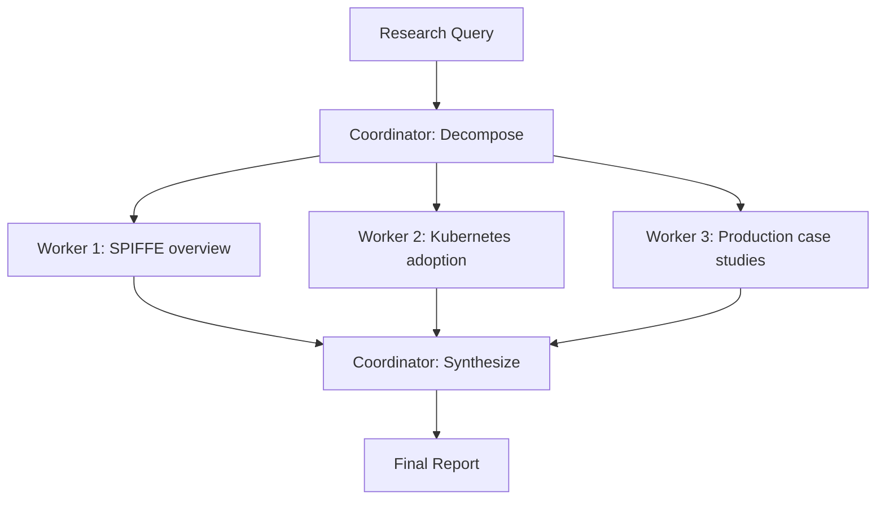

# Research Mode

Multi-source research synthesis for deep knowledge queries.

## How to Access

- **Chat**: Set `research_mode: true` in the API, or ask questions the router classifies as `RESEARCH`
- **Chat (implicit)**: Ask complex multi-faceted questions — *"Compare the advantages of PostgreSQL vs MongoDB for time-series data"*

## Quick Example

> *"Research the current state of SPIFFE adoption in production Kubernetes environments"*

The system engages the Coordinator to:

1. Decompose the topic into subtasks
2. Assign research workers to each subtask
3. Synthesize findings into a coherent report

## Detailed Usage

### How Research Mode Works

### Coordination Phases

| Phase | Description |
|-------|-------------|
| **Decompose** | Break the query into 2–5 focused subtasks |
| **Research** | Parallel workers investigate each subtask |
| **Synthesize** | Merge findings, resolve contradictions, structure the report |
| **Verify** | Fresh worker validates accuracy and completeness |

### When Research Mode Activates

The router classifies these as `RESEARCH`:

- Academic or historical analysis requests
- Comparative evaluations
- Multi-faceted technical questions
- Requests explicitly asking for "research" or "deep dive"

### Perspective Research Mode (Pioneer Agents)

For broad, multi-faceted topics the Coordinator can engage a set of **Perspective Research** agents — named after computing pioneers (Knuth, Weil, Keynes, etc.) — each approaching the topic from a distinct lens (technical, ethical, economic, regulatory, end-user, scientific).

!!! important "Research toggle required"
    Perspective Research Mode is gated behind the **Research toggle** in the chat toolbar. If the toggle is OFF, the Coordinator uses its standard single-thread decomposition even on broad queries. Turn the Research toggle ON to unlock pioneer agent cards and the perspective-matrix synthesis.

This gate was introduced to prevent pioneer agents from spawning unexpectedly on wide queries when the user has not explicitly requested deep research.

## Tips & Common Patterns

!!! tip "Scope Your Query"
    Narrower queries produce better results. *"Compare React hooks vs Vue composition API for state management"* beats *"Compare frontend frameworks"*.

!!! note "No Internet"
    Research mode synthesizes from the model's training data and any available local documents. It does not search the internet.

## Related

- [Module: Coordinator](../modules/coordinator.md) — multi-worker orchestration details
- [Architecture: Agent System](../architecture/agent-system.md) — how agents collaborate

