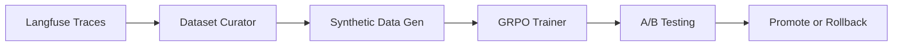

# Training Interface

Monitor and trigger model fine-tuning through the GRPO (Group Relative Policy Optimization) pipeline.

## How to Access

- **UI**: Navigate to **Training** workspace in the Hive Mind sidebar
- **Chat**: Use `TRAIN` intent — *"Start a training run"* or *"Remember that I prefer concise answers"*

## Quick Example

> *"Train the solver model on the last week's high-scoring interactions"*

## Detailed Usage

### GRPO Pipeline

The training pipeline fine-tunes models using interaction traces from Langfuse:

### Components

| Component | Purpose |
|-----------|---------|
| **Dataset Curator** | Selects high-quality interaction traces based on verifier scores |
| **Synthetic Generator** | Creates additional training examples from successful patterns |
| **GRPO Trainer** | Fine-tunes the model with group relative policy optimization |
| **A/B Testing** | Routes traffic between base and fine-tuned models to compare |

### Training Configuration

| Parameter | Default | Description |
|-----------|---------|-------------|
| Base Solver | `Qwen/Qwen2.5-Coder-7B-Instruct` | Starting model |
| Base Router | `qwen3:8b` (default, override via `ROUTER_MODEL`) | Router model |
| LoRA Rank | 16 | Low-rank adaptation rank |
| LoRA Alpha | 32 | LoRA scaling factor |
| Batch Size | 1 | Training batch size |
| Gradient Accumulation | 8 | Effective batch size multiplier |
| Learning Rate | 5e-6 | Optimizer learning rate |
| Epochs | 3 | Training epochs |
| Max Sequence Length | 4096 | Maximum token length |
| Training Window | 02:00–06:00 | Scheduled low-usage hours |

### A/B Testing

After a training run, the ExpertiseTemplate registry can route a percentage of traffic to the fine-tuned variant. Process-reward scores from Langfuse determine whether to promote the variant or roll back.

## Tips & Common Patterns

!!! warning "GPU Exclusive"
    Training requires exclusive GPU access. Inference requests queue during training. The default training window (2 AM–6 AM) minimizes impact.

!!! tip "Teaching Rules"
    Use `TRAIN` intent to teach the system preferences: *"Remember that when I ask for code, I want type hints and docstrings"*. This updates the memory system, not the model weights.

## Related

- [Module: Training Pipeline](../modules/mars-loop.md) — GRPO trainer details
- [Module: Template Registry](../modules/config.md) — A/B testing and model variants
- [Tutorial: Train a Model](../tutorials/train-preferences.md) — step-by-step guide

