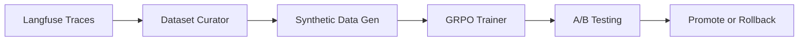
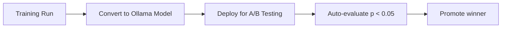

# Training Interface

Fine-tune the Hive's language models directly from the browser. Instead of running CLI commands on individual machines, you select a training strategy, configure options, and launch — the system handles dataset preparation, security scanning, and GPU-bound training across the cluster.

## How to Access

- **UI**: Navigate to **Training** in the Hive Mind sidebar, then choose a tab (**Overview**, **Run History**, or **Launch**)
- **Chat**: Use the `TRAIN` intent — *"Start a training run"* or *"Remember that I prefer concise answers"*

## Quick Example

> *"Train the solver model on the last week's high-scoring interactions"*

Or from the UI: open **Training → Launch**, select **Full Pipeline**, set a 1-hour time budget, and launch. The system exports high-scoring Langfuse traces and trains on them automatically.

## Detailed Usage

### GRPO Pipeline

The training pipeline fine-tunes models using interaction traces from Langfuse:

```mermaid
graph LR
    A[Langfuse Traces] --> B[Dataset Curator]
    B --> C[Synthetic Data Gen]
    C --> D[GRPO Trainer]
    D --> E[A/B Testing]
    E --> F[Promote or Rollback]
```

| Component | Purpose |
|-----------|---------|
| **Dataset Curator** | Selects high-quality interaction traces based on verifier scores, or downloads/converts curated HuggingFace datasets |
| **Synthetic Generator** | Creates additional training examples from successful patterns via local Ollama models |
| **GRPO Trainer** | Fine-tunes the model with QLoRA + Group Relative Policy Optimization |
| **A/B Testing** | Routes traffic between base and fine-tuned models to compare |

### Tabs

#### Overview

Live dashboard showing:

- **Training Data** — total samples available (exported traces + synthetic + curated datasets)
- **Last Run** — status, model, loss, runtime of the most recent training run
- **A/B Tests** — count of model versions currently in A/B testing
- **Model Versions** — table of all trained adapters with status (`candidate`, `ab_testing`, `promoted`, `retired`), average score, and invocation count

If a run is in progress, an amber banner appears at the top with a start time and run ID.

!!! info "Auto-refresh"
    The Overview tab auto-refreshes every 15 seconds.

#### Run History

Paginated table of all past training runs. Click any row to expand and see:

- **Training Report** — timing breakdown (training vs. overhead), model info, hyperparameters, results, deployment status
- **Convert to Ollama Model** button — merges the LoRA adapter into the base model and imports it into Ollama for inference (appears for completed training runs)
- **Deploy for A/B Testing** button — starts an A/B test comparing the new model against the current baseline (appears after conversion)
- Error messages (for failed runs)

!!! info "Auto-refresh"
    The Run History tab auto-refreshes every 30 seconds.

#### Launch

Where you start new training runs. There are five run types:

| Run Type | What it does | When to use |
|----------|---------------|-------------|
| **Full Pipeline** | Exports high-reward traces (score > 0.8) from Langfuse, then trains on the export | You have active agent usage generating scored traces and want to train on real conversations |
| **Curated Datasets** | Downloads verified datasets from HuggingFace Hub, converts to GRPO format, security-scans every sample, then trains | Early on, when you don't have many real traces yet, or to augment with public data |
| **Synthetic Generation** | Uses local Ollama models to generate multi-turn tool-use problems, scores them, security-scans, then trains | Bootstrapping training data or filling gaps in a specific domain without external sources |
| **Train Only** | Trains on an existing GRPO JSONL dataset file, skipping export/download/generation | You already have a dataset and want to re-train or sweep hyperparameters |
| **Export Only** | Exports high-reward traces to GRPO JSONL without training | You want to inspect exported data before committing to a training run |

**Curated dataset options** (available: `glaive-function-calling`, `hermes-function-calling`, `openhermes`, `glaive-code-assistant`, `slim-orca`) cover tool calling, general reasoning, code, and chain-of-thought — see the source `training/dataset_curator.py` for the current catalog and sizes.

**Synthetic generation domains**: Code (weighted 3x), File operations, IoT/Home automation, and Research. The **trajectory target** (default 552, based on ToolOrchestra research) sets how many high-quality samples to generate; the system makes up to 3x attempts since low-quality responses are filtered out.

### Common Launch Options

**Time Budget** — available for all run types except Export Only. Presets: 15 min, 30 min, 1 hour, 2 hours, 4 hours, No limit (or a custom value). When set, training stops automatically when the budget expires, checkpoints save every 50 steps so no progress is lost, and a warning logs with under 2 minutes remaining. The budget covers only the training phase — dataset download/export/generation time is separate.

**Advanced Options** (click "Show advanced options"):

| Parameter | Default | Description |
|-----------|---------|--------------|
| Base Solver | `Qwen/Qwen2.5-Coder-7B-Instruct` | Starting model |
| Base Router | `qwen3:8b` (override via `ROUTER_MODEL`) | Router model |
| LoRA Rank | 16 | Higher = more trainable parameters/capacity but more VRAM. Try 8 for quick experiments, 32 for production |
| LoRA Alpha | 32 | LoRA scaling factor |
| Batch Size | 1 | Training batch size |
| Gradient Accumulation | 8 | Effective batch size multiplier |
| Learning Rate | 5e-6 | Lower = more stable but slower convergence; reduce if loss is unstable |
| Epochs | 3 | Passes over the dataset; more risks overfitting on small datasets |
| Max Sequence Length | 4096 | Maximum token length |
| Training Window | 02:00–06:00 | Scheduled low-usage hours |

### Convert & Deploy

Once a training run completes, two additional steps turn the adapter into a live model:

**Convert to Ollama Model** — click the button in the expanded run details. This merges the LoRA adapter into the base model (~5–15 min), imports it into Ollama (GGUF quantization if llama.cpp is installed, otherwise safetensors directly), and records a model version with status `candidate`. The conversion report shows a timing breakdown, import method used, Ollama model name, verification status, and warnings. You can optionally set a system prompt before converting — it gets baked into the Ollama Modelfile.

**Deploy for A/B Testing** — after conversion, click the button and configure:

| Option | Default | Description |
|--------|---------|--------------|
| Template | (first available) | Which expertise template to test against (e.g. `code_developer`, `technical_writer`) |
| Traffic Split | 20% | Percentage of requests routed to the candidate model |
| Min Invocations | 100 | Minimum samples before the test can conclude |

The deploy report shows live scores updating every 15 seconds, a progress bar toward minimum invocations, statistical significance (p-value via Welch's t-test), and the winner determination once enough data is collected. The test runs passively against real chat requests — no manual intervention needed. After a training run, the ExpertiseTemplate registry routes the configured traffic percentage to the candidate, and process-reward scores from Langfuse determine whether to promote or roll back.

Full workflow:

```mermaid
graph LR
    A[Training Run] --> B[Convert to Ollama Model]
    B --> C[Deploy for A/B Testing]
    C --> D[Auto-evaluate p < 0.05]
    D --> E[Promote winner]
```

### Security Model

Every training data source — Langfuse traces, HuggingFace downloads, Ollama-generated synthetic data — passes through the security scanner before reaching the training pipeline. It runs automatically for curated and synthetic runs; for Train Only runs on pre-existing files you can trigger a manual scan via the API or CLI. The scanner checks for:

- Prompt injection attempts ("ignore previous instructions", DAN mode, jailbreak scaffolding)
- Hidden payloads (base64-encoded instructions, zero-width unicode tricks)
- Adversarial suffixes (GCG-style token manipulation)
- Data exfiltration patterns (curl/wget to external URLs)
- Quality issues (repetitive/corrupted text, degenerate entropy)
- Mid-conversation system prompt injection
- Code execution attempts (`eval`, `exec`, `os.system` patterns)

Rejected samples are saved to a separate `_rejected.jsonl` file for audit.

### Interpreting Results

**Overview tab** — Training Data count: higher is generally better, but quality matters more than quantity (500+ high-quality samples is a reasonable starting point). Last Run loss: lower is better, typical values range 0.5–2.0; if loss doesn't decrease across runs, try a lower learning rate or more diverse data. Model Versions: a new adapter appears as `candidate` and gets promoted to production through A/B testing.

**Run History details** — `train_loss` (final training loss), `train_runtime` (wall-clock seconds for the training phase), `trainable_params` (LoRA parameter count, determined by rank), `budget_limited` (true if training stopped due to time budget rather than completing all epochs).

## Tips & Common Patterns

!!! warning "GPU Exclusive"
    Training requires exclusive GPU access. Inference requests queue during training. The default training window (2 AM–6 AM) minimizes impact.

!!! tip "Teaching Rules"
    Use the `TRAIN` intent to teach the system preferences: *"Remember that when I ask for code, I want type hints and docstrings"*. This updates the memory system, not the model weights.

!!! tip "Only one run at a time"
    If you see *"A training run is already in progress"*, wait for the current run to finish or check Run History — a run stuck as "running" after the process has ended may be a stale record.

!!! tip "Start small"
    Start with a 30-minute time budget for small datasets (under 1,000 samples), or 1–2 hours for larger ones.

## Related

- [Module: Training Pipeline](../modules/mars-loop.md) — GRPO trainer details
- [Module: Template Registry](../modules/config.md) — A/B testing and model variants
- [Tutorial: Train a Model](../tutorials/train-preferences.md) — step-by-step guide

---

## Source References

??? info "Source of Truth — Canonical Files"

    | Source | Type | Relevance |
    |--------|------|-----------|
    | `training/grpo_trainer.py` | Implementation | GRPO training loop with QLoRA |
    | `training/export_traces.py` | Implementation | Langfuse → JSONL trace export |
    | `training/dataset_curator.py` | Implementation | HuggingFace download, format conversion, security scanning |
    | `training/synthetic_gen.py` | Implementation | Synthetic trajectory generation via Ollama |
    | `training/security_scanner.py` | Implementation | Poison/injection detection for training data |
    | `training/model_converter.py` | Implementation | LoRA merge → GGUF → Ollama import |
    | `training/ab_test_manager.py` | Implementation | A/B test deployment and statistical evaluation |
    | `ui/src/app/training/page.tsx` | Implementation | Training UI page with Overview/History/Launch tabs |
    | `ui/src/stores/trainingStore.ts` | Implementation | Client-side training state and polling |
    | [GRPO (DeepSeek)](https://arxiv.org/abs/2402.03300) | Research | Group Relative Policy Optimization algorithm |
    | [QLoRA](https://arxiv.org/abs/2305.14314) | Research | Quantized Low-Rank Adaptation for efficient fine-tuning |
    | [ToolOrchestra](https://arxiv.org/abs/2407.04329) | Research | Minimum viable sample count for tool-use training |

---

## Maintenance & Update Guide

### Adding New Curated Datasets

1. Add the dataset key and HuggingFace path to `training/dataset_curator.py` in the `AVAILABLE_DATASETS` dict.
2. Add format conversion logic if the dataset uses a non-ShareGPT format.
3. Update the curated dataset table in this guide.
4. Restart the agent runtime to pick up the new dataset list.

### Tuning Training Defaults

1. Default hyperparameters (LoRA rank, learning rate, epochs) are in `training/grpo_trainer.py` and `agents/config.py`.
2. The quality score threshold for training candidates (currently `0.80`) is in `training/export_traces.py`.
3. The A/B test significance threshold (currently `p < 0.05`) is in `training/ab_test_manager.py`.

### Updating Security Scanner Rules

1. Detection patterns are in `training/security_scanner.py`.
2. Add new patterns to the `PATTERNS` dict for new attack types.
3. Test with known-good and known-bad samples before deploying.

---

## Functionality Testing

### Automated Tests

| Test File | What It Covers |
|-----------|----------------|
| `tests/test_training.py` | Training API endpoints, run lifecycle, status polling |
| `tests/test_security_scanner.py` | Poison detection, injection patterns, quality filtering |

### Manual Verification

1. **Export Only**: Run an export → verify JSONL file is created with correct format.
2. **Curated pipeline**: Select a small dataset (max 100 samples) → verify download, scan, and training complete without errors.
3. **Security scanner**: Inject a known-bad sample into a dataset → verify it appears in the `_rejected.jsonl` file.
4. **Model conversion**: After training, click Convert → verify the model appears in `ollama list`.
5. **A/B Testing**: Deploy a candidate → verify traffic split in Langfuse traces → verify statistical test runs after min invocations.

---

*[Back to Index](../index.md)*
