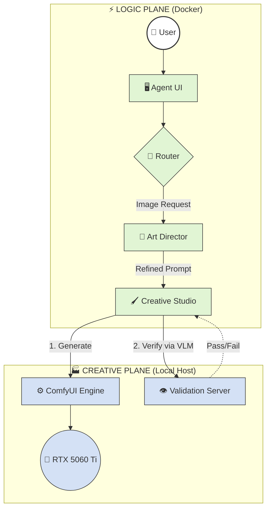

# System Architecture: Home AI Lab v2

## 🗺️ High-Level Topology

This system is a **Hybrid Swarm**, split into a **Logic Plane** (Docker Containers) and a **Creative Plane** (Local GPU Host).

---

## 🔌 Service Map

| Service | Port | Function |
| :--- | :--- | :--- |
| **Agent UI** | `8501` | 💬 Chat Interface |
| **ComfyUI** | `8188` | 🎨 Image Engine |
| **Ollama** | `11434`| 🧠 AI Models |
| **Grafana** | `80` | 📊 Metrics |
| **Validation**| `5000` | 👁️ Visual Checks |

---

## 🚀 Unified Controls

Use `launch_swarm.bat` to manage the entire system.

*   **startup**: Launches Docker + ComfyUI together.
*   **shutdown**: Press **`Q`** in the launcher window to clean kill all processes.
