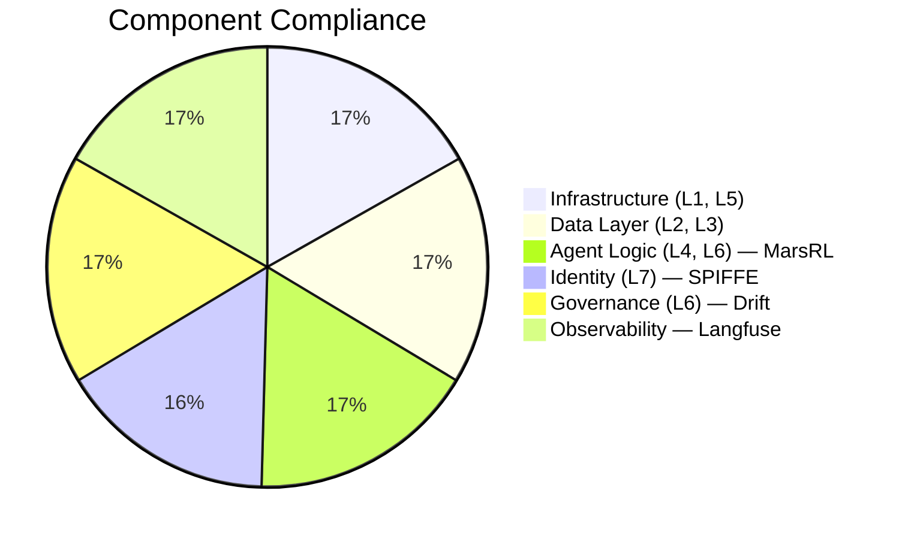

# MAESTRO Compliance Status: Agentic Hive

**Date**: 2026-02-22
**Version**: 2.0 (MarsRL + 3-Node Topology)
**Overall Status**: ✅ DEPLOYMENT READY (Production)

## 1. Executive Summary

> [!IMPORTANT]
> The Agentic Hive has completed a Full L1-L7 MAESTRO Security Audit reflecting the new **3-node distributed topology** and **MarsRL inference-time loop** (Solver → Verifier → Corrector).

The system now employs:

- **Active Defense**: Drift (Code) + SecurityAgent (Runtime) + MarsRL LogicVerifier (Output)
- **Strict Identity (L7)**: SPIRE/SPIFFE workload identity (Dell Wyse CA → Hive PC agent)
- **Full Observability**: Langfuse LLM tracing with **process-level reward scoring** at each MarsRL step
- **Smart Host Routing**: Hardware-aware load balancing between Justin-PC (16GB) and Dell R730 (8GB)

_For full technical implementation details, see the [Engineering Framework: MarsRL & MAESTRO-SPIFFE](../engineering_framework_marsrl_spiffe.md) paper._

> [!NOTE]
> Identity score is 95% (not 100%) because the Dell R730 is a new node not yet enrolled in SPIRE. See Section 5 below.

---

## 2. Component Compliance Matrix

| Component             | Layer  | Status       | Evaluation                                                   | Evidence                                                         |
| --------------------- | ------ | ------------ | ------------------------------------------------------------ | ---------------------------------------------------------------- |
| **Infrastructure**    | L1, L5 | ✅ Compliant | [eval_infrastructure.md](eval_infrastructure.md)             | [2026-02-22 audit](../evidence/maestro_full_audit_2026_02_22.md) |
| **Data Layer**        | L2, L3 | ✅ Compliant | [eval_data_layer.md](eval_data_layer.md)                     | [env check](../evidence/data_layer_env_check_2026-02-08.txt)     |
| **Agent Logic**       | L4, L6 | ✅ Compliant | [eval_agent_logic.md](eval_agent_logic.md)                   | MarsRL loop + LogicVerifier                                      |
| **Identity**          | L7     | ⚠️ Partial   | [eval_identity_security.md](eval_identity_security.md)       | R730 not yet SPIRE-enrolled                                      |
| **Governance**        | L6     | ✅ Compliant | [eval_governance.md](eval_governance.md)                     | [drift analysis](../evidence/drift_analysis_2026-02-09.md)       |
| **Observability**     | L4, L6 | ✅ Compliant | [Spec](../specs/langfuse_observability_spec.md)              | Process rewards live                                             |
| **MarsRL Loop (New)** | L4, L6 | ✅ Compliant | [marsrl walkthrough](../marsrl_hive_redesign_walkthrough.md) | Solver→Verifier→Corrector                                        |

---

## 3. Key Defensive Mechanisms

- **Drift Governance**: Enforces approved code patterns (Try/Except, Logging, no eval()).
- **Security Agent**: Regex-based blocking of malicious shell commands + dependency gating.
- **MarsRL LogicVerifier**: 3-layer output validation (AST parse → coherence → llama-guard).
- **Docker Isolation**: User-namespace remapping (non-root) + network segmentation.
- **Secret Management**: `.env`-based injection. No hardcoded credentials anywhere.
- **LLM Observability**: Langfuse tracing with per-step process reward scores.
- **SPIFFE mTLS**: Short-lived X.509 SVIDs; zero-trust workload identity.

---

## 4. Infrastructure Services

### Control Plane (Dell Wyse 5070 — 192.168.2.102)

| Service      | Port | Status | Purpose                             |
| ------------ | ---- | ------ | ----------------------------------- |
| SPIRE Server | 8081 | ✅ Up  | Workload identity CA                |
| PostgreSQL   | 5432 | ✅ Up  | Agent memory + metadata             |
| ClickHouse   | 8123 | ✅ Up  | Trace data (OLAP)                   |
| Langfuse     | 3000 | ✅ Up  | LLM observability + process rewards |
| MinIO        | 9190 | ✅ Up  | S3 blob storage                     |
| Redis        | 6379 | ✅ Up  | Cache and queue                     |

### Primary Inference (Hive PC with 5060ti)

| Service        | Port  | Status | Model                                 |
| -------------- | ----- | ------ | ------------------------------------- |
| ollama_gpu     | 11434 | ✅ Up  | qwen3.5:9b                            |
| agent-runtime  | 8000  | ✅ Up  | MarsRL loop host                      |
| comfyui_gpu    | 8188  | ✅ Up  | Flux/TripoSG                          |
| text_gen_webui | 7860  | ⏸ Off  | Diagnostic only (profile: diagnostic) |
| spire-agent    | —     | ✅ Up  | SVID delivery                         |

### Secondary Inference (Dell R730 — Offload Node)

| Service       | Port  | Status          | Model                    |
| ------------- | ----- | --------------- | ------------------------ |
| ollama (R730) | 11434 | ✅ Up           | qwen3.5:9b (Primary)      |
| ollama (R730) | 11434 | ✅ Up           | nemotron-mini, llama-guard|
| spire-agent   | —     | ⚠️ Not enrolled | Pending SPIRE enrollment |

---

## 5. Open Items & Remediation

| Item                            | Severity | Status  | Action                          |
| ------------------------------- | -------- | ------- | ------------------------------- |
| Dell R730 SPIRE enrollment      | Medium   | ⚠️ Open | Enroll R730 as SPIRE agent node |
| mTLS between Justin-PC and R730 | Medium   | ⚠️ Open | Requires R730 SVID              |
| TLS on Ollama API (R730)        | Low      | ⚠️ Open | nginx reverse proxy + cert      |
| OIDC Auth on UI                 | Low      | Future  | Replace Basic Auth              |

---

## 6. Next Steps

1. **Enroll Dell R730 in SPIRE** — run `spire-agent` on R730, register via control plane
2. **Pull models on R730** — `ollama pull nemotron-orchestrator:8b && ollama pull llama-guard-3:8b`
3. **Set `SECONDARY_OLLAMA_HOST`** in Hive PC `.env` to R730's IP
4. **Run test suite** — `pytest tests/test_mars_loop.py -v`
5. **Validate Langfuse** — verify `mars_loop` traces appear with process reward scores
6. **Token inspection baseline** — run 5 MarsRL tasks while Text Gen WebUI is active to capture borderline logit distributions
