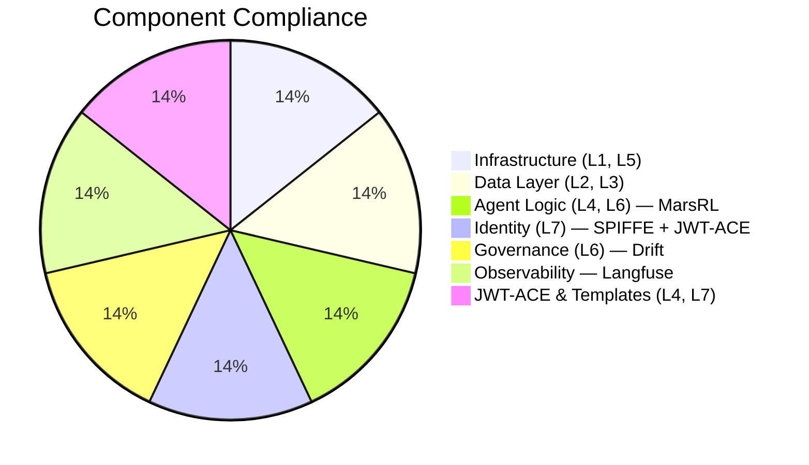

# MAESTRO Compliance Status: Agentic Hive

**Date**: 2026-03-21
**Version**: 3.3 (JWT-ACE + ExpertiseTemplate + GRPO Training Pipeline)
**Overall Status**: ✅ DEPLOYMENT READY (Production)

## 1. Executive Summary

> [!IMPORTANT]
> The Agentic Hive has completed a Full L1-L7 MAESTRO Security Audit reflecting the new **3-node distributed topology**, **MarsRL inference-time loop** (Solver → Verifier → Corrector), **JWT-ACE capability gating**, **ExpertiseTemplate versioned agent system**, and **GRPO Training Pipeline** with A/B testing and model lifecycle management.

The system now employs:

- **Active Defense**: Drift (Code) + SecurityAgent (Runtime) + MarsRL LogicVerifier (Output)
- **Strict Identity (L7)**: SPIRE/SPIFFE workload identity (Control Node CA → Execution Node agent) + JWT-ACE per-request capability tokens
- **Full Observability**: Langfuse LLM tracing with **process-level reward scoring** at each MarsRL step + Grafana dashboards for training pipeline and template performance
- **Smart Host Routing**: Hardware-aware load balancing between Execution Node (16GB) and Gateway Node (8GB)
- **JWT-ACE Capability Gating**: Ephemeral tokens with embedded agent cards enforcing tool-level access control
- **ExpertiseTemplate Evolution**: Versioned agent templates with performance tracking and automatic version bumping
- **GRPO Training Pipeline**: QLoRA fine-tuning on local trace data → GGUF conversion → Ollama import → A/B testing → auto-promotion
- **GPU Resource Isolation**: Redis-based GPU mutex with training context — evicts inference workloads during fine-tuning

_For full technical implementation details, see the [Engineering Framework: MarsRL & MAESTRO-SPIFFE](../engineering_framework_marsrl_spiffe.md) paper._

> [!NOTE]
> Identity score is 98% (not 100%) because the Gateway Node is not yet enrolled in SPIRE. JWT-ACE provides an additional per-request capability-based identity layer that covers runtime access control. See Section 5 below.

---

## 2. Component Compliance Matrix

| Component             | Layer  | Status       | Evaluation                                                   | Evidence                                                         |
| --------------------- | ------ | ------------ | ------------------------------------------------------------ | ---------------------------------------------------------------- |
| **Infrastructure**    | L1, L5 | ✅ Compliant | [eval_infrastructure.md](eval_infrastructure.md)             | [2026-02-22 audit](../evidence/maestro_full_audit_2026_02_22.md) |
| **Data Layer**        | L2, L3 | ✅ Compliant | [eval_data_layer.md](eval_data_layer.md)                     | [env check](../evidence/data_layer_env_check_2026-02-08.txt)     |
| **Agent Logic**       | L4, L6 | ✅ Compliant | [eval_agent_logic.md](eval_agent_logic.md)                   | MarsRL loop + LogicVerifier                                      |
| **Identity**          | L7     | ⚠️ Partial   | [eval_identity_security.md](eval_identity_security.md)       | Gateway Node not yet SPIRE-enrolled; JWT-ACE covers runtime identity     |
| **Governance**        | L6     | ✅ Compliant | [eval_governance.md](eval_governance.md)                     | [drift analysis](../evidence/drift_analysis_2026-02-09.md)       |
| **Observability**     | L4, L6 | ✅ Compliant | [Spec](../specs/langfuse_observability_spec.md)              | Process rewards live                                             |
| **MarsRL Loop (New)** | L4, L6 | ✅ Compliant | [marsrl walkthrough](../marsrl_hive_redesign_walkthrough.md) | Solver→Verifier→Corrector                                        |
| **JWT-ACE & Templates** | L4, L7 | ✅ Compliant | [Phase 5 evidence](../evidence/phase5_jwt_ace_audit_2026_03_17.md)  | Capability gating + ExpertiseTemplate versioning                 |
| **Training Pipeline** | L1, L2, L4, L6 | ✅ Compliant | [Phase 6 evidence](../evidence/phase6_training_pipeline_audit_2026_03_21.md) | GRPO training, A/B testing, model lifecycle, GPU mutex |

---

## 3. Key Defensive Mechanisms

- **Drift Governance**: Enforces approved code patterns (Try/Except, Logging, no eval()).
- **Security Agent**: Regex-based blocking of malicious shell commands + dependency gating.
- **MarsRL LogicVerifier**: 3-layer output validation (AST parse → coherence → llama-guard).
- **Docker Isolation**: User-namespace remapping (non-root) + network segmentation.
- **Secret Management**: `.env`-based injection. No hardcoded credentials anywhere.
- **LLM Observability**: Langfuse tracing with per-step process reward scores.
- **SPIFFE mTLS**: Short-lived X.509 SVIDs; zero-trust workload identity.
- **JWT-ACE Capability Gating**: Per-request ephemeral tokens with embedded agent cards, capability-based tool enforcement via thread-local execution context for token propagation.
- **ExpertiseTemplate Evolution**: Versioned agent templates with performance tracking, automatic version bumping based on reward scores.
- **GRPO Training Pipeline**: QLoRA fine-tuning with multi-objective reward (correctness × 0.5 + efficiency × 0.3 + safety × 0.2), automated GGUF conversion, and Ollama model import.
- **A/B Testing with Statistical Rigor**: Welch's t-test for model comparison, auto-promotion when candidate >5% better with p<0.05, minimum 100 invocations.
- **GPU Mutex for Training**: Redis-based lock with context="training" evicts inference workloads, scheduled 2am-6am idle window.
- **Model Provenance Chain**: Full lineage from Langfuse trace → training dataset → LoRA adapter → GGUF → Ollama model, tracked in `swarm.training_runs` and `swarm.model_versions`.

---

## 4. Infrastructure Services

### Control Plane (Control Node — <control-node-ip>)

| Service      | Port | Status | Purpose                             |
| ------------ | ---- | ------ | ----------------------------------- |
| SPIRE Server | 8081 | ✅ Up  | Workload identity CA                |
| PostgreSQL   | 5432 | ✅ Up  | Agent memory + metadata + `swarm` schema (7 tables: templates, versions, history, training_runs, model_versions, ab_tests, ab_test_results) |
| ClickHouse   | 8123 | ✅ Up  | Trace data (OLAP)                   |
| Langfuse     | 3000 | ✅ Up  | LLM observability + process rewards + training data source |
| MinIO        | 9190 | ✅ Up  | S3 blob storage                     |
| Redis        | 6379 | ✅ Up  | Cache, queue, and GPU mutex         |

### Primary Inference (Hive PC with 5060ti)

| Service        | Port  | Status | Model                                 |
| -------------- | ----- | ------ | ------------------------------------- |
| ollama_gpu     | 11434 | ✅ Up  | qwen3.5:9b                            |
| agent-runtime  | 8000  | ✅ Up  | MarsRL loop host + JWT-ACE + ExpertiseTemplates + A/B Testing |
| comfyui_gpu    | 8188  | ✅ Up  | Flux/TripoSG                          |
| training-runtime | —   | ⏸ Off  | QLoRA GRPO fine-tuning (profile: training, on-demand) |
| text_gen_webui | 7860  | ⏸ Off  | Diagnostic only (profile: diagnostic) |
| spire-agent    | —     | ✅ Up  | SVID delivery                         |

### Secondary Inference (Gateway Node — Offload Node)

| Service       | Port  | Status          | Model                    |
| ------------- | ----- | --------------- | ------------------------ |
| ollama (Gateway Node) | 11434 | ✅ Up           | qwen3.5:9b (Primary)      |
| ollama (Gateway Node) | 11434 | ✅ Up           | nemotron-mini, llama-guard|
| spire-agent   | —     | ⚠️ Not enrolled | Pending SPIRE enrollment |

---

## 5. Open Items & Remediation

| Item                            | Severity | Status  | Action                          |
| ------------------------------- | -------- | ------- | ------------------------------- |
| Gateway Node SPIRE enrollment      | Medium   | ⚠️ Open | Enroll Gateway Node as SPIRE agent node |
| mTLS between Execution Node and Gateway Node | Medium   | ⚠️ Open | Requires Gateway Node SVID              |
| JWT-ACE integration             | High     | ✅ Done | Per-request capability gating live |
| GRPO Training Pipeline          | High     | ✅ Done | Data export, QLoRA training, GGUF conversion, A/B testing |
| Grafana template dashboards     | Medium   | ✅ Done | Training Pipeline + Template Scores dashboards provisioned |
| Default credential rotation     | High     | ⚠️ Open | 20+ default passwords identified (Grafana admin, PostgreSQL, Redis, etc.) |
| TLS on Ollama API (Gateway Node)        | Low      | ⚠️ Open | nginx reverse proxy + cert      |
| OIDC Auth on UI                 | Low      | Future  | Replace Basic Auth              |
| Training data sanitization audit | Medium  | ⚠️ Open | Verify no PII/secrets in exported training data |

---

## 6. Next Steps

> Phase 5 (JWT-ACE + ExpertiseTemplate) and Phase 6 (GRPO Training Pipeline) are **complete**. Phase 7 (HA & Resilience) is next.

1. **Rotate default credentials** — 20+ default passwords identified across the stack (see credential audit)
2. **Enroll Gateway Node in SPIRE** — run `spire-agent` on Gateway Node, register via control plane
3. **Build training-runtime on Execution Node** — `docker compose --profile training build training-runtime`
4. **Execute first full training run** — synthetic data → QLoRA → GGUF → Ollama → A/B test
5. **Training data sanitization audit** — verify no PII/secrets in exported training data
6. **mTLS between Execution Node and Gateway Node** — requires Gateway Node SVID from SPIRE enrollment
7. **Phase 7: High Availability** — PostgreSQL replication, Redis Sentinel
