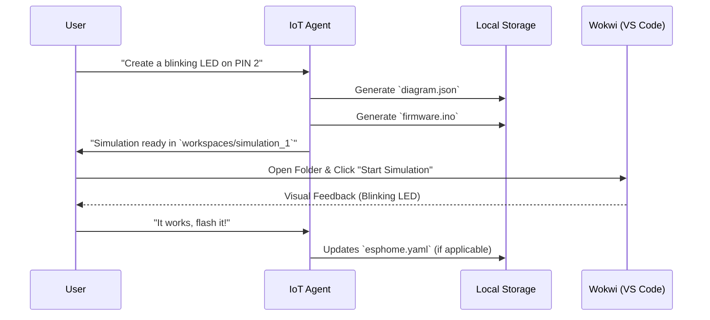

# Wokwi Integration Specification 🔬

**Version**: 1.0
**Phase**: 9.5 (IoT Expansion)

## 1. Objective

Enable the **IoT Controller Agent** to simulate firmware code (C++/MicroPython) in a safe, virtual environment before flashing physical hardware.

## 2. Architecture: "The Hybrid Workflow"



## 3. Data Structures

### `diagram.json` (Wokwi Schema)

The agent must generate valid JSON defining the board and parts.

```json
{
  "version": 1,
  "author": "IoT Agent",
  "editor": "wokwi",
  "parts": [
    {
      "type": "board-esp32-devkit-c-v4",
      "id": "esp",
      "top": 0,
      "left": 0,
      "attrs": {}
    },
    {
      "type": "wokwi-led",
      "id": "led1",
      "top": 0,
      "left": 100,
      "attrs": { "color": "red" }
    }
  ],
  "connections": [
    ["esp:TX", "$serialMonitor:RX", "", []],
    ["esp:RX", "$serialMonitor:TX", "", []],
    ["esp:D2", "led1:A", "green", []],
    ["led1:C", "esp:GND", "black", []]
  ]
}
```

## 4. Tool Interface: `tools/wokwi_ops.py`

### `create_simulation(project_name: str, board_type: str = "esp32")`

Creates a folder `workspace/simulations/{project_name}` and initializes `diagram.json`.

### `add_part(project_name: str, part_type: str, part_id: str, x: int, y: int, attributes: dict)`

Adds a component (LED, Servo, Sensor) to the diagram.

### `connect_pin(project_name: str, source: str, target: str, color: str)`

Wires two components together (e.g., `esp:D2` to `led1:DIN`).

## 5. Security Guardrails

- **No Web Uploads**: Simulation files remain local to the `execution_plane`.
- **Sandboxing**: Code execution happens in the user's VS Code instance (Wokwi Extension) or constrained browser session, not on the Agent Runtime itself.
