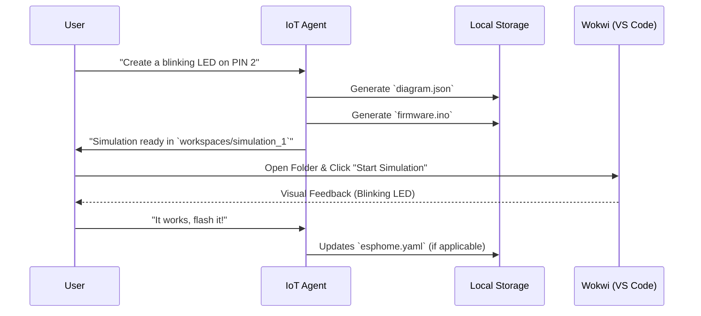

# Wokwi Integration Specification 🔬

**Version**: 1.0
**Phase**: 9.5 (IoT Expansion)

## 1. Objective

Enable the **IoT Controller Agent** to simulate firmware code (C++/MicroPython) in a safe, virtual environment before flashing physical hardware.

## 2. Architecture: "The Hybrid Workflow"



## 3. Data Structures

### `diagram.json` (Wokwi Schema)

The agent must generate valid JSON defining the board and parts.

```json
{
  "version": 1,
  "author": "IoT Agent",
  "editor": "wokwi",
  "parts": [
    {
      "type": "board-esp32-devkit-c-v4",
      "id": "esp",
      "top": 0,
      "left": 0,
      "attrs": {}
    },
    {
      "type": "wokwi-led",
      "id": "led1",
      "top": 0,
      "left": 100,
      "attrs": { "color": "red" }
    }
  ],
  "connections": [
    ["esp:TX", "$serialMonitor:RX", "", []],
    ["esp:RX", "$serialMonitor:TX", "", []],
    ["esp:D2", "led1:A", "green", []],
    ["led1:C", "esp:GND", "black", []]
  ]
}
```

## 4. Tool Interface: `tools/wokwi_ops.py`

### `create_simulation(project_name: str, board_type: str = "esp32")`

Creates a folder `workspace/simulations/{project_name}` and initializes `diagram.json`.

### `add_part(project_name: str, part_type: str, part_id: str, x: int, y: int, attributes: dict)`

Adds a component (LED, Servo, Sensor) to the diagram.

### `connect_pin(project_name: str, source: str, target: str, color: str)`

Wires two components together (e.g., `esp:D2` to `led1:DIN`).

## 5. Security Guardrails

- **No Web Uploads**: Simulation files remain local to the `execution_plane`.
- **Sandboxing**: Code execution happens in the user's VS Code instance (Wokwi Extension) or constrained browser session, not on the Agent Runtime itself.

---

## Source References

<details markdown>
<summary><strong>Source of Truth — Canonical Files</strong> (click to expand)</summary>

| Source | Type | Relevance |
|--------|------|----------|
| `core_tools/wokwi_ops.py` | Implementation | Simulation creation, part management, pin wiring |
| `workspace/simulations/` | Data | Generated diagram.json and firmware files |
| [Wokwi](https://wokwi.com/) | External | Hardware simulation platform |
| [ESPHome](https://esphome.io/) | External | Physical device flashing framework |

</details>

---

<details markdown>
<summary><strong>Changelog</strong> (click to expand)</summary>

| Date | Author | Changes |
|------|--------|--------|
| 2026-04-16 | AI-Copilot | Added source references, changelog, maintenance guide, testing section |
| 2026-02-20 | AI-Copilot | v1.0 — Initial Wokwi integration specification |

</details>

---

## Maintenance & Update Guide

### Adding New Board Types

1. Add the board definition to `wokwi_ops.py` in the `BOARD_TYPES` dict.
2. Update `diagram.json` schema if the board has unique pin layouts.
3. Test with a sample simulation before deploying.

### Adding New Components

1. Refer to the [Wokwi parts catalog](https://docs.wokwi.com/parts/wokwi-led) for supported parts.
2. Add component templates to `wokwi_ops.py` if custom defaults are needed.

---

## Functionality Testing

### Manual Verification

1. **Create simulation**: Call `create_simulation('test', 'esp32')` → verify `workspace/simulations/test/diagram.json` is created.
2. **Add parts**: Call `add_part(...)` → verify the part appears in `diagram.json`.
3. **Pin wiring**: Call `connect_pin(...)` → verify connections array in `diagram.json`.
4. **Security**: Verify simulation files stay local — no outbound network calls during simulation.
