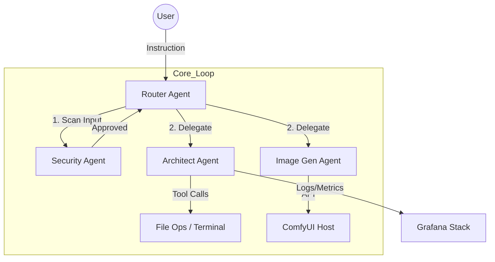

# Home AI Lab: Engineering Datasheet

> **⚠️ Deprecated**: This document reflects the Phase 3 Alpha architecture (January 2026).
> For the current architecture (v3.1, March 2026), see
> [docs/AGENTIC_HIVE_ARCHITECTURE.md](docs/AGENTIC_HIVE_ARCHITECTURE.md).

**Version**: 1.0 (Phase 3 Alpha)
**Date**: January 2026
**Architecture**: Distributed Hybrid Swarm (DHS)

---

## 1. Executive Summary

The **Home AI Lab** is a private, air-gapped capable AI orchestration platform designed for secure code execution, continuous monitoring, and specialized generative workflows. It leverages a **Split-Compute Topology**, offloading orchestration state to a low-power Control Plane while reserving high-performance compute resources (Execution Plane) for LLM inference and generative tasks.

### Key Highlights

- **Zero-Shared State**: Agents communicate via stateless APIs (Ollama/REST), with persistent memory isolated in the Control Plane.
- **Sandboxed Execution**: All code generation occurs within isolated Docker-in-Docker (DinD) environments (OpenHands).
- **Observability First**: Full-stack monitoring via Prometheus (Metrics) and Loki (Logs), visualized in Grafana.
- **Enterprise Identity**: SPIRE (SPIFFE) integration for workload identity and zero-trust authentication.

---

## 2. Infrastructure Topology

The system is physically distributed but logically unified under a single mesh network.

### Control Plane (The Brain)

- **Hardware**: Dell Wyse 5070 Thin Client
- **OS**: Ubuntu Server 24.04 LTS
- **Role**: State Management & Identity Authority
- **Services**:
  - **PostgreSQL (Agno)**: Long-term vector memory and conversation history.
  - **SPIRE Server**: Issuance of x509 identity certificates to agents.
  - **Orchestrator**: Maintains the swarm state and health.
- **Connectivity**: Static IP (`192.168.2.102`)

### Execution Plane (The Body)

- **Hardware**: Custom Workstation (Dual GPU)
  - _GPU 1_: RTX 4060 Ti (16GB) - Primary Inference (Qwen2.5-Coder)
  - _GPU 2_: RTX 3070 Ti (8GB) - Security & Validation (Llama-Guard)
- **OS**: Windows 11 (WSL2 Backend)
- **Role**: Heavy Compute & Action Execution
- **Services**:
  - **Ollama**: Accelerated LLM Inference API.
  - **Agent Runtime**: Python-based Agno agents (Architect, Security, Router).
  - **ComfyUI**: Node-based Stable Diffusion backend for Image Generation.
  - **Monitoring Stack**: Prometheus, Loki, Grafana, cAdvisor.

---

## 3. Logical Framework (The Swarm)

The application follows a **Hub-and-Spoke** agentic pattern:

### Agent Roles

1.  **Router (Middleware)**:
    - Functions as the entry point.
    - Classifies intent (Coding vs. Creative vs. Research).
    - Enforces security scans _before_ delegation.

2.  **Security Agent (The Guard)**:
    - Model: `llama-guard-3:8b`
    - Action: Scans prompts for malicious intent, injection attacks, or policy violations.
    - Authority: Can veto any user request before it reaches the Architect.

3.  **Architect Agent (The Builder)**:
    - Model: `qwen2.5-coder:14b`
    - Capabilities: Full filesystem access, code execution, planning.
    - Safety: Confined strictly to the `/workspace` volume.

4.  **Creative Studio (The Artist)**:
    - Backend: ComfyUI (Local)
    - Capabilities: High-fidelity image synthesis using SDXL/v1.5 workflows.

---

## 4. Security Posture

### A. Identity & authentication

- **Zero-Trust**: No implicit trust between containers. Identity is verified via **SPIFFE ID**.
- **Workload Attestation**: SPIRE verifies the process binary before issuing certificates.

### B. Input/Output Safety

- **Pre-Execution**: All prompts pass through Llama-Guard.
- **Execution Isolation**: Code runs in ephemeral Docker containers (OpenHands Sandbox).
- **Network**: Air-gap capable. No external API calls required for core function (Local LLMs).

### C. Data Privacy

- **Local-Only**: No data leaves the local network (no OpenAI/Anthropic calls).
- **Encrypted Storage**: Credentials and long-term memory stored in local PostgreSQL.

---

## 5. Observability Schema

- **Metrics**:
  - `workflow_steps_total`: Track agent velocity and error rates.
  - `agent_state`: Real-time status (Idle, Working, Error).
  - `container_cpu_usage_seconds_total`: Hardware resource consumption.
- **Logs**:
  - Structured JSON logs aggregated by Promtail.
  - Queryable via LogQL in Grafana (e.g., `{job="agent_runtime"} |= "ERROR"`).
