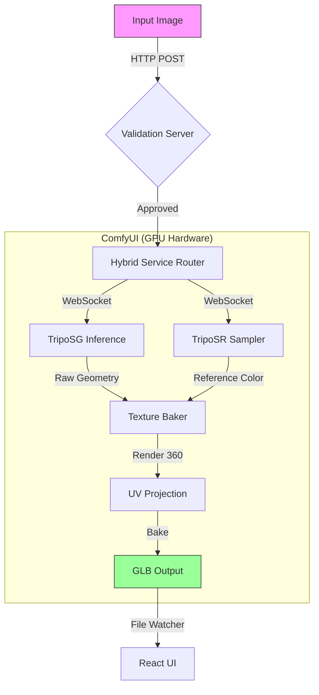

# Walkthrough - Creature Forge Ecosystem

This document provides a comprehensive guide to understanding, visualizing, and implementing the Creature Forge 3D generation system. It covers the dual-pipeline architecture, hardware requirements, and the specific models and services that drive the application.

## 🎨 System Overview
The core workflow is a "Hybrid" pipeline that runs locally. It combines high-quality geometry generation with a specialized "texture baking" process to create FDM-printer-ready 3D assets.

### Workflow Diagram
*(If the diagram below does not render, please install a Mermaid Markdown extension or viewing tool)*

---

## 🏗️ Technical Architecture

### 1. Services & APIs
The project is composed of three communicating services:

*   **Frontend (Vite/React)**:
    *   **Role**: User Interface for uploading images and viewing results.
    *   **Port**: `5173`
    *   **API Interactions**: `POST http://localhost:3000/validate`
*   **Validation Server (Python/FastAPI)**:
    *   **Role**: Pre-checks validation (background removal, centering).
    *   **Port**: `3000`
    *   **Code**: `validation_server.py`
    *   **Dependencies**: `rembg`, `pillow`, `numpy`
*   **ComfyUI Backend (Python/Torch)**:
    *   **Role**: Executes the heavy ML inference.
    *   **Port**: `8188`
    *   **Interface**: WebSocket (via `hybridService.ts`)

---

## 🛠️ Pipeline A: The "Stable" Path (RTX 3070 Ti)
*Best for: Stability, compatibility, and troubleshooting using established standards.*

### 📦 Resource Manifest (Download Links)
| Category | Resource Name | Version | Link / Command |
| :--- | :--- | :--- | :--- |
| **GPU Driver** | NVIDIA Studio Driver | Latest Stable | [NVIDIA Drivers](https://www.nvidia.com/Download/index.aspx) |
| **CUDA** | CUDA Toolkit | **12.4** | [Download CUDA 12.4](https://developer.nvidia.com/cuda-12-4-0-download-archive) |
| **PyTorch** | PyTorch Stable | **2.5.1+cu124** | `pip install torch torchvision --index-url https://download.pytorch.org/whl/cu124` |
| **Compiler** | Visual Studio | **2022** (Standard) | [Visual Studio Community](https://visualstudio.microsoft.com/vs/community/) |

### 🧠 Primary AI Models
| Model Name | Purpose | Link |
| :--- | :--- | :--- |
| **TripoSG** | Geometry Generation | [HuggingFace: VAST-AI/TripoSG](https://huggingface.co/VAST-AI/TripoSG) |
| **TripoSR** | Texture Reference | [HuggingFace: stabilityai/TripoSR](https://huggingface.co/stabilityai/TripoSR) |

### 🔌 API Endpoints
*   **ComfyUI API**: `http://127.0.0.1:8188`
*   **WebSocket**: `ws://127.0.0.1:8188/ws`

### 🧩 Required Custom Nodes
*   [ComfyUI-TripoSG](https://github.com/Start51/ComfyUI-TripoSG)
*   [ComfyUI-Flowty-TripoSR](https://github.com/flowtyone/ComfyUI-Flowty-TripoSR)
*   [ComfyUI-3D-Pack](https://github.com/MrForExample/ComfyUI-3D-Pack)

**How to Run**:
1.  Run `start_unified.bat`.
2.  System defaults to **Device 0**.

---

## 🚀 Pipeline B: The "Experimental" Path (RTX 5060 Ti)
*Best for: Speed, testing next-gen hardware, and development.*

### 📦 Resource Manifest (Download Links)
| Category | Resource Name | Version | Link / Command |
| :--- | :--- | :--- | :--- |
| **GPU Driver** | NVIDIA Driver | **570.00+** | [NVIDIA Beta Drivers](https://www.nvidia.com/en-us/geforce/drivers/) (Required for Blackwell) |
| **CUDA** | CUDA Toolkit | **12.8** | [Download CUDA 12.8](https://developer.nvidia.com/cuda-downloads) |
| **Compiler** | Visual Studio | **2022** (Latest) | [Visual Studio Community](https://visualstudio.microsoft.com/vs/community/) |
| **PyTorch** | PyTorch **Nightly** | **Pre-release** | `pip install --pre torch torchvision --index-url https://download.pytorch.org/whl/nightly/cu128` |
| **Framework** | **Nvdiffrast** | GitHub Main | `git clone https://github.com/NVlabs/nvdiffrast` |
| **Framework** | **PyTorch3D** | GitHub Main | `git clone https://github.com/facebookresearch/pytorch3d` |

### 🧠 Primary AI Models
*(Same models, but running in a Nightly environment)*
| Model Name | Purpose | Link |
| :--- | :--- | :--- |
| **TripoSG** | Geometry Generation | [HuggingFace: VAST-AI/TripoSG](https://huggingface.co/VAST-AI/TripoSG) |
| **TripoSR** | Texture Reference | [HuggingFace: stabilityai/TripoSR](https://huggingface.co/stabilityai/TripoSR) |

### 🔌 API Endpoints
*   **ComfyUI API**: `http://127.0.0.1:8188` (Same port, different environment)
*   **WebSocket**: `ws://127.0.0.1:8188/ws`

### 🧩 Required Custom Nodes & Tools
*   [ComfyUI-TripoSG](https://github.com/Start51/ComfyUI-TripoSG)
*   [ComfyUI-Flowty-TripoSR](https://github.com/flowtyone/ComfyUI-Flowty-TripoSR)
*   [ComfyUI-3D-Pack](https://github.com/MrForExample/ComfyUI-3D-Pack) (Deeply Patched)

### 🩹 Required Patches
To run on the 5060 Ti, these specific interventions are required (and handled by our scripts):
1.  **PyTorch3D Compilation**: Must be built from source using VS2022 to fix C++ template errors.
    *   *Tool*: `compile_pytorch3d_fix.py`
2.  **3D-Pack Dependency Patch**: Bypasses `utils3d` to prevent crashing on load.
    *   *Tool*: `patch_nodes.py` (Wraps imports in `Nodes.py`)
    *   *Fix*: `pip install pytorch-msssim` (Manually added dependency)

**How to Run**:
1.  Run `start_unified_nightly.bat`.
2.  System forces **Device 1** (or whichever index the 5060 Ti occupies).

### Phase 3: Agent Swarm Integration (Completed)
Successfully integrated `ForgeAgent` and `ImageGenAgent` with local ComfyUI instance.

**Key Technical Hurdles Resolved:**
1.  **File Handoff:**
    *   **Problem:** Agents could not see ComfyUI output files.
    *   **Solution:** Identified nested path `Documents/ComfyUI/ComfyUI/output` and corrected Docker Volume Mounts.
2.  **Workflow Format:**
    *   **Problem:** Agent crashed processing "UI-Save" JSON format.
    *   **Solution:** Enforced strict "API-Save" format (`workflow_hunyuan_paint-2.json`) and added robust parsing logic.
3.  **Validation Errors:**
    *   **Problem:** ComfyUI rejected `{{SEED}}` placeholders as non-integers.
    *   **Solution:** Implemented recursive JSON traversal to replace placeholders with random integers before submission.
4.  **Logging:**
    *   **Problem:** Docker Desktop prevented Promtail from scraping log files.
    *   **Solution:** Switched to direct network logging using `python-logging-loki`.

**Current Status:**
*   3D Generation Pipeline is **Active**.
*   Dashboard Telemetry is **Live**.
*   ComfyUI Connectivity is **Stable**.

## 🔧 Detailed Troubleshooting History (Phase 12-15)

### Phase 14-15: The "Box vs Bunny" Resolution
We encountered a critical geometry artifact where the model appeared as a "Collapsed Box" or "Cube".

**Root Cause:**
*   **Background Color**: We initially set the composite background to **White (255)**. TripoSG interpreted this white space as "Solid Mass", generating a box around the character.
*   **Reference**: TripoSG expects the subject to be isolated against a **Black (0)** or Transparent background (which it treats as void).

**The Fix:**
1.  **Black Composite**: Modified `nodes.py` to composite transparent inputs onto **Black (0,0,0)**.
2.  **UV Alignment**: Reverted `project_mesh.py` to standard Spherical UV mapping (`0.5 - asin(y)`) to fix upside-down textures.

**Result:**
*   **Texture**: Upright and aligned with features (Eyes on face).

## 💎 Phase 16: The "Hybrid Pipeline" Implementation (Production Quality)
To achieve true "Pixar-style" quality with seamless texturing, we have transitioned from the projection-based approach to a native **Hybrid Pipeline**.

### Architecture
1.  **Geometry Generation**: **TripoSG**
    *   **Role**: Generates the high-quality, solid mesh from the input image.
    *   **Tool**: `comfyui-triposg`
    *   **Why**: Proven robustness, good topology, fast generation.
2.  **Texture Generation**: **Hunyuan3D V2 Paint**
    *   **Role**: Takes the TripoSG mesh AND the input image, and "grows" a high-fidelity texture directly onto the surface using a dedicated diffusion model.
    *   **Tool**: `ComfyUI-Hunyuan3DWrapper`
    *   **Why**:
        *   **Zero Seams**: Eliminates the visible lines found in projection methods.
        *   **Perfect Wrapping**: Solves "under chin" and "inner leg" artifacts.
        *   **Lighting Consistency**: Generates coherent PBR-like albedo maps.

### Workflow File
*   **File**: `workflow_hunyuan_paint.json`
*   **Status**: Ready for testing.
*   **Requirements**:
    *   `CoimfyUI-Flowty-TripoSR` (TripoSG Nodes)
    *   `ComfyUI-Hunyuan3DWrapper` (Hunyuan V2 Nodes)
    *   **High VRAM**: Hunyuan V2 Paint requires significant GPU memory (16GB+ recommended).

### Progress
*   [x] Identified Component Nodes (`TripoSGInference`, `Hy3DSampleMultiView`).
*   [x] Created Workflow JSON.
*   [ ] User Verification (Waiting for first generation).
